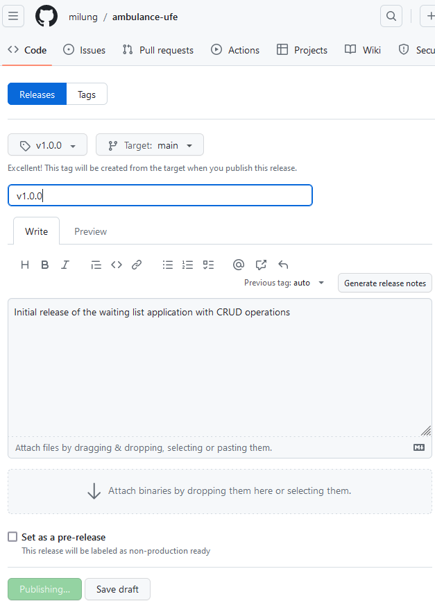

# Nasadenie aplikácie na produkčný kubernetes klaster

---

>info:>
Šablóna pre predvytvorený kontajner ([Detaily tu](../99.Problems-Resolutions/01.development-containers.md)):
`registry-1.docker.io/milung/wac-ufe-111`

---

Z bezpečnostných dôvodov je GitOps git repozitár pre produkčný klaster privátny, zmeny v ňom môže robiť iba gitops team. Má podobnú štruktúru ako náš `ambulance-gitops` repozitár. Na rozdiel od lokálneho klastra, zabezpečuje prítomnosť infraštruktúry v tomto klastri externý Gitops team (cvičiaci). Študenti majú k dispozícii konfiguráciu ku klastru, pomocou ktorej môžu ku klastru pristúpiť a nasadiť svoje aplikácie do namespace `wac-hospital`. V tomto kroku si pripravíme konfiguráciu pre nasadenie do klastra. Predpokladáme, že repozitár Vašej konfigurácie, ako aj obrazy softvérových kontajnerov sú verejne prístupné a nie je nutné použiť autentifikáciu. Pokiaľ tomu tak nie je, musíte do konfigurácie doplniť aj príslušné autentifikačné údaje vo forme kubernetes objektov _Secret_.

1. V tejto konfigurácii predpokladáme, že chcete explicitne kontrolovať, ktoré verzie softvérových kontajnerov budú do spoločného klastra nasadzované - predpokladajme, že je to _produkčný_ klaster. Ďalej predpokladajme, že naša aplikácia je v stave pripravenom na produkčné nasadenie. Ako prvý krok preto vytvoríme nové vydanie - _release_ - našej aplikácie. Na stránke [GitHub] prejdite do repozitára `ambulance-ufe` a v sekcii _Code_ stlačte na odkaz `0 tags` a následne na tlačidlo _Create a new release_. V rozbaľovacom zozname _Choose a tag_ zadajte  text `v1.0.0` a kliknite na tlačidlo _+ Create new tag: v1.0.0 on publish_. Do poľa _Release title_ zadajte text `v1.0.0` a v poli _Describe this release_ zadajte text `Initial release of the waiting list application with CRUD operations`. Stlačte tlačidlo _Publish release_.

   

   V predchádzajúcich častiach sme vytvárali predpis priebežnej integrácie. V súbore `${WAC_ROOT}/ambulance-ufe/.github/workflows/ci.yml` sme určili spúšťač aj vytvorenie _tag-u_ vo formáte `v1*`.

   ```yaml
   name: Ambulance uFE CI
    on:
    push:
        branches: [ "main" ]
        tags: @_important_@
        - 'v1*'  @_important_@
    pull_request:
        branches: [ "main" ]
   ```

   To spôsobí, že sa proces priebežnej integrácie po vytvorení nového vydania automaticky naštartuje. Na stránke [GitHub] prejdite vo Vašom repozitári `ambulance-ufe` do sekcie _Actions_ a skontrolujte, že sa nový beh priebežnej integrácie úspešne dokončí. Po jej ukončení si môžete overiť aj stav obrazu na stránke [Docker Hub], kde môžete vidieť nové označenia verzie a platformy pre váš image.

2. Vytvorte nový súbor `${WAC_ROOT}/ambulance-gitops/clusters/wac-aks/install/kustomization.yaml` s nasledujúcim obsahom:

   ```yaml
   apiVersion: kustomize.config.k8s.io/v1beta1
   kind: Kustomization

   namespace: wac-hospital

   commonLabels:
    app.kubernetes.io/part-of: wac-hospital
    app.kubernetes.io/name: <pfx>-ambulance-wl

   resources:
    - ../../../apps/<pfx>-ambulance-ufe


   components: 
    - ../../../components/version-release @_important_@
   ```

   Náš spoločný klaster sme tu nazvali `wac-aks`, čo referuje na nasadenie do klastra služby [Azure Kubernetes Services](https://azure.microsoft.com/en-us/products/kubernetes-service). Obsah je obdobný s obsahom z klastra `localhost`, avšak zmenili sme komponent v sekcii `components`.

3. Vytvorte súbor `${WAC_ROOT}\ambulance-gitops/components/version-release/kustomization.yaml` s obsahom:

   ```yaml
   apiVersion: kustomize.config.k8s.io/v1alpha1
   kind: Component
   images:
   - name: <docker-id>/ambulance-ufe
     newName: <docker-id>/ambulance-ufe 
     newTag: 1.0.0  #aktuálna verzia docker obrazu, ktorú chcete aby používatelia - cvičiaci - videli nasadenú

   replacements: 
    - targets:
      - select: 
            group: fe.milung.eu
            version: v1 
            kind: WebComponent
            name: <pfx>-ambulance-ufe 
        fieldPaths:
            - spec.hash-suffix @_important_@
      source: 
        version: v1
        kind: Deployment
        name:  <pfx>-ambulance-ufe-deployment  
        fieldPath: spec.template.spec.containers.0.image @_important_@
        options: 
            delimiter: ':'
            index: 1
   ```

   V tomto klastri nebudeme používať [_Image Update Automation_](https://fluxcd.io/flux/guides/image-update/) [Flux CD] operátor, ale chceme mať explicitnú kontrolu nad verziou docker obrazov, ktoré budú nasadzované. Preto sme vytvorili nový komponent `version-release`, ktorý obsahuje konfiguráciu špecifickú pre oficiálne vydanie nášho softvéru.

   Navyše sme použili [_Replacement Transformer_](https://kubectl.docs.kubernetes.io/references/kustomize/kustomization/replacements/) pomocou ktorého skopírujeme verziu docker obrazu z nášho deploymentu do definície webkomponentu za účelom vyprázdnenia vyrovnávacej pamäte, tzv. [_Cache busting_](https://developer.mozilla.org/en-US/docs/Web/HTTP/Caching#cache_busting). Vždy, keď zmeníme tag verzie docker obrazu, zmení sa aj hash v definícii webkomponentu a hash výsledného javaskript súboru ponúkaného službou `ufe-controller`. Následkom je, že pri ďalšom načítaní stránky sa používateľovi v prehliadači obnoví verzia nášho komponentu.

   >info:> Mohli by sme použiť aj sémantické verzionovanie a pre každú verziu definovať komponent podľa vydania celého systému, napríklad `version-1.0.3` a v komponente `version-release` len vytvoriť referenciu na komponent aktuálneho vydania. V cvičení tento postup vynecháme za účelom zjednodušenia.

4. Vytvorte adresár `${WAC_ROOT}/ambulance-gitops/clusters/wac-aks/gitops` a v ňom súbor `${WAC_ROOT}/ambulance-gitops/clusters/wac-aks/gitops/git-repository.yaml` s obsahom:

   ```yaml
   apiVersion: source.toolkit.fluxcd.io/v1
   kind: GitRepository
   metadata:
    name: <pfx>-gitops-repo # v spoločnom klastri je nasadených viacero takýchto objektov @_important_@
    namespace: wac-hospital
   spec:
    interval: 1m0s
    ref:
        branch: main
    timeout: 1m0s
    url: https://github.com/<your-account>/ambulance-gitops @_important_@

   # ak používate privátny repozitár nezabudnite doplniť autentifikačné údaje
   # secretRef:
   #    name: <pfx>-repository-pat
   ```

   Tento manifest definuje prístup k Vašemu repozitáru pre operátor [Flux CD]. Venujte pozornosť používaniu unikátnych názvov objektov v rámci klastra. Ďalej vytvorte súbor `${WAC_ROOT}/ambulance-gitops/clusters/wac-aks/gitops/install.kustomization.yaml` definujúci konfiguráciu Vašej aplikácie:

   ```yaml
   apiVersion: kustomize.toolkit.fluxcd.io/v1
   kind: Kustomization
   metadata:
    name: <pfx>-install  # v spoločnom klastri je nasadených viacero takýchto objektov @_important_@
    namespace: wac-hospital
   spec:
    wait: true
    interval: 120s
    path: clusters/wac-aks/install @_important_@
    prune: true
    sourceRef:
        kind: GitRepository
        name: <pfx>-gitops-repo @_important_@
   ```

   Pridajte súbor `${WAC_ROOT}/ambulance-gitops/clusters/wac-aks/gitops/cd.kustomization.yaml` s obsahom pre konfiguráciu priebežného nasadenia Vašej aplikácie:

   ```yaml
   apiVersion: kustomize.toolkit.fluxcd.io/v1
   kind: Kustomization
   metadata:
       name: <pfx>-cd # v spoločnom klastri je nasadených viacero takýchto objektov @_important_@
       namespace: wac-hospital
   spec:
       wait: true
       interval: 42s
       path: clusters/wac-aks
       prune: true
       sourceRef:
           kind: GitRepository
           name: <pfx>-gitops-repo @_important_@
   ```

   Pridajte súbor `${WAC_ROOT}/ambulance-gitops/clusters/wac-aks/gitops/kustomization.yaml` :

   ```yaml
   apiVersion: kustomize.config.k8s.io/v1beta1
   kind: Kustomization

   commonLabels:
        app.kubernetes.io/part-of: wac-hospital
        app.kubernetes.io/name: <pfx>-ambulance-wl

   namespace: wac-hospital

   resources:
    - cd.kustomization.yaml
    - install.kustomization.yaml
    - git-repository.yaml
   ```

   Nakoniec pridajte súbor `${WAC_ROOT}/ambulance-gitops/clusters/wac-aks/kustomization.yaml`:

   ```yaml
   apiVersion: kustomize.config.k8s.io/v1beta1
   kind: Kustomization


   commonLabels:
    app.kubernetes.io/name: <pfx>-apps
    app.kubernetes.io/instance: release
    app.kubernetes.io/version: "1.0.0"

   resources:
     - gitops  
   ```

   >info:> Pokiaľ používate privátny repozitár, nezabudnite vytvoriť aj objekty pre autentifikačné údaje, pozri tiež bod 8 v kapitole [Kontinuálne nasadenie pomocou nástroja Flux - Príprava konfigurácie](./081-flux)

5. Uložte zmeny a overte správnosť konfigurácie - v priečinku  `${WAC_ROOT}/ambulance-gitops` vykonajte príkaz:

   ```ps
   kubectl kustomize clusters/wac-aks/install
   kubectl kustomize clusters/wac-aks
   ```

   Pokiaľ boli oba príkazy schopné vygenerovať konfiguráciu bez chýb, archivujte zmeny priečinka `${WAC_ROOT}/ambulance-gitops` do repozitára. V priečinku `${WAC_ROOT}/ambulance-gitops` vykonajte príkaz:

   ```ps
   git add .
   git commit -m "Konfigurácia pre nasadenie do produkčného klastra"
   git push
   ```

6. Aby sme uviedli do činnosti priebežné nasadenie pre našu konfiguráciu, musíme ju prvýkrát nasadiť ručne. K tomu budete potrebovať prístup k spoločnému klastru. Na základe _Pokynov k predmetu_ si stiahnite konfiguráciu pre spoločný klaster - `wac-202?-student.kubeconfig.yaml` a [skombinujte ju s už existujúcou konfiguráciou](https://kubernetes.io/docs/concepts/configuration/organize-cluster-access-kubeconfig/). Z dlhodobého hľadiska je asi najpraktickejším spôsobom udržiavať konfigurácie pre jednotlivé klastre v samostatných súboroch a nastaviť vo Vašom prostredí premennú `KUBECONFIG` tak, aby ukazovala na zoznam jednotlivých klastrov. Skopírujte konfiguráciu pre spoločný klaster do súboru `$HOME/.kube/wac-student.kubeconfig.yaml` a nastavte vo svojom prostredí premennú `$env:KUBECONFIG` na hodnotu `$HOME\.kube\config;$HOME\.kube\wac-student.kubeconfig.yaml`. V prípade linux prostredia použite ako oddelovač ciest znak `:` namiesto znaku `;`:

   ```ps
   cp wac-202?-student.kubeconfig.yaml $HOME/.kube/wac-student.kubeconfig.yaml
   $env:KUBECONFIG="$HOME/.kube/config;$HOME/.kube/wac-student.kubeconfig.yaml"
   ```

   >info:> V pripade systémov Linux a Mac pouzite miesto oddelovača ';' oddelovač ':'
   
   Uvedená konfigurácia doplní do prostredia kubectl nový kontext `wac-student`, pomocou ktorého sa môžete pripojiť k spoločnému klastru.

   >info:> Odporúčame premennú `$env:KUBECONFIG` mať nastavenú trvalo, nie len pre danú inštanciu terminálu.  Pomocou príkazu `echo $profile` môžete získať cestu k Vášmu profilu pre powershell a doplniť do neho príkaz `$env:KUBECONFIG="$HOME/.kube/config:$HOME/.kube/wac-student.kubeconfig.yaml"` tak, aby sa spúšťal pri každom štarte terminálu PowerShell. Alternatívne inicializačné súbory existujú aj pre iné interpretery príkazového riadku.

7. V priečinku `${WAC_ROOT}/ambulance-gitops` vykonajte príkazy:

   ```ps
   kubectl config use-context wac
   kubectl apply -k clusters/wac-aks
   ```

   Overte stav nasadenia aplikácie príkazmi:

   ```ps
   kubectl get gitrepository <pfx>-gitops-repo -n wac-hospital
   kubectl get kustomization <pfx>-cd -n wac-hospital
   kubectl get kustomization <pfx>-install -n wac-hospital
   ```

   Pokiaľ je stav `READY` na hodnote `True`, znamená to, že Flux CD úspešne
   nasadil konfiguráciu do klastra.

   >build_circle:> Ak je stav `READY` na hodnote `False`, skontrolujte 
   položku `Status` vo výpise príkazu `kubectl describe kustomization <name> -n wac-hospital`
   a opravte prípadnú chybu. Aplikujte opravu komitom vašich zmien do repozitára. Pokiaľ sa chyba týka
   objektu `gitops-repo`, vykonajte aj príkaz `kubectl apply -k clusters/localhost`, v opačnom prípade je komit do repozitára postačujúci.

   Nakoniec overte, či sú všetky nasadené objekty pripravené a či sú všetky pody v stave `Running`:

   ```ps
   kubectl get all -n wac-hospital
   ```

   Výstup by mal okrem iného obsahovať Váš deployment `<pfx>-ambulance-ufe-deployment` a k tomu zodpovedajúci pod. Pokiaľ sú oba nasadené, môžete prejsť na stránku [spoločného klastra](https://wac-24.westeurope.cloudapp.azure.com/ui/), kde v zozname aplikácií uvidíte aj svoju aplikáciu.

   Zmeňte kubectl kontext späť na lokálny klaster:

   ```ps
   kubectl config use-context docker-desktop
   ```

   Vďaka konfigurácii priebežného nasadenia teraz bude postačovať vykonať zmeny vo Vašom repozitári `ambulance-gitops`. Operátor [Flux CD] zabezpečí aplikáciu zmien priamo do klastra. Nezabudnite ale, že v prípade, že chcete zmeniť verziu docker obrazu, musíte vytvoriť nové vydanie v repozitári `ambulance-ufe` a zmeniť verziu v súbore `${WAC_ROOT}/ambulance-gitops/components/version-release/kustomization.yaml`. 
