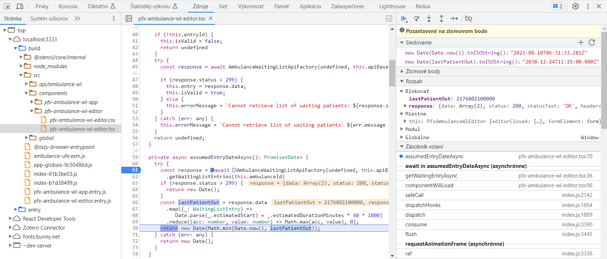
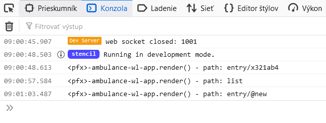

# Ladenie aplikácie

---

>info:>
Šablóna pre predvytvorený kontajner ([Detaily tu](../99.Problems-Resolutions/01.development-containers.md)):
`registry-1.docker.io/milung/wac-ufe-120`

---

V tomto kroku si ukážeme, ako ladiť aplikáciu v _Nástrojoch vývojára_.

1. Ladenie aplikácie si odskúšame v rámci pridávania nového pacienta. V súbore
   `${WAC_ROOT}/ambulance-ufe/src/components/ambulance-wl-editor/ambulance-wl-editor.tsx`
   upravte funkciu `getWaitingEntryAsync` nasledovne:

   ```tsx
   private async getWaitingEntryAsync(): Promise<WaitingListEntry> {
     if (this.entryId === "@new") {
       this.isValid = false;
       this.entry = {
        id: "@new",
        patientId: "",
        waitingSince: new Date().toISOString(), @_important_@
        estimatedDurationMinutes: 15
       };
       this.entry.estimatedStart = (await this.assumedEntryDateAsync()).toISOString(); @_add_@
       return this.entry;
     }

     ...
   }
   ```

   Do toho istého súboru pridajte novú funkciu `assumedEntryDateAsync` a ``:

    ```tsx
    private async getWaitingEntryAsync(): Promise<WaitingListEntry> {
      ...
    }

    private async assumedEntryDateAsync(): Promise<Date> {  @_add_@
      try {  @_add_@
        const response = await AmbulanceWaitingListApiFactory(undefined, this.apiBase)  @_add_@
          .getWaitingListEntries(this.ambulanceId)  @_add_@
        if (response.status > 299) {  @_add_@
          return new Date();  @_add_@
        }  @_add_@
        const lastPatientOut = response.data  @_add_@
          .map((_: WaitingListEntry) =>    @_add_@
              Date.parse(_.estimatedStart)   @_add_@
              + _.estimatedDurationMinutes * 60 * 1000   @_add_@
          )  @_add_@
          .reduce((acc: number, value: number) => Math.max(acc, value), 0);  @_add_@
        return new Date(Math.min(Date.now(), lastPatientOut));  @_add_@
      } catch (err: any) {  @_add_@
        return new Date();  @_add_@
      }  @_add_@
   }  @_add_@
   ```

   Pridajte zobrazenie predpokladaného času vstupu:

    ```tsx
      render() {
        return (
          <Host>
           ...
            <md-filled-text-field disabled
                           label="Čakáte od" 
                           value={new Date(this.entry?.waitingSince || Date.now()).toLocaleTimeString()}> @_important_@
                           <md-icon slot="leading-icon">watch_later</md-icon>
            </md-filled-text-field>
            <md-filled-text-field disabled @_add_@
                           label="Predpokladaný čas vyšetrenia"  @_add_@
                           value={new Date(this.entry?.estimatedStart || Date.now()).toLocaleTimeString()}> @_add_@
                           <md-icon slot="leading-icon">login</md-icon>  @_add_@
            </md-filled-text-field> @_add_@
           ...
      }
    ```

   Súbor uložte a pokiaľ nemáte naštartovaný vývojový server, naštartujte ho príkazom
   `npm run start` a prejdite na stránku [http://localhost:3333/ambulance-wl](http://localhost:3333/ambulance-wl). Stlačte na tlačidlo _'+'_.
   Na obrazovke vidíte upravený editor.

2. V súbore `${WAC_ROOT}/ambulance-ufe/api/ambulance-wl.openapi.yaml` sme uviedli v príklade `WaitingListEntriesExample` časy v budúcnosti, predpokladaný čas vstupu očakávame o 11:15 svetového času (UTC). Po započítaní časového pásma by to malo byť `12:15`.Všimnite si, že predpokladaný čas vstupu je ale (takmer) rovnaký ako čas príchodu pacienta.

   Pravdepodobne už viete v čom spočíva problém, ale teraz si ukážeme prístup, ako problém odhaliť pomocou ladiacich nástrojov.

   V prehliadači stlačte tlačidlo _F12_ alebo v menu otvorte položku _Ďalšie nástroje -> Nástroje pre vývojárov_ (aktuálny názov a
   klávesová skratka sa môžu medzi prehliadačmi líšiť, tu uvádzame postup pre prehliadač [Google Chrome](https://www.google.com/chrome/)).
   Otvorte záložku `Zdroje`  a v navigačnom paneli otvorte položku `localhost:3333/build/src/components/<pfx>-ambulance-wl-editor/<pfx>-ambulance-wl-editor.tsx`.
   Vyhľadajte funkciu `assumedEntryDateAsync` a kliknutím na číslo druhého riadku funkcie nastavte bod prerušenia. Implicitne predpokladáme,
   že výpočet doby vstupu musí byť nesprávny, keďže zobrazovaná hodnota nezodpovedá realite.

3. Opätovne načítajte stránku stlačením klávesy _F5_. Prehliadač zastane na bode prerušenia, ktorý sme nastavili v predchádzajúcom bode a v pravom paneli sa zobrazia informácie o stave výpočtu v tomto bode. Postupným stláčaním tlačidla _F10_ odkrokujte program až na posledný riadok bloku `try` v tejto funkcii. Všímajte si, ako sa menia hodnoty v pravom paneli v záložke _Rozsah_ (_Scope_). Pridajte nový výraz sledovania v pravom paneli - stlačte ikonu '+' v riadku _Sledovanie_ (_Watch_): a zadajte výraz `new Date(Date.now()).toISOString()` a následne výraz `new Date(lastPatientOut).toISOString()`. Tieto výrazy reprezentujú hodnoty v čase, keď sa zastavil program na bode prerušenia. Výsledok by mal vyzerať nasledovne: 

   

   Porovnajte časy uvedené v zadaných výrazoch - čas v premennej `lastPatientOut` zodpovedá nášmu očakávaniu, chyba musí byť teda inde. Po preskúmaní výrazu `Math.min(Date.Now(), lastPatientOut)` zistíme, že sme omylom použili operátor `min` namiesto operátora `max`.

   Preskúmajte aj ďalšie prvky rozhrania pre ladenie programu. Navrchu nástroja sú ovládacie prvky pre krokovanie programu. V okne si môžme prezrieť hodnoty jednotlivých premenných, viditeľných v rozsahu bodu prerušenia programu. Tiež vidíme zásobník volaní, pomocou ktorého môžme vyhodnotiť hodnoty premenných v rozsahu nadradenom súčasnému rozsahu.

4. Opravte chybu v súbore `${WAC_ROOT}/ambulance-ufe/src/components/<pfx>-ambulance-wl-editor/<pfx>-ambulance-wl-editor.tsx` - nahraďte operátor `min` operátorom `max` a znovu načítajte stránku. Odstráňte bod prerušenia z programu a overte, že vypočítaná hodnota zodpovedá očakávaniu.

5. Nástroje ladenia fungujú v prostredí, kde je k dispozícii ako kompilovaný kód, tak aj zdrojový kód. Táto podmienka nie je splnená v produkčnom nastavení. Aby bolo možné detekovať príčinu prípadných chýb, respektíve zreprodukovať situáciu, ktorá v produkčnom nasadení viedla k vzniku chyby, býva zvykom doplniť kód o záznamy vykonávania programu - tzv. logging. My si ukážeme, ako vypísať cestu, ktorú sa snaží obslúžiť komponent `<pfx>-ambulance-wl-app`. Otvorte súbor `${WAC_ROOT}/ambulance-ufe\src\components\<pfx>-ambulance-wl-app\<pfx>-ambulance-wl-app.tsx` a upravte funkciu `render()`

    ```tsx
    render() {
      console.debug("<pfx>-ambulance-wl-app.render() - path: %s", this.relativePath);
      ...
    ```
  
   Súbor uložte. Prejdite do prehliadača, v Nástrojoch vývojára zvoľte záložku _Konzola_ a v rozbaľovacom zozname predvolených úrovní zvoľte aj možnosť _Podrobnosti_ - _Debug_. Znovu načítajte stránku. Na výstupe konzoly vidíte výpis funkcie `console.debug()`.

   

   K dispozícii máme ešte funkcie `console.log()`, `console.information()`, `console.warning()`, a `console.error()`, prípadne môžme použiť niektorú z mnohých knižníc venujúcich sa vytváraniu záznamov z vykonávania programu. V každom prípade treba tieto metódy vhodne používať - príliš časté volanie týchto metód môže zbytočne zneprehľadniť výpis v konzole, použitie logov bez príslušnej informácie o stave programu môže byť neužitočné pre pochopenie príčin zlyhania, posielanie záznamov na server zasa môže zbytočne zaťažiť prenosové pásmo, ktoré má používateľ k dispozícii.

6. Archivujte Vaše zmeny do vzdialeného repozitára.

   ```ps
   git add .
   git commit -m "Predpokladaný čas vstupu"
   git push
   ```
