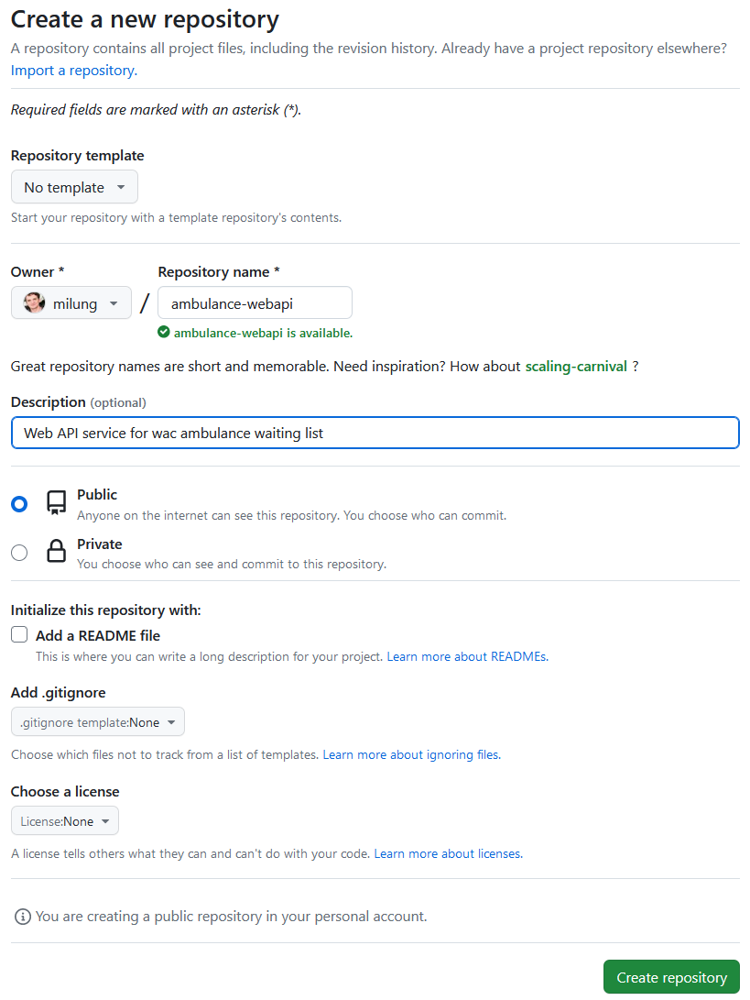

# Kostra Web API služby

---

>info:>
Šablóna pre predvytvorený kontajner ([Detaily tu](../99.Problems-Resolutions/01.development-containers.md)):
`registry-1.docker.io/milung/wac-api-010`

---

1. Prejdite na stránku [GitHub] a pod svojim účtom vytvorte nový repozitár nazvaný "ambulance-webapi". Ponechajte nastavenia prázdne.

    

    Po stlačení tlačidla _Create repository_ sa zobrazí stránka s návodom, ako si môžete vytvorený repozitár naklonovať na svoj počítač. Momentálne nás ale zaujíma cesta k Vášmu repozitáru, ktorá bude použitá ako idenitifikátor pre modul [Golang module](https://go.dev/doc/modules/developing) nášho projektu. V prehliadači skopírujte adresu k Vášmu repozitáru bez úvodnej schémy `https://`, to znamená reťazec v tvare `github.com/<github-id>/ambulance-webapi`.

2. Vytvorte priečinok `${WAC_ROOT}/ambulance-webapi` a na príkazovom riadku vykonajte v tomto adresári nasledujúci príkaz:

    ```
    go mod init github.com/<github-id>/ambulance-webapi
    ```

    Príkaz vytvorí súbor `${WAC_ROOT}/ambulance-webapi/go.mod` s obsahom v tvare:

    ```go
    module github.com/<github-id>/ambulance-webapi

    go 1.21
    ```

3. V našom projekte sa budeme pri organizácii súborov riadiť štruktúrou priečinkov popísanou v dokumente [Standard Go Project Layout](https://github.com/golang-standards/project-layout/tree/master#readme). Našim prvým krokom bude poskytnúť používateľom našej služby prístup k špecifikácii API. Zároveň týmto spôsobom vytvoríme základný funkčný skeleton našej služby.

   Vytvorte priečinok `${WAC_ROOT}/ambulance-webapi/api` a skopírujte do neho súbor `${WAC_ROOT}/ambulance-ufe/api/ambulance-wl.openapi.yaml}`.

   >info:> Neskôr špecifikáciu z projektu `ambulance-ufe` odstránime, zatiaľ ju tam ale ponechajte.

4. Vytvorte súbor `${WAC_ROOT}/ambulance-webapi/cmd/ambulance-api-service/main.go` a vložte do neho nasledujúci obsah:

   ```go
   package main

   import (
       "log"
       "os"
       "strings"
       "github.com/gin-gonic/gin"
       "github.com/<github-id>/ambulance-webapi/api" @_important_@
   )

   func main() {
       log.Printf("Server started")
       port := os.Getenv("AMBULANCE_API_PORT")
       if port == "" {
           port = "8080"
       }
       environment := os.Getenv("AMBULANCE_API_ENVIRONMENT")
       if !strings.EqualFold(environment, "production") { // case insensitive comparison
           gin.SetMode(gin.DebugMode)
       }
       engine := gin.New()
       engine.Use(gin.Recovery())
       // request routings
       engine.GET("/openapi", api.HandleOpenApi) @_important_@
       engine.Run(":" + port)
   }
   ```

   Funkcia `main` v _package_ `main` slúži ako vstupný bod programu v jazyku [Go]. V našom prípade vytvorí inštanciu HTTP servera s využitím knižnice [gin-go][gin], ktorý bude počúvať na porte, ktorý je definovaný v premennej prostredia `AMBULANCE_API_PORT`. Smerovanie požiadaviek na jednotlivé funkcie sú zabezpečené pomocou funkcie `engine.GET` . V našom prípade sme zaregistrovali funkciu `api.HandleOpenApi`, ktorá bude spracovávať požiadavky na získanie špecifikácie API. Všimnite si tiež, že referencujeme balíček `github.com/<github-id>/ambulance-webapi/api` čo je vlastne odkaz na nami vytvorený priečinok `${WAC_ROOT}/ambulance-webapi/api`.

   >info:> Odporúčame mať v  prostredí Visual Studio Code nainštalované rozšírenie [golang.go](https://marketplace.visualstudio.com/items?itemName=golang.Go). Chyby v zozname importovaných balíčkov vyriešime v nasledujúcom kroku.

5. Vytvorte súbor `${WAC_ROOT}/ambulance-webapi/api/openapi.go` s nasledujúcim obsahom:

    ```go
    package api

    import (
        _ "embed"
        "net/http"

        "github.com/gin-gonic/gin"
    )

    //go:embed ambulance-wl.openapi.yaml @_important_@
    var openapiSpec []byte

    func HandleOpenApi(ctx *gin.Context) {
        ctx.Data(http.StatusOK, "application/yaml", openapiSpec)
    }
    ```

    V tomto súbore sme pridali funkcionalitu pre náš balíček - _package_ - `github.com/<github-id>/ambulance-webapi/api`. Využili sme funkcionalitu knižnice [_embed_](https://pkg.go.dev/embed), ktorá zabezpečí, že súbor `ambulance-wl.openapi.yaml` bude pribalený k binárnemu súboru nášho programu.

6. V predchádzajúcich súboroch sme ponechali chybové hlásenia informujúce, že daný _package_ nie je dostupný. Všetky závislosti nášho modulu musia byť uvedené v súbore `${WAC_ROOT}/ambulance-webapi/go.mod` a načítané v lokálnej vyrovnávacej pamäti. Aby sme nemuseli jednotlivé závislosti pridávať ručne, využijeme príkaz `go mod tidy`, ktorý ich pridá automaticky. Uložte zmeny a v príkazovom riadku v priečinku `${WAC_ROOT}/ambulance-webapi` vykonajte nasledujúci príkaz:

    ```ps
    go mod tidy
    ```

    Následne vykonajte príkaz, ktorý zkompiluje náš program a odovzdá riadenie jeho vstupnému bodu  - funkcii `main` v _package_ `main`:

    ```ps
    go run ./cmd/ambulance-api-service
    ```

    Otvorte nový terminál a v príkazovom riadku zadajte príkaz:

    ```ps
    curl http://localhost:8080/openapi
    ```

    Odozvou bude výpis našej [OpenAPI] špecifikácie.

7. Vytvorte súbor `${WAC_ROOT}/ambulance-webapi/.gitignore` s nasledujúcim obsahom:

    ```text
    *.exe
    *.exe~
    ./ambulance-api-service
    ```

    Inicializujte a archivujte git repozitár:

    ```sh
    git init
    git add .
    git commit -m "Initial commit"
    git branch -M main
    git remote add origin https://github.com/<github-id>/ambulance-webapi.git
    git push -u origin main
    ```
