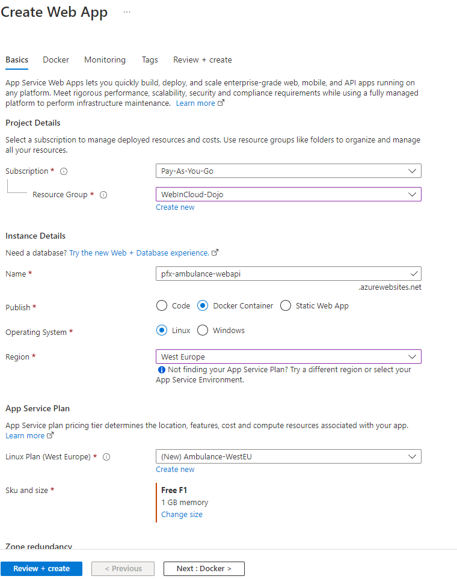

## (Nepovinné) Manuálne nasadenie WEB API na azure a integrácia s FE

V "klient" časti cvičení sme si ukázali, ako sa dá nasadiť klient aplikácia na Azure ako web aplikácia (použitím docker obrazu):
[Manuálne nasadenie aplikácie v Microsoft Azure](/v2/01.Web-Components/dojo/004-docker-manual-azure-deployment.md).

Rovnakým spôsobom si nasadíme aj webapi a potom ho prepojíme s klientom.

1. Najprv overíme, či nasadený klient stále funguje. Prejdite na stránku azure portálu ([https://portal.azure.com](https://portal.azure.com)), skontrolujte, či máte vybranú správnu subscription a otvorte si *Resource group* (*WebInCloud-Dojo*), ktorú sme vytvorili pri nasadení klienta. V zozname zdrojov danej grupy vyberte `ambulance-<pfx>` zdroj a kliknite na URL, kde je aplikácia dostupná.

   >warning:> Do URL cesty treba pridať `/ambulance-wl`, aby ste boli presmerovaný na správny web komponent.

   

   Ak vidíte v konzole chybu pri prístupe na `http://localhost:8080/api/waiting-list/bobulova/entry`, je všetko v poriadku. Klient sa snaží pristúpiť na webapi s adresou nakonfigurovanou v súbore `index.html`.
  
   > Ak chcete overiť, ktorú verziu docker obrazu máte nasadenú, choďte na Azure portál ku prostriedkom klient aplikácie a kliknite na `Deployment Center` na pravej strane stránky a potom na záložku `Logs`.

### Nasadenie Webapi na azure cloud

2. Rovnakým spôsobom nasadíme na azure portál aj webapi kontajner.  
Otvorte skupinu prostriedkov (*Resource Group*) `WebInCloud-Dojo` a stlačte tlačítko **plus** - a pridajte nový *resource* typu `Web App`.

   * Vyberte *Resource Group* `WebInCloud-Dojo`.

   * V rámci sekcie *Instance Details*:
     * Zadajte meno aplikácie, napr. `<pfx>-ambulance-webapi`. Toto meno bude použité ako názov servera, na ktorom bude vaša aplikácia vystavená, preto musí byť názov jedinečný.
     * V riadku *Publish* vyberte *Docker Container*
     * Ako *Operating System* nastavte *Linux*.
     * V riadku *Region* zvoľte `West Europe` (dátové centrum v Holandsku).
   * Zvoľte ten istý aplikačný plán ako pre prvú webapi. Ak nie je k dispozícii, vytvorte nový a nastavte cenovú úroveň (*Pricing Tier*) na *Free F1*.

   

   Stlačte tlačidlo *Next* a vyplňte údaje pre docker:
   * *Source* na hodnotu `Container Registry`
   * *Container Type* na hodnotu `Single Container`
   * *Registry Source* na hodnotu `Docker Hub`
   * *Repository Access* na hodnotu `Public`
   * *Full Image Name and Tag* na hodnotu `<dockerId>/ambulance-webapi:latest`

   Nastavte *Continuous deployment* na hodnotu `On` a prekopírujte si hodnotu z `Webhook URL`.

   Prejdite na stránku **Docker Hub** do svojho repozitára `ambulance-webapi`, kliknite na záložku `Webhooks` a vytvorte nový webhook s menom `azure webapp` a do hodnoty `Webhook URL` vložte zapamätanú hodnotu.

   Stlačte tlačidlo *Review + create*, skontrolujte nastavenia webovej aplikácie a potvrďte voľbou *Create*.

   Po chvíli sa v portáli vo vašich notifikáciách zobrazí nová správa *Deployment succeeded*. Zvoľte voľbu *Pin to Dashboard* a potom  *Go to Resource*. V prehľade webovej aplikácie (*Overview*) vidíte odkaz - *URL*- na novú aplikáciu. Otvorte tento odkaz v novom okne.

   Do URL v prehliadači pridajte cestu `/api`. Po odoslaní by sa v okne mala ukázať správa

   ```text
   Hello World!
   ```

### Azure - Integrácia Web klienta s Web api

3. Súbor `...\ambulance-list\src\index.html` obsahuje nakonfigurovaný odkaz na konkrétnu inštanciu nášho API a na konkrétnu inštanciu ambulancie. Tento súbor síce nie je použitý v prípade integrácie formou micro Front-End, bolo by ale vhodné, aby sme našu aplikáciu mohli aj samostatne zaintegrovať. Tu si ukážeme spôsob, ako toho dosiahnuť pomocou parametrizácie štartu kontajnera našej aplikácie pomocou nástroja [*sed*](https://www.gnu.org/software/sed/manual/sed.html).

   Otvorte súbor `.../ambulance-list/Dockerfile` a upravte druhý stupeň kompilácie obrazu do tvaru

   ```docker
   ...

   #### NGINX FOR Single Page Application ####
   FROM steebchen/nginx-spa
   
   RUN apk add sed                  # <== doinštalovaný nástroj sed
   
   COPY --from=build /build/www /app
   
   EXPOSE 80
   
   ENV WEBAPI_URL=/wl-app               # <== definícia podporovaných
   ENV AMBULANCE_ID=gp                  #     premenných prostredia
   ENV BASE_PATH=/<pfx>-ambulance-wl    #     s nastavením štandardných hodnôt
   
   # VVV  použitie sed pri štarte kontajnera na editáciu index.html VVVV
   CMD sed -E "s|api-uri=\".*\"|api-uri=\"${WEBAPI_URL}\"|" -i /app/index.html \
   && sed -E "s|ambulance=\".*\"|ambulance=\"${AMBULANCE_ID}\"|" -i /app/index.html \
   && sed -E "s|base-path=\".*\"|base-path=\"${BASE_PATH}\"|" -i /app/index.html \
   && nginx
   ```

   Naše úpravy zahŕňajú inštaláciu nástroja `sed` a jeho použitie pred samotným štartom servera [nginx](https://www.nginx.com), ako aj [špecifikáciu premenných prostredia](https://docs.docker.com/engine/reference/builder/#env), ktoré môžeme v rámci  softvérového kontajneru zmeniť parametrizáciou príkazu pre štartovanie kontajnera.

   Tieto zmeny znovu archivujeme. Náša kontinuálna integrácia vytvorí novú verziu  obrazu softvérového kontajnera a uloží ju do Docker Hub registra.

4. Prejdite na [portál platformy Azure](https://portal.azure.com/) a otvorte *App Service* vašej frontend aplikácie. Prejdite do položky *Configuration*. V sekcii [*Application Settings*](https://docs.microsoft.com/sk-sk/azure/app-service/configure-common?tabs=portal) zvoľte prvok *+ New application setting* a postupne zadajte nasledujúce hodnoty:

   * *Name*: `WEBAPI_URL`, *Value*: `https://<pfx>-ambulance-webapi.azurewebsites.net-api`  (adresa *App Service* vašeho WEB API )
   * *Name*: `AMBULANCE_ID`, *Value*: `bobulova` (alebo iný identifikátor ambulancie vo vašej databáze)
   * *Name*: `BASE_PATH`, *Value*: `/`

   Uložte zmeny stlačením na tlačidlo *Save*. Po vyplnení uvedených hodnôt by mala vaša konfigurácia vyzerať podobne, ako na obrázku nižšie:

   

   Prejdite na stránku vašej frontend aplikácie. Zobrazí sa prázdny zoznam pacientov s tlačidlom "+" na pridanie pacienta. V konzole je chyba:

   ```text
   TypeError: this.waitingPatients.map is not a function
   ```

   Chyba nastane vtedy, keď webapi nemá v databáze ambulanciu. V našom prípade nemáme vôbec k dispozícii MongoDB kontajner...

   **To zatiaľ nemáme vyriešené.**

   ****
