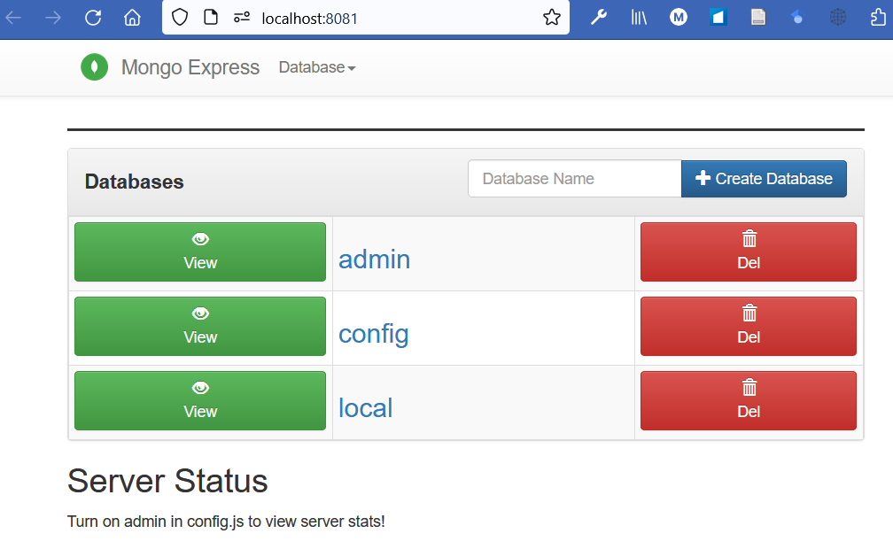

# Inštalácia a nastavenie MongoDB databázy

---

>info:>
Šablóna pre predvytvorený kontajner ([Detaily tu](../99.Problems-Resolutions/01.development-containers.md)):
`registry-1.docker.io/milung/wac-api-030`

---

Údaje, ktoré bude naše WEB API spravovať potrebuje mať niekde trvalo uložené. V tomto cvičení si ukážeme ako ich ukladať v [dokumentovej databáze](https://en.wikipedia.org/wiki/Document-oriented_database), konkrétne v [MongoDB]. Súčasne budeme používať aplikáciu [MongoExpress], ktorá nám umožňuje spravovať pripojenú [MongoDB] z používateľského rozhrania. Databázu zabezpečíme heslom, čo zodpovedá jej reálnemu použitiu.

Okrem dokumentovej databázy sme mohli zvoliť [relačnú databázu](https://en.wikipedia.org/wiki/Relational_database), alebo [grafovo orientovanú databázu](https://en.wikipedia.org/wiki/Graph_database), prípadne [databázu orientovanú na prácu s časovými dátami](https://en.wikipedia.org/wiki/Time_series_database). Výber databázy závisí od konkrétneho použitia a požiadaviek na aplikáciu. V našom prípade sme zvolili dokumentovú databázu, pretože nám vyhovuje jej jednoduchosť a flexibilita.

## Lokálne použitie MongoDB

Pri použití MongoDB máme niekoľko možností. Môžme napríklad aplikáciu nainštalovať priamo na lokálny počítač alebo použiť kontajnerovú technológiu. Prípadne môžeme MongoDB nasadiť do nášho lokálneho klastra a pristúpiť k databáze prostredníctvom príkazu `kubectl proxy-forward`. Predtým si ale ukážeme ako naštartovať niekoľko kontajnerizovaných aplikácií pre lokálny vývoj s využitím nástroja [Docker Compose]. Našim cieľom je pripraviť konfiguráciu, ktorú potom môžeme jednoduchým spôsobom naštartovať v lokálnom prostredí, v ktorom je k dispozícii subsystém docker.

1. Vytvorte súbor `${WAC_ROOT}/ambulance-webapi/deployments/docker-compose/compose.yaml` s nasledujúcim obsahom:

    ```yaml
    services: 
        mongo_db:
            image: mongo:7.0-rc
            container_name: mongo_db @_important_@
            restart: always
            ports:
            - 27017:27017
            volumes:
            - db_data:/data/db @_important_@
            environment:
                MONGO_INITDB_ROOT_USERNAME: ${AMBULANCE_API_MONGODB_USERNAME}
                MONGO_INITDB_ROOT_PASSWORD: ${AMBULANCE_API_MONGODB_PASSWORD} 
        mongo_express:
            image: mongo-express
            container_name: mongo_express
            restart: always
            ports:
            - 8081:8081
            environment:
                ME_CONFIG_MONGODB_ADMINUSERNAME: ${AMBULANCE_API_MONGODB_USERNAME}
                ME_CONFIG_MONGODB_ADMINPASSWORD: ${AMBULANCE_API_MONGODB_PASSWORD}
                ME_CONFIG_MONGODB_SERVER: mongo_db
                ME_CONFIG_BASICAUTH_USERNAME: mexpress
                ME_CONFIG_BASICAUTH_PASSWORD: mexpress
            links:
            - mongo_db
    volumes:
        db_data: {} @_important_@
    ```

    V tomto predpise uvádzame, že chceme naštartovať dve služby - `mongo-db` a `mongo-express`. Služba [MongoExpress] nám bude poskytovať používateľské prostredie pomocou ktorého si overíme funkcionalitu našej aplikácie. V sekcii `volumes` sme uviedli názov trvalého úložiska tzv. [_persistent docker volume_](https://docs.docker.com/storage/volumes/), v ktorom budú uložené údaje našej databázy. Prístupové údaje k databáze budú uložené v premenných prostredia.

    Vytvorte súbor `${WAC_ROOT}/ambulance-webapi/deployments/docker-compose/.env` s nasledujúcim obsahom:

    ```env
    AMBULANCE_API_MONGODB_USERNAME=root
    AMBULANCE_API_MONGODB_PASSWORD=neUhaDnes
    ```

    V priečinku `${WAC_ROOT}/ambulance-webapi` vykonajte nasledujúci príkaz:

    ```ps
    docker compose --file ./deployments/docker-compose/compose.yaml up
    ```

    Následne v prehliadači prejdite na stránku [http://localhost:8081](http://localhost:8081). Prihláste sa pomocou údajov špecifikovaných v premených prostredia mongo express v súbore `compose.yaml`, `ME_CONFIG_BASICAUTH_USERNAME` a `ME_CONFIG_BASICAUTH_USERNAME`. Mali by ste vidieť používateľské rozhranie [MongoExpress].

    >info:> V prípade, že sa vám nepodarí pripojiť na používateľské rozhranie MongoExpress a dostanete v prehliadači chybové hlásenie `Unauthorized`, skúste vyčistiť `Basic Authentication Details` v prehliadači.

    

    >info:> [Docker Compose] umožňuje vytvárať aj komplikovanejšie konfigurácie poskytujúce rôzne ďalšie parametre prostredia. V našom prípade sme sa rozhodli použiť jednoduchú konfiguráciu, ktorá nám postačuje na lokálny vývoj a zároveň je dostatočná pre zachytenie hlavnej myšlienky pri používaní docker compose.

2. V používateľskom rozhraní MongoExpress vytvorte novú databázu s názvom `<pfx>-ambulance-wl`. Do poľa _Database Name_ zadajte text `<pfx>-ambulance-wl` a stlačte tlačidlo _+ Create Database_. Následne stlačte na tlačidlo _View_ vedľa názvu `<pfx>-ambulance-wl`. Do poľa _Collection name_ zadajte hodnotu `ambulance` a stlačte tlačidlo `Create collection`. Tým máme našu databázu pripravenú pre ďalší vývoj.

3. Upravíme spôsob naštartovania našej aplikácie. Otvorte súbor `${WAC_ROOT}\ambulance-webapi\scripts\run.ps1` a upravte ho:

    ```ps
    ...
    $env:AMBULANCE_API_PORT="8080"
    $env:AMBULANCE_API_MONGODB_USERNAME="root"    @_add_@
    $env:AMBULANCE_API_MONGODB_PASSWORD="neUhaDnes"    @_add_@
        @_add_@
    function mongo {    @_add_@
        docker compose --file ${ProjectRoot}/deployments/docker-compose/compose.yaml $args    @_add_@
    }    @_add_@

    switch ($command) {
        "openapi" {
            docker run --rm -ti  -v ${ProjectRoot}:/local openapitools/openapi-generator-cli generate -c /local/scripts/generator-cfg.yaml 
        }
        "start" {
            try {    @_add_@
                mongo up --detach    @_add_@
                go run ${ProjectRoot}/cmd/ambulance-api-service
            } finally {    @_add_@
                mongo down    @_add_@
            }    @_add_@
        }
        "mongo" {    @_add_@
        mongo up    @_add_@
        }    @_add_@
        default {
            throw "Unknown command: $command"
        }
    }
    ```

    Príkaz `scripts/run.ps1 start` teraz štartuje našu aplikáciu a databázu. Príkaz `scripts/run.ps1 mongo` štartuje len databázu.

4. Zastavte bežiaci proces, v ktorom beží mongo a zavolajte príkaz

    ```ps
    docker compose --file ./deployments/docker-compose/compose.yaml down
    ```

    Tento príkaz spraví presný opak variantu up. Všetky kontajnery, ktoré boli vytvorené príkazom `up` budú zastavené a odstránené. Všetky sieťové rozhrania, ktoré boli vytvorené príkazom `up` budú odstránené.

5. Zmeny uložte a archivujte ich do git repozitára. V priečinku `${WAC_ROOT}/ambulance-webapi` vykonajte príkazy:

    ```ps
    git add .
    git commit -m "Add mongodb compose file"
    git push
    ```
