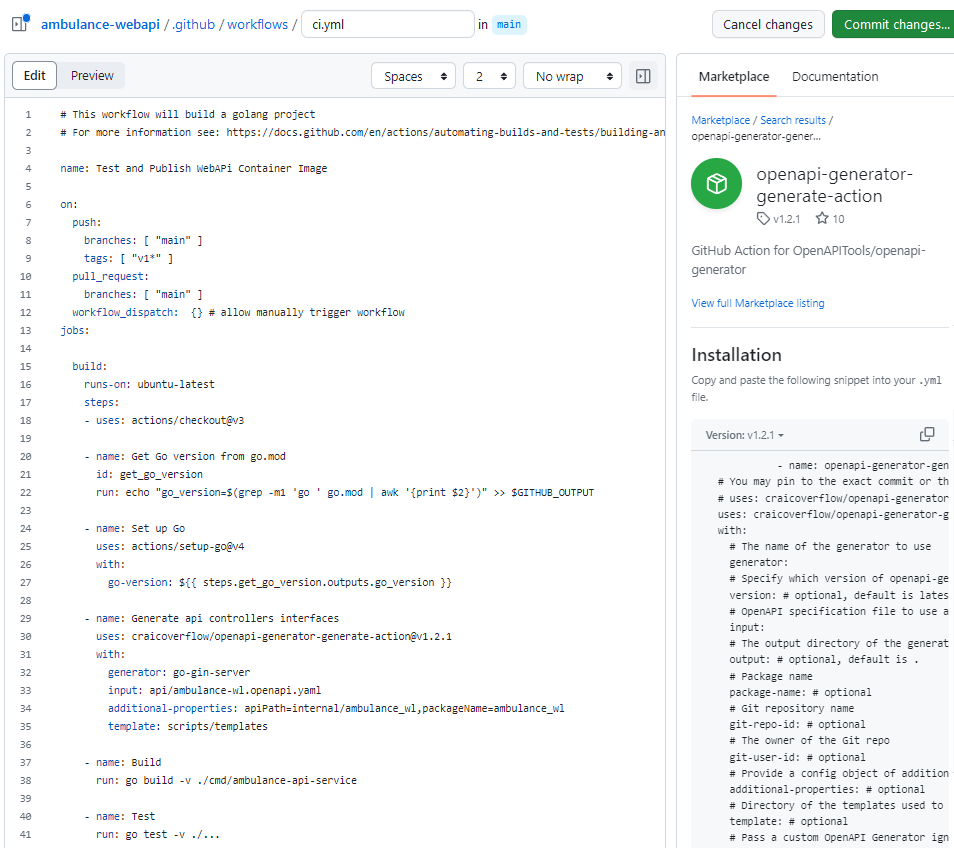
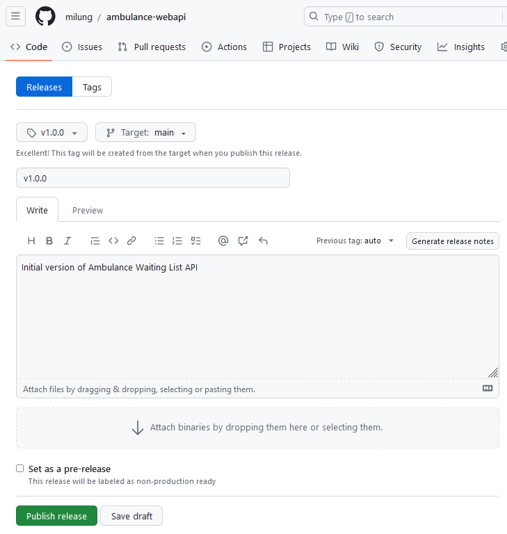

# Kontajnerizovanie aplikácie a priebežná integrácia

---

>info:>
Šablóna pre predvytvorený kontajner ([Detaily tu](../99.Problems-Resolutions/01.development-containers.md)):
`registry-1.docker.io/milung/wac-api-060`

---

Podarilo sa nám vytvoriť funkčné webové API. Pre jeho nasadenie ešte potrebujeme vytvoriť softvérový kontajner a zabezpečiť priebežnú integráciu kódu.

## Vytvorenie obrazu (image) softvérového kontajnera pre službu webového api

Jednou z hlavných výhod kontajnerizovanej aplikácie je jej jednoduché a jednotné nasadenie do rôznych prostredí. Podobne ako v prípade web komponentu aj teraz použijeme viac-fázové vytvorenie obrazu.

1. Vytvorte súbor  `${WAC_ROOT}/ambulance-webapi/build/docker/Dockerfile` a vložte do neho nasledujúci obsah:

   ```dockerfile
   # use specific versions of images
   FROM openapitools/openapi-generator-cli:v7.0.1 as api
   
   WORKDIR /local

   COPY api api
   COPY scripts scripts
   COPY .openapi-generator-ignore .openapi-generator-ignore

   RUN docker-entrypoint.sh generate -c /local/scripts/generator-cfg.yaml

   # not used normally but redefine entrypoint for the case of checking this stage results
   ENTRYPOINT ["bash"]

   ############################################
   ```

   V prvej fáze použijeme obraz [openapitools/openapi-generator-cli](https://hub.docker.com/r/openapitools/openapi-generator-cli) k tomu, aby sme vygenerovali zdrojové súbory pre webové api. Využívame k tomu našu konfiguráciu a šablóny, ktoré sme vytvorili v predchádzajúcich kapitolách. Výsledkom je priečinok `/local/internal/ambulance_wl`, ktorý obsahuje zdrojové súbory pre webové api.

2. Ďalej pridajte do súboru `${WAC_ROOT}/ambulance-webapi/build/docker/Dockerfile` inštrukcie pre druhú fázu vytvorenia obrazu:

   ```dockerfile
   # use specific versions of images if you want
   FROM openapitools/openapi-generator-cli:v7.0.1 as api
   ...
   ############################################
   FROM golang:latest AS build    @_add_@
      @_add_@
   WORKDIR /app   @_add_@
      @_add_@
   # download dependencies - low frequency of changes   @_add_@
   COPY go.mod go.sum ./   @_add_@
   RUN go mod download   @_add_@
      @_add_@
   # copy sources - higher frequency of changes   @_add_@
   COPY internal/ internal/   @_add_@
   COPY cmd/ cmd/   @_add_@
   COPY --from=api /local/ ./   @_add_@
      @_add_@
   # ensure tests are passing   @_add_@
   RUN go test ./...   @_add_@
      @_add_@
   # create executable - ambulance-webapi-srv   @_add_@
   # we want to use scratch image so setting    @_add_@
   # the build options in the way that will link all dependencies statically   @_add_@
   RUN CGO_ENABLED=0 GOOS=linux \   @_add_@
       go build \    @_add_@
         -ldflags="-w -s" \   @_add_@
         -installsuffix 'static' \   @_add_@
         -o ./ambulance-webapi-srv ./cmd/ambulance-api-service   @_add_@
       @_add_@
   ############################################   @_add_@
   ```

   V tejto časti využívame obraz [golang:latest](https://hub.docker.com/_/golang) na to, aby sme skompilovali zdrojové súbory webového api. Všimnite si, že sme najprv použili len súbor `go.mod` a `go.sum` k získaniu knižníc, od ktorých je náš kód závislý. Tieto súbory sa zvyknú meniť len zriedka, preto je relatívne veľká šanca, že pri lokálnom generovaní využijeme cache systému docker namiesto toho, aby sme túto vrstvu museli znovu generovať. Ďalej sme skopírovali zdrojové súbory, vrátane súborov generovaných v predchádzajúcej fáze a vykonali sme testy. Až potom sme skompilovali zdrojové súbory do spustiteľného súboru. Pri kompilácii sme pritom použili nastavenia, ktoré vytvoria spustiteľný súbor, ktorý neobsahuje žiadne závislosti na dynamických knižniciach, ktoré by bolo potrebné nainštalovať do cieľového kontajnera. Výsledkom je súbor `ambulance-webapi-srv`, ktorý použijeme v tretej fáze.

3. Do súboru `${WAC_ROOT}/ambulance-webapi/build/docker/Dockerfile` inštrukcie pre tretiu fázu

   ```dockerfile
   ...
   ############################################
   FROM golang:latest AS build
   ...
   ############################################
   FROM scratch        @_add_@
           @_add_@
   # see https://github.com/opencontainers/image-spec/blob/main/annotations.md for details     @_add_@
   LABEL org.opencontainers.image.authors="Your Name"      @_add_@
   LABEL org.opencontainers.image.title="Ambulance Waiting List WebAPI Service"        @_add_@
   LABEL org.opencontainers.image.description="WEBAPI for managing entries in ambulances` waiting list"        @_add_@
           @_add_@
   # list all variables and their default values for clarity       @_add_@
   ENV AMBULANCE_API_ENVIRONMENT=production        @_add_@
   ENV AMBULANCE_API_PORT=8080	        @_add_@
   ENV AMBULANCE_API_MONGODB_HOST=mongo        @_add_@
   ENV AMBULANCE_API_MONGODB_PORT=27017        @_add_@
   ENV AMBULANCE_API_MONGODB_DATABASE=pfx-ambulance        @_add_@
   ENV AMBULANCE_API_MONGODB_COLLECTION=ambulance      @_add_@
   ENV AMBULANCE_API_MONGODB_USERNAME=root     @_add_@
   ENV AMBULANCE_API_MONGODB_PASSWORD=     @_add_@
   ENV AMBULANCE_API_MONGODB_TIMEOUT_SECONDS=5     @_add_@
           @_add_@
   COPY --from=build /app/ambulance-webapi-srv ./      @_add_@
           @_add_@
   # Actual port may be changed during runtime     @_add_@
   # Default using for the simple case scenario        @_add_@
   EXPOSE 8080     @_add_@
   ENTRYPOINT ["./ambulance-webapi-srv"]       @_add_@
   ```

   Posledná fáza je založená na obraze [scratch](https://hub.docker.com/_/scratch), čo je obraz, ktorý neobsahuje žiadnu pridanú vrstvu. Keďže náš kontajner bude obsahovať iba jeden spustiteľný súbor, tak je to ideálny kandidát. Okrem nastavenia premenných prostredia, ktoré budú použité pri spustení kontajnera a pridania značiek opisujúcich obsah obrazu, obsahuje táto fáza len jednu vrstvu vytvorenú príkazom `COPY --from=build /app/ambulance-webapi-srv ./`.

4. Vytvorte súbor `${WAC_ROOT}/ambulance-webapi/.dockerignore` a vložte do neho nasledujúci obsah:

   ```text
   internal/ambulance_wl/api_*    @_important_@
   internal/ambulance_wl/model_*     @_important_@
   internal/ambulance_wl/routers.go    @_important_@
   build/
   deployments/
   ```

    Tento súbor definuje, ktoré súbory a priečinky sa majú ignorovať pri vytváraní obrazu kontajnera. V našom prípade to sú najmä súbory, ktoré budú vygenerované v prvej fáze vytvárania obrazu.

5. Otvorte súbor `${WAC_ROOT}/ambulance-webapi/scripts/run.ps1` a pridajte príkaz na vytvorenie obrazu kontajnera:

   ```shell
   ...
   switch ($command) {
      ...
      "mongo" {
         mongo up
      }
      "docker" {    @_add_@
          docker build -t <docker-id>/ambulance-wl-webapi:local-build -f ${ProjectRoot}/build/docker/Dockerfile .    @_add_@
      }    @_add_@
      default {
      ...
   ```

   Upravte text `<docker-id>` tak, aby obsahoval Vaše user id na stránke [Docker Hub] a uložte zmeny. Naštartujte subsystém docker a na príkazovom riadku v priečinku `${WAC_ROOT}/ambulance-webapi` vykonajte príkaz:

   ```shell
   .\scripts\run.ps1 docker
   ```

   Po úspešnom dokončení príkazu budete mať k dispozícii nový obraz softvérového kontajnera s názvom `<docker-id>/ambulance-wl-webapi:local-build`. Skontrolujte to pomocou príkazu:

   ```shell
   docker inspect <docker-id>/ambulance-wl-webapi:local-build
   ```

   Obraz môžete zverejniť na stránke [Docker Hub] pomocou príkazu:

   ```shell
   docker login
   docker push <docker-id>/ambulance-wl-webapi:local-build
   ```

6. Archivujte zmeny príkazmi v priečinku `${WAC_ROOT}/ambulance-webapi`

   ```shell
   git add .
   git commit -m "Added dockerization"
   git push
   ```

## Priebežná integrácia

Priebežná integrácia je proces, ktorý zabezpečuje automatické spustenie testov a vygenerovanie výsledných artefaktov (balíčky knižníc, obraz softvérového kontajnera a pod.), v niektorých prípadoch aj automatické nasadenie aplikácie do cieľového prostredia. Podobne ako v prípade web komponentu aj tu využijeme službu [GitHub Actions](https://github.com/features/actions). Postačujúcim krokom by bolo zabezpečiť vytvorenie softvérového kontajnera, ktorý už v sebe obsahuje aj vykonanie testov. Pre názornosť ale vytvoríme predpis, ktorý vykoná generovanie kostry webového api, vykoná testy a až následne vytvorí softvérový kontajner. Tentokrát si ukážeme, ako vytvoriť predpis pre priebežnú integráciu pomocou grafického editora na stránke [GitHub].

1. Prejdite na stránku [GitHub] a otvorte repozitár `ambulance-webapi`. V hornej lište vyberte záložku `Actions`. Na stránke _Get started with GitHub Actions_ zvoľte tlačidlo _Configure_ v položke _GO_ v zozname odporúčaných predpisov.

2. Na nasledujúcej stránke sa zobrazí editor predpisu pre priebežnú integráciu. V hornej časti zmeňte meno z `go.yaml` na `ci.yaml`.  Upravte názov a spúšťač predpisu nasledovne:

   ```yaml
   ...
   name: Go @_remove_@
   # WEBAPI docker 
   name: Test and Publish WebAPi Container Image @_add_@
   
   on:
     push:
       branches: [ "main" ]
       tags: [ "v1*" ] @_add_@
     pull_request:
       branches: [ "main" ]
     workflow_dispatch:  {} # allow manually trigger workflow @_add_@
     ...      
   ```

3. Pre automatické prebratie verzie jazyka `go` zo súboru `go.mod` použijeme nasledovné 2 kroky:

   ```yaml
   ...
   build:
      runs-on: ubuntu-latest
      steps:
      - name: Checkout repository
         uses: actions/checkout@v3

      - name: Get Go version from go.mod    @_add_@
         id: get_go_version    @_add_@
         run: echo "go_version=$(grep -m1 'go ' go.mod | awk '{print $2}')" >> $GITHUB_OUTPUT    @_add_@
         
      - name: Set up Go
         uses: actions/setup-go@v4
         with:
           go-version: 1.21 @_remove_@
           go-version: ${{ steps.get_go_version.outputs.go_version }}    @_add_@
   ...      
   ```

4. Teraz upravte krok `Build`:

   ```yaml
   ...
   jobs:
     ...
     - name: Build
         run: go build -v ./... @_remove_@
         # build api service 
         run: go build -v ./cmd/ambulance-api-service @_add_@
     ...      
   ```

5. V pravej časti v záložke _Marketplace_ zadajte do vyhľadávania text _openapi_ a zo zoznamu vyberte položku _openapi-generator-generate-action_. V nasledujúcom zobrazení zkopírujte kód z časti _Installation_ a vložte ho do Vášho kódu pred blok `- name: Build`. Upravte vložený kód do nasledujúceho tvaru:

   ```yaml
   ...
       - name: Set up Go
         uses: actions/setup-go@v4
         with:
           go-version: ${{ steps.get_go_version.outputs.go_version }}

       - name: Generate api controllers interfaces    @_add_@
         uses: craicoverflow/openapi-generator-generate-action@v1.2.1    @_add_@
         with:    @_add_@
           # version: 7.0.0-beta - at time of writing this text only prerelease was available    @_add_@
           generator: go-gin-server            @_add_@
           input: api/ambulance-wl.openapi.yaml    @_add_@
           additional-properties: apiPath=internal/ambulance_wl,packageName=ambulance_wl    @_add_@
           template: scripts/templates    @_add_@

       - name: Build
   ...

   ```

   

6. Prejdite späť do vyhľadávania v _Marketplace_ (stlačte na odkaz _Marketplace_ v texte _Marketplace/Search results_ ) a vyhľadajte akcie podľa slova _docker_. Vyberte zo zoznamu položku _Docker Setup QUEMU_ a skopírujte kód tejto akcie na koniec Vášho predpisu. Upravte ho do tvaru:

   ```yaml
   ...
       - name: Test
         run: go test -v ./...
   
       - name: Docker Setup QEMU  @_add_@
         uses: docker/setup-qemu-action@v2.2.0  @_add_@
   ```

   Vráťte sa do výsledkov vyhľadávania (stlačte na odkaz _Search results_)  a obdobným postupom skopírujte kód pre akcie _Docker Setup Buildx_, _Docker metadata action_, _Docker Login_ a nakoniec _Build and push Docker Images_. Upravte výsledný kód do tvaru:

   ```yaml
   ...
       - name: Docker Setup QEMU
         uses: docker/setup-qemu-action@v2.2.0 

       - name: Docker Setup Buildx     @_add_@
         uses: docker/setup-buildx-action@v2.9.1      @_add_@
         @_add_@
       - name: Docker Metadata action     @_add_@
         id: meta    @_add_@
         uses: docker/metadata-action@v4.6.0    @_add_@
         with:    @_add_@
           images: <docker-id>/ambulance-wl-webapi     @_add_@
           tags: |      @_add_@
               type=schedule     @_add_@
               type=ref,event=branch      @_add_@
               type=ref,event=branch,suffix={{date '.YYYYMMDD.HHmm'}}      @_add_@
               type=ref,event=tag      @_add_@
               type=semver,pattern={{version}}     @_add_@
               type=semver,pattern={{major}}.{{minor}}      @_add_@
               type=semver,pattern={{major}}          @_add_@
               type=raw,value=latest,enable={{is_default_branch}}    @_add_@
         @_add_@
       - name: Docker Login   @_add_@
         uses: docker/login-action@v2.2.0   @_add_@
         with:   @_add_@
            username: ${{ secrets.DOCKERHUB_USERNAME }}   @_add_@
            password: ${{ secrets.DOCKERHUB_TOKEN }}   @_add_@
            @_add_@
       - name: Build and push Docker images     @_add_@
         uses: docker/build-push-action@v4.1.1     @_add_@
         with:    @_add_@
           context: .      @_add_@
           file: ./build/docker/Dockerfile      @_add_@
           labels: ${{ steps.meta.outputs.labels }}            @_add_@
           platforms: linux/amd64,linux/arm64/v8      @_add_@
           push: true      @_add_@
           tags: ${{ steps.meta.outputs.tags }}       @_add_@
   ```

   >info:> Väčšina uvedených krokov s kopírovaním kódu zo záložky _Marketplace_ by sa dala preskočiť a mohli by sme rovno pracovať so súborom `${WAC_ROOT}/ambulance-webapi/.github/workflows/ci.yml`. Zámerom ale bolo ukázať, akým spôsobom pracovať s grafickým editorom predpisov na stránke [GitHub], kde okrem získania aktuálnych šablón predpisu možete zároveň získať aj prehľad o množstve znovupoužiteľných akcií vytvorených pre automatizáciu najrozličnejších úloh v procese vývoja softvérových systémov.

7. Stlačte na tlačidlo _Commit changes ..._ v hornej časti stránky, zvoľte _Commit directly to main_ a opäť stlačte tlačidlo _Commit changes_. V repozitári prejdite do záložky _Actions_ a skontrolujte, že sa spustil predpis _Test and Publish WebAPi Container Image_. V tejto chvíli bude beh neúspešný, konkrétne krok zverejnenia obrazu v registry Docker Hub a to z dôvodu nedostupnosti autorizačných práv.

8. Pre úspešný beh priebežnej integrácie je nutné ešte nastaviť premenné `secrets.DOCKERHUB_USERNAME` a `secrets.DOCKERHUB_TOKEN`. Prejdite na stránku [Docker Hub], rozbaľte menu označené názvom Vášho účtu a zvoľte _Account Settings_. V záložke _Security_ nájdete tlačidlo _New Access Token_.

   

   Vytvorte nový token s názvom `ambulance-webapi CI` a priraďte mu práva `Read, Write, Delete` a stlačte tlačidlo _Generate_. Vygenerovaný token si skopírujte do schránky.

   Teraz prejdite do Vášho repozitára `<github-id>/ambulance-webapi` na stránke [GitHub]. V hornej lište zvoľte záložku _Settings_ a následne na bočnom paneli zvoľte položku _Secrets and Variables_ -> _Actions_.
   Na tejto stránke stlačte na tlačidlo _New repository secret_ a vytvorte novú premennú s názvom `DOCKERHUB_TOKEN` a ako hodnotu vložte zo schránky skopírovaný token. Opäť stlačte na tlačidlo _New repository secret_ a vytvorte premennú s názvom `DOCKERHUB_USERNAME` a ako hodnotu vložte svoje používateľské meno na Docker Hub.

   

   Vytvorené premenné sú k dispozícii pre ďalší beh našej priebežnej integrácie.

9. V repozitári prejdite do záložky _Code_, stlačte na odkaz _0 tags_, a následne na tlačidlo _Create new release_. Zadajte do poľa _Choose tag_ hodnotu `v1.0.0`, do poľa _Release Title_ zadajte text `v1.0.0` a do poľa _Describe this release_ zadajte text `Initial version of Ambulance Waiting List API`. Stlačte na tlačidlo _Publish release_.

   

   V repozitári prejdite do záložky _Actions_ a skontrolujte, že sa spustil predpis _Test and Publish WebAPi Container Image_ pre novo vytvorený tag. Po jeho ukončení môžete overiť na stránke [Docker Hub], že sa v repozitári vytvoril nový obraz softvérového kontajnera s názvom `<docker-id>/ambulance-wl-webapi:v1.0.0`.

10. Prevezmite si zmeny zo svojho [GitHub] repozitára. V priečinku `${WAC_ROOT}/ambulance-webapi` vykonajte príkaz:

   ```shell
   git pull
   ```
