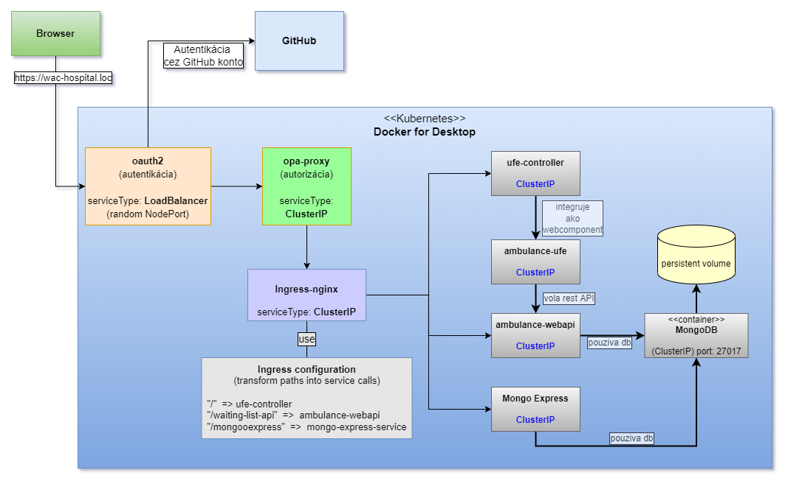

# Integrácia mikro služieb do Service Mesh

Náš systém pozostáva z jednotlivých mikroslužieb, ktoré navzájom spolupracujú a sú koordinované deklaratívnym spôsobom v systéme kubernetes. Z externého pohľadu sa ale javia ako sada rôznych služieb, nasadených v iných subdoménach, ktoré spája len ad-hoc konfigurácia. V tejto časti cvičenia tieto mikro služby zapojíme do jednej zostavy, a pridáme ďalšie vrstvy koordinácie, ktoré nám pomôžu vytvoriť ucelenejší celok nášho systému.

Pod pojmom _Service Mesh_ v tejto kapitole rozumieme sadu nástrojov a techník, ktoré nám pomôžu vytvoriť ucelený systém z viacerých mikroslužieb. Ukážeme si aj nasadenie služieb, ktoré tieto techniky implementujú a v komunite sú tiež známe pod názvom _Service Mesh_ - napr. [Istio](https://istio.io/), [Linkerd], a iné. V našom prípade použijeme neskôr v kapitole [Linkerd].

_Obrázok znázorňuje žiadaný stav._

