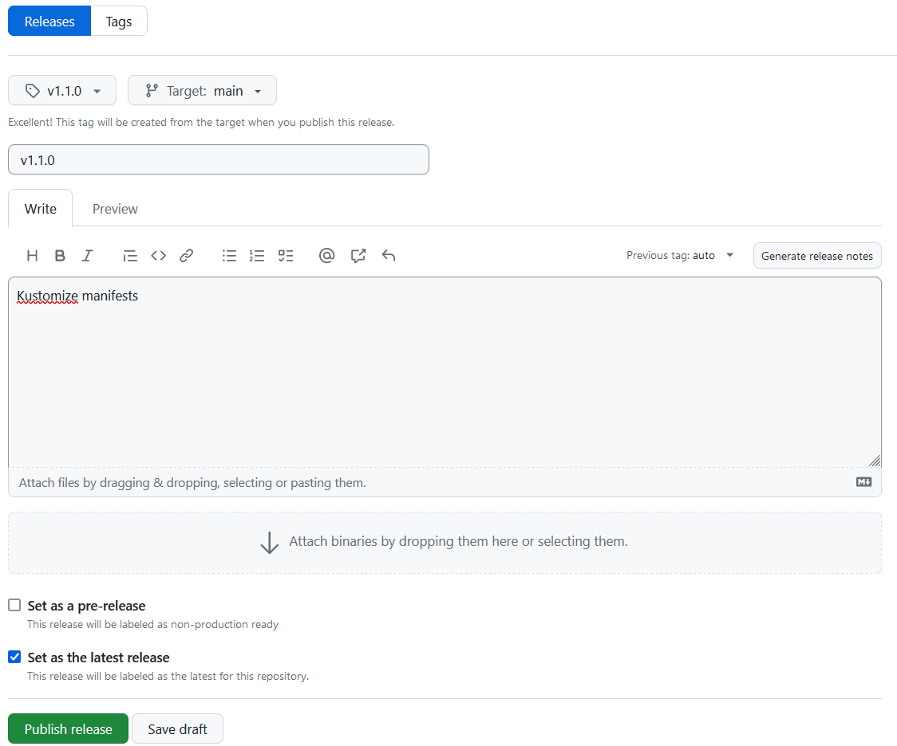

# Nasadenie na produkčný kubernetes klaster

---

>info:>
Šablóna pre predvytvorený kontajner ([Detaily tu](../99.Problems-Resolutions/01.development-containers.md)):
`registry-1.docker.io/milung/wac-mesh-030`

---

Rovnako ako v prípade web klienta, aj pre webapi bola infraštruktúra nasadená centrálne. To znamená, že v klastri bežia služby  _MongoDb_, _ufe-container_ a _Envoy Gateway_.

Na Mongo Express bolo vytvorené smerovacie pravidlo, aplikácia je prístupná na adrese [https://wac-24.westeurope.cloudapp.azure.com/ui/mongo-express/](https://wac-24.westeurope.cloudapp.azure.com/ui/mongo-express/).
Keďže ide o verejne prístupný zdroj, prístup je chránený menom a heslom, ktoré sa dozviete od cvičiaceho.

1. Overte, či stále funguje vaša klient aplikácia (webkomponent) na adrese [https://wac-24.westeurope.cloudapp.azure.com/ui](https://wac-24.westeurope.cloudapp.azure.com/ui/).

2. Pokiaľ ste medzičasom vykonali zmeny vo Vašej front-end aplikácii - `ambulance-ufe`, musíte vytvoriť jej nové vydanie - release. Podobne ako pri [prvom nasadzovaní nášho Web komponentu](../01.Web-Components/111-production-deployment.md), na stránke [GitHub] prejdite do repozitára `ambulance-ufe` a v sekcii _Code_ stlačte na odkaz `1 tags` a následne na tlačidlo _Create a new releases_. V rozbaľovacom zozname _Choose a tag_ zadajte  text `v1.1.0` - alebo ďalší vyšší v zmysle [sémantického verzionovania][semver]. Do poľa _Release title_ zadajte text `v1.1.0` a v poli _Describe this release_ zadajte text v zmysle zmien, ktoré ste vykonali. Stlačte tlačidlo _Publish release_.

   To spôsobí, že sa proces priebežnej integrácie po vytvorení nového vydania automaticky naštartuje. Na stránke [GitHub] prejdite vo vašom repozitári `ambulance-ufe` do sekcie _Actions_ a skontrolujte, že sa nový beh priebežnej integrácie úspešne dokončí. Po jej ukončení si môžete overiť aj stav obrazu na stránke [Docker Hub], kde môžete vidieť nové označenia verzie a platformy pre váš image.

3. Podobným spôsobom vytvoríme nové vydanie aj pre webapi. Na stránke [GitHub] prejdite do repozitára `ambulance-webapi` a v sekcii _Code_ stlačte na odkaz `1 tags` a následne na tlačidlo _Create a new releases_. V rozbaľovacom zozname _Choose a tag_ zadajte  text `v1.1.0` - alebo ďalší vyšší v zmysle [sémantického verzionovania][semver]. Do poľa _Release title_ zadajte text `v1.1.0` a v poli _Describe this release_ zadajte _Kustomize manifests_. Stlačte tlačidlo _Publish release_.

   

   Na stránke [GitHub] prejdite vo vašom repozitári `ambulance-webapi` do sekcie _Actions_ a skontrolujte, že sa nový beh priebežnej integrácie úspešne dokončí. Po jej ukončení si môžete overiť aj stav obrazu na stránke [Docker Hub], kde môžete vidieť nové označenia verzie a platformy pre váš image.

4. Otvorte súbor `${WAC_ROOT}/ambulance-gitops/components/version-release/kustomization.yaml` a upravte ho. Použite tag-y zodpovedajúce tag-om vytvoreným v predchádzajúcich dvoch krokoch, `<docker-id>` zameňte za meno Vášho účtu v službe  [Docker Hub]

   ```yaml
   apiVersion: kustomize.config.k8s.io/v1alpha1
   kind: Component
   images:
   - name: <docker-id>/ambulance-ufe
     newName: <docker-id>/ambulance-ufe 
     newTag: 1.1.0 @_important_@
   - name: <docker-id>/ambulance-wl-webapi   @_add_@
     newName: <docker-id>/ambulance-wl-webapi   @_add_@
     newTag: 1.1.0   @_add_@
   replacements: 
   ...
   ```

5. Upravte súbor `${WAC_ROOT}/ambulance-gitops/clusters/wac-aks/install/kustomization.yaml`

   ```yaml
   ...
   resources:
   - ../../../apps/<pfx>-ambulance-ufe
   - ../../../apps/<pfx>-ambulance-webapi @_add_@
   ...
   ```

6. Archivujte svoje zmeny do vzdialeného repozitára:

   ```ps
   git add .
   git commit -m "Release of webapi to production cloud"
   git push
   ```

   Keď sa zmeny dostanú do `main` vetvy a flux nasadí nové komponenty, overte, že vaše pody bežia - buď cez _Lens_ tool alebo _kubectl_ príkaz. (Nezabudnite zmeniť kontext!)

   ```ps
   kubectl config get-contexts
   kubectl config use-context <meno-kontextu-na-produkcny-k8s>
   kubectl get pods -n wac-hospital
   ```

7. Môžete skúsiť pristúpiť na váš web komponent cez stránku [https://wac-24.westeurope.cloudapp.azure.com/ui/](https://wac-24.westeurope.cloudapp.azure.com/ui/).

---

>info:> Podobným spôsobom postupujte pri nasadzovaní Vášho semestrálneho projektu. Vytvorte príslušné manifesty, upravte verziu vydania, podľa toho nakoľko je stabilná, a nasaďte ju do produkčného klastra.
