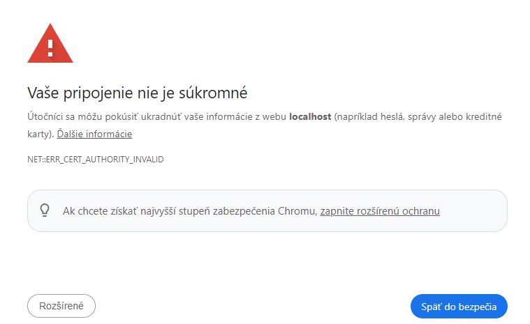

# Bezpečné pripojenie k aplikácii protokolom HTTPS

---

>info:>
Šablóna pre predvytvorený kontajner ([Detaily tu](../99.Problems-Resolutions/01.development-containers.md)):
`registry-1.docker.io/milung/wac-mesh-040`

---

Naša aplikácia je teraz dostupná na porte 80 (HTTP) a javí sa ako jeden aplikačný server. [HTTP protokol](https://developer.mozilla.org/en-US/docs/Web/HTTP) však sám o sebe prenáša všetky údaje v textovej podobe a v nezabezpečenom formáte, čo môže spôsobiť únik informácií na verejných sieťach. Navyše, k našej aplikácii môže pristupovať hociktorá osoba, čo nemusí byť vždy žiadúce, napríklad môžeme chcieť obmedziť prístup k inštancii mongo express alebo umožniť len prístup pre registrovaných pacientov. V tejto časti si ukážeme ako zabezpečiť prístup k našej aplikácii pomocou [TLS](https://developer.mozilla.org/en-US/docs/Web/Security/Transport_Layer_Security), v ďalšej časti sa potom budeme zaoberať autentifikáciou a autorizáciou požiadaviek.

Pre vytvorenie bezpečného pripojenia k našej aplikácii potrebujeme vytvoriť TLS certifikát pomocou infraštruktúry PKI a nasadiť ho do nášho kubernetes klastra. Aby bol certifikát akceptovaný klientom, musí byť vydaný, respektíve overený, známou certifikačnou autoritou, ktorej klient dôveruje. Prehliadač má vopred nastavené certifikačné autority, ktorým dôveruje, a ktoré sú schopné overiť platnosť certifikátu, prípadne môžeme doplniť vlastné certifikačné autority.

V prípade verejných serverov môžeme využiť niektoré verejne dostupné certifikačné autority, ktoré vydávajú certifikáty zadarmo, napríklad [Let's Encrypt](https://letsencrypt.org/). Jej použitie však vyžaduje použitie verejnej domény, ktorú však v rámci tohto cvičenia nemáme k dispozícii. Preto budeme na lokálny vývoj používať takzvaný [_self-signed certificate_](https://en.wikipedia.org/wiki/Self-signed_certificate) a prehliadaču následne povieme, aby mu dôveroval. V prípade verejných serverov je však použitie _self-signed certificate_ nebezpečné, pretože klient nemá možnosť overiť platnosť certifikátu. Pripravíme si preto aj infraštruktúru pre použitie služby [Let's Encrypt](https://letsencrypt.org/).

Za účelom vydávania certifikátov nasadíme do klastra službu [cert-manager]. Cert-manager podporuje niekoľko vlastných objektov, v našom prípade budeme využívať najmä objekty typu [_Issuer_](https://cert-manager.io/docs/concepts/issuer/) a nepriamo objekt typu [_Certificate_](https://cert-manager.io/docs/concepts/certificate/), ktorý bude za nás vytvárať _cert-manager_ na základe anotácií umiestnených na našom objekte [_Gateway_](https://cert-manager.io/docs/usage/gateway/).

1. Vytvorte priečinok `${WAC_ROOT}/ambulance-gitops/infrastructure/cert-manager` a v ňom súbor `${WAC_ROOT}/ambulance-gitops/infrastructure/cert-manager/development.issuer.yaml` s obsahom:

    ```yaml
    apiVersion: cert-manager.io/v1
    kind: Issuer
    metadata:
      name: development-issuer
      namespace: wac-hospital
    spec:
      selfSigned: {} @_important_@
    ```

    Týmto sme vytvorili autoritu, ktorá bude vydávať certifikáty pre naše lokálne vývojové prostredie. Táketo certifikáty sú vo všeobecnosti nebezpečné, pretože klient nemá možnosť overiť ich platnosť. Pre lokálne vývojové prostredie je to však postačujúce.

    >info:> Pokiaľ chcete vytvoriť vlastnú autoritu pre vydávanie certifikátov, napríklad pre potreby vývojového klastra, alebo oddelenie, pozrite napríklad tento jednoduchý [návod](https://cert-manager.io/docs/configuration/selfsigned/#bootstrapping-ca-issuers).

2. Ďalej vytvorte súbor `${WAC_ROOT}/ambulance-gitops/infrastructure/cert-manager/lets-encrypt.issuer.yaml`

   ```yaml
   apiVersion: cert-manager.io/v1
   kind: Issuer
   metadata:
     name: letsencrypt-issuer
     namespace: default
   spec:
     acme:
       email: <your-email>
       server: https://acme-staging-v02.api.letsencrypt.org/directory  # Use this for testing
       privateKeySecretRef:
         name: letsencrypt-issuer-account-key
       solvers:
         - http01:
             gatewayHTTPRoute:
               parentRefs:
                 - name: wac-hospital-gateway
                   namespace: wac-hospital
                   kind: Gateway
   ```

   V tomto cvičení síce nepoužijeme tohto vydavateľa certifikátov, slúži najmä ako ukážka pre Vaše budúce použitie. V prípade, že by ste chceli použiť tohto vydavateľa certifikátov, musíte zameniť emailovú adresu za Vašu vlastnú. Taktiež je potrebné zmeniť `server` na `https://acme-v02.api.letsencrypt.org/directory` pre produkčné prostredie. Premenná `privateKeySecretRef` určuje názov _Secret_-u, ktorý _cert-manager_ vygeneruje automaticky. Pre viac informácií pozrite [dokumentáciu](https://cert-manager.io/docs/configuration/acme/).

3. Teraz vytvorte súbor `${WAC_ROOT}/ambulance-gitops/infrastructure/cert-manager/kustomization.yaml`

   ```yaml
   apiVersion: kustomize.config.k8s.io/v1beta1
   kind: Kustomization
   
   resources:
   # check the version is up-to-date
   - https://github.com/cert-manager/cert-manager/releases/download/v1.13.1/cert-manager.yaml
   - development.issuer.yaml
   - lets-encrypt.issuer.yaml
   
   patches:
   - patch: |-
      - op: add
        path: /spec/template/spec/containers/0/args/-
        value: --feature-gates=ExperimentalGatewayAPISupport=true @_important_@
     target:
       kind: Deployment
       name: cert-manager
       namespace: cert-manager
   ```

    V tomto súbore sme vytvorili konfiguráciu pre _cert-manager_ a pridali sme do nej dva objekty typu _Issuers_. Navyše sme pridali aj patch, ktorý povolí experimentálnu podporu pre [_Gateway API_][gatewayapi].

4. Pridáme _cert-manager_ do nášho klastra. Upravte súbor `${WAC_ROOT}/ambulance-gitops/clusters/localhost/prepare/kustomization.yaml`:

   ```yaml
   ... 
   resources:
   ...
   - ../../../infrastructure/cert-manager @_add_@
     
   patches: 
   ...
   ```

5. Upravíme konfiguráciu pre objekt `wac-hospital-gateway`. Upravte súbor `${WAC_ROOT}/ambulance-gitops/infrastructure/envoy-gateway/gateway.yaml`:

```yaml
  ...
  metadata:
    name: wac-hospital-gateway
    namespace: wac-hospital
    annotations:   @_add_@
      cert-manager.io/issuer: development-issuer # patch this to letsencrypt-issuer for production cluster   @_add_@
      cert-manager.io/email-sans: "pfx@gmail.com"   @_add_@
      cert-manager.io/subject-organizations: "WAC-Hospital"   @_add_@
      cert-manager.io/subject-organizationalunits: "IT Support"   @_add_@
      cert-manager.io/subject-countries: "SK"   @_add_@
      cert-manager.io/subject-localities: "Bratislava"   @_add_@
      cert-manager.io/revision-history-limit: "3"   @_add_@
      cert-manager.io/private-key-rotation-policy: Always   @_add_@
  spec:
    gatewayClassName: wac-hospital-gateway-class
    listeners:
    - name: http
      ...
    - hostname: wac-hospital.loc     @_add_@
      name: fqdn     @_add_@
      protocol: HTTPS     @_add_@
      port: 443     @_add_@
      tls:     @_add_@
        mode: Terminate     @_add_@
        certificateRefs:     @_add_@
        - kind: Secret     @_add_@
          name: wac-hospital-tls     @_add_@
    - hostname: localhost     @_add_@
      name: https-localhost     @_add_@
      protocol: HTTPS     @_add_@
      port: 443     @_add_@
      tls:     @_add_@
        mode: Terminate     @_add_@
        certificateRefs:     @_add_@
        - kind: Secret     @_add_@
          name: wac-hospital-tls     @_add_@
```

   Pomocou bloku anotácií informujeme _cert-manager_ o tom, že má vytvoriť certifikát pre doménu `wac-hospital.loc` a pre doménu `localhost`. V prípade produkčného klastra by sme museli zmeniť vydavateľa certifikátov na `letsencrypt-issuer` a zmeniť emailovú adresu, ako aj zmeniť doménu na verejne dostupnú doménu. Doménu `wac-hospital.loc` využijeme v ďalšej časti, kedy bude potrebná pre správnu komunikáciu s [OpenID] poskytovateľom.

6. Ďalej upravte súbor `${WAC_ROOT}/ambulance-gitops/infrastructure/ufe-controller/http-route.yaml`:

```yaml
      ...
      filters:
      - type: RequestRedirect
        requestRedirect:
          path:
            type: ReplaceFullPath
            replaceFullPath: /ui
          scheme: https   @_add_@
          port: 443   @_add_@
```

7. Overte správnosť konfigurácie príkazom v priečinku `${WAC_ROOT}/ambulance-gitops`

   ```ps
   kubectl kustomize clusters/localhost/prepare
   ```

   a následne archivujte a odovzdajte kód do vzdialeného repozitára.

   ```ps
   git add .
   git commit -m "Added cert-manager and TLS listener"
   git push
   ```

   Overte, že boli naše zmeny úspešne nasadené príkazom

   ```ps
   kubectl get pods -n cert-manager
   ```

8. V prehliadači otvorte stránku [https://localhost/ui/](https://localhost/ui/). Prehliadač Vás upozorní na neplatný certifikát, pretože je vydávaný _self-signed certificate_:

   

   Stlačte tlačidlo _Rozšírené_ a následne stlačte na odkaz _Prejsť na stránku https://localhost/ui/_. Mali by ste vidieť stránku s aplikáciou, pričom prehliadač Vás v poli adresy stále upozorňuje na nebezpečné pripojenie.

   >info:> Aktuálny postup prechodu na stránku s nebezpečným certifikátom sa môže medzi prehliadačmi odlišovať.
