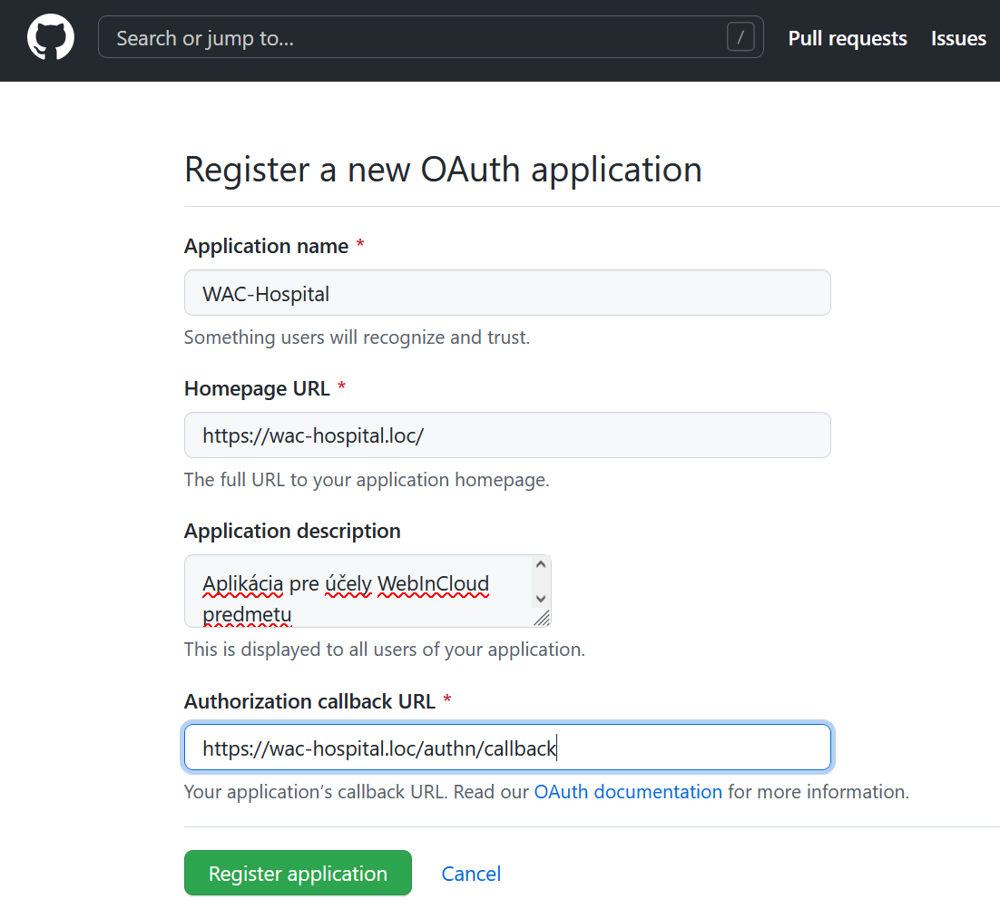
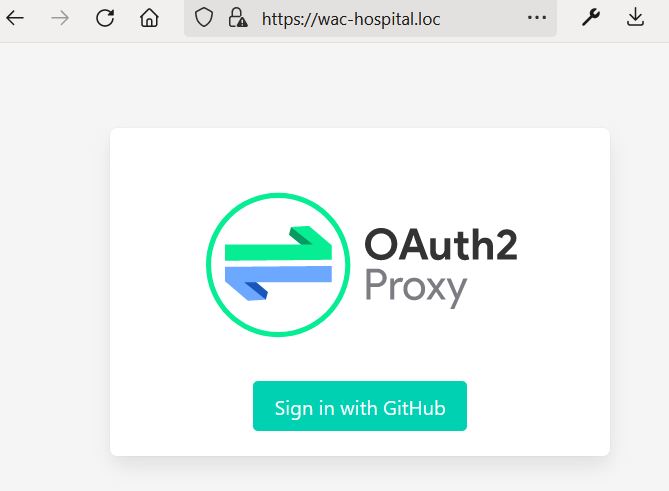

## Autentifikácia používateľov pomocou OpenID Connect

---

>info:>
Šablóna pre predvytvorený kontajner ([Detaily tu](../99.Problems-Resolutions/01.development-containers.md)):
`registry-1.docker.io/milung/wac-mesh-060`

---

V tejto kapitole si ukážeme, ako zabezpečiť identifikáciu používateľov pomocou protokolu [OpenID Connect](https://openid.net/connect/). Nebudeme tu vykonávať autorizáciu používateľov, teda nebudeme ešte riadiť prístup používateľov k jednotlivým zdrojom, len zabezpečíme, že všetci používatelia pristupujúci do klastra sa musia identifikovať a to tak, aby sme vedeli jednoznačne určiť ich identitu. Ako poskytovateľa identít použijeme platformu [GitHub](https://github.com/), ale obdobným spôsobom by sme mohli použiť aj iných poskytovateľov identít, ako napríklad Google, Microsoft, Facebook, a podobne. Pokiaľ by sme si chceli zriadiť vlastného poskytovateľa identít, mohli by sme zaintegrovať do nášho systému niektorú z implementácií [Identity Provider](https://en.wikipedia.org/wiki/Identity_provider) služby. V oblasti menších projektov je napríklad populárna implementácia [dex](https://dexidp.io/), ale k dispozícii je [mnoho ďalších implementácií a knižníc](https://openid.net/developers/certified/).

Pre účely autentifikácie použijeme službu [oauth2-proxy](https://oauth2-proxy.github.io/oauth2-proxy/) a postupne nakonfigurujeme [Envoy Gateway] tak, aby túto službu použila na overovanie identity asociovanej so vstupnou požiadavkou.

1. Dôležitým aspektom protokolu OIDC je predpoklad použitia štandardného prehliadača odolného voči rôznym bezpečnostným útokom. Prehliadač plní v protokole [Open ID Connect](https://openid.net/developers/how-connect-works/) dôležitú úlohu a naviguje používateľa medzi rôznymi poskytovateľmi - webová aplikácia, poskytovateľ identít, poskytovateľ chránených zdrojov. Protokol predpokladá vytvorenie viacstranného kontraktu medzi jednotlivými entitami. V tomto prostredí je preto potrebné používať jednoznačné označenia entít, čo neplatí pre doménu `localhost`, ktorá označuje akýkoľvek výpočtový prostriedok.  

   Nášmu lokálnemu počítaču musíme preto priradiť iné označenia, taskzvaný [_Fully Qualified Domain Name (FQDN)_](https://sk.wikipedia.org/wiki/Presne_stanoven%C3%A9_meno_dom%C3%A9ny). V kapitole [Bezpečné pripojenie k aplikácii protokolom HTTPS](./040-secure-connection.md) sme k objektu `wac-hospital-gateway` priradili meno `wac-hospital.loc`. Týmto menom budeme označovať náš lokálny klaster, musíme ešte vytvoriť doménové meno pre náš počítač.

   Zistite IP adresu, ktorá je vášmu počítaču priradená, napríklad príkazom `ipconfig`, alebo `ifconfig` v prípade OS Linux. Otvorte súbor `C:\Windows\System32\drivers\etc\hosts` (`/etc/hosts` na systémoch linux) a vytvorte v ňom nový záznam

   ```plain
   <vaša IP adresa> wac-hospital.loc
   ```

   Súbor uložte - budete vyzvaný na prechod do privilegovaného módu, respektíve musíte tento súbor otvoriť a upraviť s administrátorskými oprávneniami.

   >warning:> IP adresa pridelená Vášmu počítaču sa môže zmeniť, pri každom ďalšom sedení preto musíte overiť, aká IP adresa je vášmu počítaču pridelená a zmeniť záznam v tomto súbore. V niektorých sieťach majú jednotlivé zariadenia, vrátane pracovných počítačov, pridelené stále FQDN. V týchto prípadoch môžete použiť toto označenie a nemusíte upravovať súbor `etc/hosts`. Použitie označenia `localhost` v ďalšom cvičení ale nebude fungovať.

2. Aby sme získali prístup k identite používateľov platformy GitHub, musíme na tejto platforme zaregistrovať našu aplikáciu. Používatelia budú neskôr vyzvaní na poskytnutie súhlasu so zdieľaním ich identity s našou aplikáciou. Prihláste sa so svojim účtom do platformy GitHub a prejdite na stránku [https://github.com/settings/developers](https://github.com/settings/developers). Zvoľte voľbu _Register a new application_. Vyplňte formulár na zobrazenej stránke:

   * _Application name_: `WAC hospital`
   * _Homepage URL_: `https://wac-hospital.loc`
   * _Application description_: `Aplikácia vytvorená na cvičeniach WAC - <vaše meno>`
   * _Authorization callback URL_: `https://wac-hospital.loc/authn/callback`

   Prvé tri položky budú prezentované používateľom pri poskytovaní súhlasu so zdieľaním informácií. Posledná položka je dôležitá v samotnom protokole OIDC - používatelia budú po autentifikácii na stránke GitHub presmerovaní jedine na túto URL, a poskytovateľ identít akceptuje jedine požiadavky o autentifikovanie používateľov, ktoré presmerujú používateľa na niektorú z registrovaných _authorization callback_ URL. Týmto spôsobom je zabránené, aby sa škodlivá stránka mohla vydávať za vašu aplikáciu a získať prístup k údajom používateľa bez jeho predchadzajúceho súhlasu.

   

   Po vyplnení stlačte ovládací prvok  _Register Application_ a na ďalšej stránke stlačte na ovládací prvok _Generate a new client secret_. Poznačte si identifikátor klienta - _Client ID_, a zobrazené heslo - _Client Secret_. Nakoniec stlačte tlačidlo _Update application_.

   >info:> Návody a odkazy na konfiguráciu použitej služby s inými poskytovateľmi identít nájdete [tu](https://oauth2-proxy.github.io/oauth2-proxy/configuration/providers/).

3. Na stránke [https://www.random.org/strings/](https://www.random.org/strings/) vytvorte náhodný reťazec o dĺžke presne 32 znakov. Tento reťazec použijeme ako _cookie secret_ pre službu [oauth2-proxy](https://oauth2-proxy.github.io/oauth2-proxy/). Vytvorte súbor `${WAC_ROOT}/ambulance-gitops/clusters/localhost/secrets/params/oidc-client.env` s nasledujúcim obsahom (musíte použiť hodnoty špecifické pre vašu individuálnu konfiguráciu):

    ```env
    client-id=<client id z kroku 2>
    client-secret=<client secret z kroku 2>
    cookie-secret=<náhodný reťazec>
    ```

   Otvorte okno príkazového riadku a prejdite do adresára `${WAC_ROOT}/ambulance-gitops/clusters/localhost/secrets/params`. Vytvorte _Secret_ pomocou príkazu

   ```powershell
   sops --encrypt --in-place oidc-client.env
   ```

   Upravte súbor `${WAC_ROOT}/ambulance-gitops/clusters/localhost/secrets/kustomization.yaml` a pridajte do neho vytvorenie nového objektu typu [_Secret_](https://kubernetes.io/docs/concepts/configuration/secret/)

   ```yaml
   ...
   secretGenerator:
     - name: repository-pat
       ...
     - name: mongodb-auth
       ...
     - name: oidc-client     @_add_@
       type: Opaque     @_add_@
       envs:     @_add_@
         - params/oidc-client.env     @_add_@
       options:     @_add_@
           disableNameSuffixHash: true     @_add_@
   ```

4. Vytvorte konfiguráciu pre mikro službu [ouath2-proxy](https://oauth2-proxy.github.io/oauth2-proxy/). Vytvorte adresár `${WAC_ROOT}/ambulance-gitops/infrastructure/oauth2-proxy` a v ňom súbor `${WAC_ROOT}/ambulance-gitops/infrastructure/oauth2-proxy/deployment.yaml` s obsahom

```yaml
  apiVersion: apps/v1
  kind: Deployment
  metadata:
    name: &PODNAME oauth2-proxy
  spec:
    replicas: 1
    selector:
      matchLabels:
        pod: *PODNAME
    template:
      metadata: 
        labels:
          pod: *PODNAME
      spec:
        containers:
        - name: oauth2-proxy  
          image: bitnami/oauth2-proxy
          args: 
          - --upstream="static://200" @_important_@
          - --set-xauthrequest @_important_@
          - --set-authorization-header
          - --silence-ping-logging
          env:
          - name: OAUTH2_PROXY_HTTP_ADDRESS
            # listen on standard interface - localhost will not work
            value: ":4180"
  
          - name: OAUTH2_PROXY_PROXY_PREFIX
            # oauth2-proxy route listens on path /authn
            value: /authn @_important_@

          - name: OAUTH2_PROXY_PROVIDER
            value: github @_important_@

          - name: OAUTH2_PROXY_CLIENT_ID
            valueFrom:
              secretKeyRef:
                name: oidc-client  @_important_@
                key: client-id
  
          - name: OAUTH2_PROXY_CLIENT_SECRET
            valueFrom:
              secretKeyRef:
                name: oidc-client @_important_@
                key: client-secret
  
          - name: OAUTH2_PROXY_REDIRECT_URL
            # must match redirection registered at GitHub Oauth2 Application form
            value: https://wac-hospital.loc/authn/callback     @_important_@
  
          - name: OAUTH2_PROXY_COOKIE_SECRET
            valueFrom:
              secretKeyRef:
                name: oidc-client
                key: cookie-secret
  
          - name: OAUTH2_PROXY_SESSION_STORE_TYPE
            # alternatively use redis and configure it
            value: cookie

          - name: OAUTH2_PROXY_COOKIE_PREFIX
            value: __Secure-
          - name: OAUTH2_PROXY_COOKIE_SAMESITE
            value: lax
            
          - name: OAUTH2_PROXY_EMAIL_DOMAINS
            # only authenticate - we will authorize users later
            value: "*"

          - name: OAUTH2_PROXY_SKIP_PROVIDER_BUTTON
            # change to true to skip provider selection page. Here false for    demonstration only
            value: "false"

          - name: OAUTH2_PROXY_SKIP_AUTH_ROUTES
            # regex of routes where anonymous users are allowed
            # either here or create separate gateway/listener for anonymous users
            value: (\/.well-known\/|\/favicon.ico)
  
          resources:
            limits:
              cpu: '0.2'
              memory: '320M'
            requests:
              cpu: '0.01'
              memory: '128M'
          livenessProbe:
            httpGet:
              path: /ready
              scheme: HTTP
              port: 4180
            initialDelaySeconds: 5
            periodSeconds: 15
          readinessProbe:
            httpGet:
              path: /ready
              scheme: HTTP
              port: 4180
            initialDelaySeconds: 5
            periodSeconds: 5
```

  Všimnite se, že referencujeme hodnoty zo _Secret_-u `oidc-client`, ktoré sme vytvorili v predchádzajúcom kroku. V tejto konfigurácii využívame na správu sedení (session) takzvaný [_Secure Cookie_](https://en.wikipedia.org/wiki/Secure_cookie), v ktorom sú zašifrované údaje o sedení a token identifikujúci používateľa. Alternatívou by bolo ukladať tieto informácie v úložisku [redis], čo sme pre zjednodušenie vynechali.

  Všimnite si voľbu `OAUTH2_PROXY_EMAIL_DOMAINS=*`. Toto nastavenie umožňuje, aby do systému vstúpili ľubovoľní autentifikovaní používatelia. Ak by sme ju zmenili napríklad na `OAUTH2_PROXY_EMAIL_DOMAINS=stuba.sk`, obmedzili by sme prístup len pre používateľov, ktorí sú vlastníkmi elektronických schránok spravovaných v doméne `stuba.sk`, to znamená pre študentov a zamestnancov STU Bratislava.  Premenná `OAUTH2_PROXY_AUTHENTICATED_EMAILS_FILE` by nám umožnila ďalej limitovať prístup len pre konkrétnych používateľov, v cvičení túto možnosť ale nepoužijeme, a v ďalšom kroku si ukážeme ako autorizovať používateľov na základe informácií o používateľovi, ktoré nám poskytne služba [oauth2-proxy].

  V argumentoch pre kontajner sme použili niekoľko [dôležitých konfiguračných nastavení](https://oauth2-proxy.github.io/oauth2-proxy/docs/configuration/overview), voľba `--upstream="static://200"`, určuje, že v prípade úspešnej autentifikácie vráti táto služba odozvu s kódom 200, a voľba `--set-xauthrequest` určuje, že služba bude používať hlavičky typu `X-Auth-Request` na prenos informácie o autentifikovanom používateľovi. Tieto hlavičky budeme neskôr používať na autorizáciu používateľov.

5. Vytvorte súbor `${WAC_ROOT}/ambulance-gitops/infrastructure/oauth2-proxy/service.yaml`

    ```yaml
    apiVersion: v1
    kind: Service
    metadata:
      name: oauth2-proxy
    spec: 
      ports:
      - name: http
        port: 80
        protocol: TCP
        targetPort: 4180
    ```

    Ďalej vytvorte súbor `${WAC_ROOT}/ambulance-gitops/infrastructure/oauth2-proxy/http-route.yaml`

   ```yaml
   apiVersion: gateway.networking.k8s.io/v1
   kind: HTTPRoute
   metadata:
     name: oauth2-proxy
   spec:
     parentRefs:
       - name: wac-hospital-gateway
     rules:
       - matches:
           - path:
               type: PathPrefix
               value: /authn
         backendRefs:
           - group: ""
             kind: Service
             name: oauth2-proxy
             port: 80
   ```

   Objekt typu `HTTPRoute` budeme v ďalšom kroku referencovať pri úprave konfigurácie _Gateway_.

   Vytvorte súbor `${WAC_ROOT}/ambulance-gitops/infrastructure/oauth2-proxy/kustomization.yaml`, ktorý tieto konfiguračné súbory zintegruje

   ```yaml
   apiVersion: kustomize.config.k8s.io/v1beta1
   kind: Kustomization
   
   namespace: wac-hospital
   
   commonLabels:
     app.kubernetes.io/part-of: wac-hospital
     app.kubernetes.io/component: oauth2-proxy
   
   resources:
   - deployment.yaml
   - service.yaml
   - http-route.yaml
   ```

   a zahrňte `oauth-proxy` do konfigurácie klastra úpravou súboru `${WAC_ROOT}/ambulance-gitops/clusters/localhost/prepare/kustomization.yaml`

   ```yaml
   ...
   resources:
   ...
   - ../../../infrastructure/cert-manager
   - ../../../infrastructure/oauth2-proxy  @_add_@
   ```

6. Aby sme mohli vyššie nakonfigurovanú službu využiť, musíme upraviť konfiguráciu [Envoy Gateway]. Z technického hľadiska implementuje [Envoy Gateway] návrhový vzor [Kubernetes Controller](https://kubernetes.io/docs/concepts/architecture/controller/) - sleduje zmeny v registrovaných objektoch skupiny [Gateway API] a následne vytvorí novú inštanciu služby [Envoy Proxy], ktorej konfigurácia je určená na základe registrovaných zdrojov. [Envoy Proxy] je vysoko efektívna implementácie reverznej proxy, ktorá umožňuje konfigurovať detaily spracovania a smerovania požiadaviek do klastra (tu vo všeobecnom zmysle klastra výpočtových prostredkov, nie je limitovaná len na kubernetes klaster). Jedným z konceptov [Envoy Proxy] je takzvaný [HTTP filter](https://www.envoyproxy.io/docs/envoy/latest/intro/arch_overview/http/http_filters), ktorý umožňuje upraviť parametre spracovania HTTP požiadaviek. V našom prípade budeme využívať filter [_External Authorization_](https://www.envoyproxy.io/docs/envoy/latest/configuration/http/http_filters/ext_authz_filter), ktorý predá riadenie našej službe `oauth2-proxy`, a jedine pokiaľ táto vráti pozitívny stavový kód (menší než 400), umožní ďalšie spracovanie požiadavky, v opačnom prípade vráti chybový stav `403 Forbidden`.

   [Envoy Gateway] umožňuje rozšíriť konfiguráciu dynamicky vytváraných inštancií [envoy proxy] pomocou objektu typu [_Envoy Patch Policy_](https://gateway.envoyproxy.io/latest/user/extensibility/envoy-patch-policy/). K dispozícii je aj nástroj [_egctl_](https://gateway.envoyproxy.io/latest/contributions/design/egctl/), ktorý umožňuje získať aktuálnu konfiguráciu, vytvorenú na základe registrovaných zdrojov. My tento typ objektov využijeme na pridanie konfigurácie [_External Authorization_](https://www.envoyproxy.io/docs/envoy/latest/configuration/http/http_filters/ext_authz_filter) do konfigurácie [Envoy Gateway].

   >info:> Jedná sa o pokročilú techniku, ktorá predpokladá znalosť konfigurácie [Envoy Proxy]. Keďže je pravdepodobné, že sa s _Envoy Proxy_ pri práci s komplexnejšími systémami v praxi stretnete, doporučujeme sa s jej detailami oboznámiť. Podrobnejšie informácie nájdete v [dokumentácii](https://www.envoyproxy.io/docs/envoy/latest/intro/intro).

   Vytvorte súbor `${WAC_ROOT}/ambulance-gitops/infrastructure/envoy-gateway/envoy-patch-policy.yaml` s obsahom

   ```yaml
   apiVersion: gateway.envoyproxy.io/v1alpha1
   kind: EnvoyPatchPolicy
   metadata: 
       name: oauth2-ext-authz
       namespace: wac-hospital
   spec:
       targetRef:
         group: gateway.networking.k8s.io
         kind: Gateway
         name: wac-hospital-gateway
         namespace: wac-hospital
       type: JSONPatch
       jsonPatches:
         - type: "type.googleapis.com/envoy.config.listener.v3.Listener"
           # The listener name is of the form <GatewayNamespace>/<GatewayName>/<GatewayListenerName>
           name:  wac-hospital/wac-hospital-gateway/fqdn  @_important_@
           operation:
             op: add
             # if there is only single listener per tls endpoint then replace "/filter_chains/0" 
             # with "/default_filter_chain" 
             # use config `egctl config envoy-proxy listener -A` to find out actual xDS configuration
             path: "/filter_chains/0/filters/0/typed_config/http_filters/0"  @_important_@
             value:
               name: authentication.ext_authz
               typed_config:
                 "@type": type.googleapis.com/envoy.extensions.filters.http.ext_authz.v3.ExtAuthz
                 http_service:
                   server_uri:
                     uri: http://oauth2-proxy.wac-hospital @_important_@
                     timeout: 30s
                     # The cluster name is of the form <RouteType>/<RouteNamespace>/<RouteName>/rule/   <RuleIndex>
                     # use  `egctl config envoy-proxy cluster -A` to find out actual xDS configuration
                     cluster: httproute/wac-hospital/oauth2-proxy/rule/0  @_important_@
                   authorizationRequest:
                     allowedHeaders:
                       patterns:
                       - exact: authorization
                       - exact: cookie
                   authorizationResponse:
                     allowedUpstreamHeaders:
                       patterns:
                       - exact: authorization
                       - prefix: x-auth
   ```

   Tento patch sa aplikuje na _listener_ `wac-hospital/wac-hospital-gateway/fqdn`, to znamená autorizácia pomocou [OpenID] protokolu sa vyvolá, len keď pristúpime na stránky na adrese `https://wac-hospital.loc`. V súbore  `${WAC_ROOT}/ambulance-gitops/infrastructure/envoy-gateway/gateway.yaml` si môžete prezrieť ako je _listener_ s menom `fqdn` nakonfigurovaný.

   >info:> Okrem filtra [External Authorization](https://www.envoyproxy.io/docs/envoy/latest/configuration/http/http_filters/ext_authz_filter.html) by sme mohli použiť filter [OAuth2](https://www.envoyproxy.io/docs/envoy/latest/configuration/http/http_filters/oauth2_filter.html), pre účely tohto cvičenia ale lepšie poslúži prvý uvedený.

   &nbsp;
  
   >warning:> [Envoy Gateway] je stále aktívne vyvíjaný, je možné, že v budúcnosti bude konfigurácia OpenID protokolu doplnená ako súčasť základnej konfigurácie.

   Vytvorte súbor `${WAC_ROOT}/ambulance-gitops/infrastructure/envoy-gateway/params/envoy-gateway.yaml` s obsahom

   ```yaml
   apiVersion: gateway.envoyproxy.io/v1alpha1
   kind: EnvoyGateway
   gateway:
     controllerName: gateway.envoyproxy.io/gatewayclass-controller
   logging:
     level:
       default: info
   provider:
     type: Kubernetes
   extensionApis:
     enableEnvoyPatchPolicy: true @_important_@
   ```

   Tento súbor upravuje konfiguračný súbor [_EnvoyGateway_](https://gateway.envoyproxy.io/latest/api/extension_types/#envoygateway), konkrétne povoľuje použitie objektu [_Envoy Patch Policy_](https://gateway.envoyproxy.io/latest/user/extensibility/envoy-patch-policy/).

   Upravte súbor `${WAC_ROOT}/ambulance-gitops/infrastructure/envoy-gateway/kustomization.yaml` a pridajte referenciu k novovytvorenej konfigurácii

   ```yaml
   resources:
   ...
   - gateway.yaml
   - envoy-patch-policy.yaml @_add_@
     @_add_@
   configMapGenerator:    @_add_@
     - name: envoy-gateway-config    @_add_@
       namespace: envoy-gateway-system    @_add_@
       behavior: replace    @_add_@
       files:    @_add_@
         - params/envoy-gateway.yaml    @_add_@
   ```

7. Uložte zmeny a archivujte ich vo vzdialenom repozitári:

   ```ps
    git add .
    git commit -m "Add oauth2-proxy"
    git push
   ```

   Overte, že sa aplikujú najnovšie zmeny vo Vašom klastri

    ```ps
    kubectl -n wac-hospital get kustomization -w
    ```

    Overte, že stav objektu _Envoy Patch Policy_ je `Programmed`
    >info:> V prípade, že sa stav nemení na Programmed je potrebné reštartovať pody envoy gateway.

    ```ps
    kubectl -n wac-hospital get epp -o=yaml
    ```

8. Otvorte v prehliadači novú záložku a otvorte _Nástroje pre vývojárov -> Sieť_.  V tejto záložke prejdite na stránku [https://wac-hospital.loc](https://wac-hospital.loc) a zvoľte voľbu _Protokol natrvalo_ (respektíve _Zachovať denník_). Nezabudnite, že v súbore `etc/host` musíte mať správne pridelenú IP adresu k záznamu `wac-hospital.loc`. Prehliadač vás upozorní na bezpečnostné riziko z dôvodu použitia neovereného TLS certifikátu. Zvoľte _Pokračovať_ a _Rozumiem bezpečnostnému riziku_.

    >build_circle:> V niektorých prípadoch môže byť voľba _Pokračovať_ nedostupná. V takom prípade ponechajte okno prehliadača ako aktívnu aplikáciu a na klávesnici vyťukajte `THISISUNSAFE`. Táto možnosť (_back-doors_) je v prehliadačoch Google ponechaná pre dobre informovaných profesionálov, akými sú napríklad softvéroví inžinieri.

    Na obrazovke vidíte prihlasovaciu stránku _OAuth2 Proxy_ (našej konfigurovanej služby) s voľbou _Sign in with GitHub_. Stlačte na túto voľbu.

    

    >info:> Konfiguráciou služby OAuth2 Proxy možno prihlasovaciu stránku zmeniť, prípadne tento krok preskočiť a byť presmerovaný priamo na stránky GitHub.

    Následne budete presmerovaný na stránku GitHub, kde budete vyzvaný na udelenie súhlasu so zdieľaním vašich identifikačných údajov s aplikáciou _WAC Hospital_. Súhlas udeľte, po čom budete presmerovaný do aplikácie vo vašom klastri.

    Prezrite si záznam sieťovej komunikácie v _Nástroji vývojárov_. Môžete vidieť, ako je prehliadač niekoľkokrát presmerovaný medzi jednotlivými entitami OIDC protokolu. Časť protokolu pritom prebieha na pozadí medzi _OAuth2 Proxy_ a poskytovateľom identít Git Hub.

    _OAuth2 Proxy_ si teraz bude pamätať Vaše prihlásenie počas nasledujúcich 168 hodín (platnosť cookie) a platforma GitHub si pamätá udelenie oprávnenia pre Vašu aplikáciu. Pri opätovnom načítaní preto budete automaticky presmerovaný na stránky aplikácie a iba pri dlhšom nepoužívaní aplikácie budete opätovne vyzvaný na prihlásenie. Alternatívne sa môžete skúsiť prihlásiť z nového súkromného okna prehliadača, ktoré nezdieľa vašu identitu (cookies a pod.) s ostatnými  oknami prehliadača.

9. Mikro služba _oauth2-proxy_ poskytuje identitu prihláseného používateľa v hlavičkách preposielaných požiadaviek. Aby sme si to overili, doplníme do nášho klastra jednoduchú službu [http-echo](https://github.com/mendhak/docker-http-https-echo). Vytvorte súbor `${WAC_ROOT}/ambulance-gitops/apps/http-echo/deployment.yaml`

   ```yaml
   apiVersion: apps/v1
   kind: Deployment
   metadata:  
     name: http-echo
   spec:
     replicas: 1  
     selector:
       matchLabels:
         pod: http-echo
     template:
       metadata:
         labels: 
           pod: http-echo 
       spec:
         containers:
         - image: mendhak/http-https-echo
           name: http-echo        
           ports:
           - name: http
             containerPort: 8080
           resources:
             limits:
               cpu: '0.1'
               memory: '128M'
             requests:
               cpu: '0.01'
               memory: '16M'
   ```

   Vytvorte súbor `${WAC_ROOT}/ambulance-gitops/apps/http-echo/service.yaml`

   ```yaml
   apiVersion: v1
   kind: Service
   metadata:
     name: http-echo
   spec: 
     ports:
     - name: http
       port: 80
       protocol: TCP
       targetPort: 8080
   ```

   Vytvorte súbor `${WAC_ROOT}/ambulance-gitops/apps/http-echo/http-route.yaml`:

   ```yaml
   apiVersion: gateway.networking.k8s.io/v1
   kind: HTTPRoute
   metadata:
     name: http-echo
   spec:
     parentRefs:
       - name: wac-hospital-gateway
     rules:
       - matches:
           - path:
               type: PathPrefix
               value: /http-echo
         backendRefs:
           - group: ""
             kind: Service
             name: http-echo
             port: 80
    ```

    a súbor `${WAC_ROOT}/ambulance-gitops/apps/http-echo/kustomization.yaml`:

   ```yaml
   apiVersion: kustomize.config.k8s.io/v1beta1
   kind: Kustomization
   
   resources: 
   - deployment.yaml
   - service.yaml
   - http-route.yaml
   
   namespace: wac-hospital
   
   commonLabels: 
     app.kubernetes.io/component: http-echo
   ```

    a nakoniec v súbore `${WAC_ROOT}/ambulance-gitops/clusters/localhost/install/kustomization.yaml` doplňte referenciu na túto službu:

    ```yaml
    ...
    resources: 
    ...
    - ../../../apps/http-echo @_add_@
    ...
    ```

   Uložte zmeny a archivujte ich vo vzdialenom repozitári:

   ```ps
    git add .
    git commit -m "Add http-echo"
    git push
   ```

   Overte, že sa aplikujú najnovšie zmeny vo Vašom klastri

    ```ps
    kubectl -n wac-hospital get pods -w
    ```

    Prejdite na stránku [https://wac-hospital.loc/http-echo](https://wac-hospital.loc/http-echo) a prezrite si vygenerovaný JSON súbor. V časti `headers` si všimnite hlavičky `x-auth-request-email`, a `x-auth-request-user`, ktoré boli do požiadavky doplnené službou `oauth2-proxy`.

    > Odporúčame nainštalovať si do prehliadača niektorý z prídavkov pre zobrazovanie JSON súborov, ktorý je užitočným nástrojom pri vývoji webových aplikácií. Príkladom takéhoto rozšírenia pre prehliadač Chrome je napríklad [JSONFormatter](https://github.com/callumlocke/json-formatter)

Naša aplikácia je teraz schopná identifikovať používateľov a v určitom rozsahu aj kontrolovať, kto môže k našim stránkam pristúpiť.
