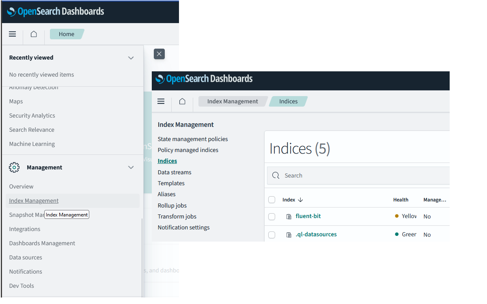

# Zber a analýza logov s Fluentbit a OpenSearch

---

>info:>
Šablóna pre predvytvorený kontajner ([Detaily tu](../99.Problems-Resolutions/01.development-containers.md)):
`registry-1.docker.io/milung/wac-mesh-080`

---

Náš systém sa postupne rozrastá o nové mikroslužby, ktoré obsluhujú rôzne aspekty našej aplikácie. Zároveň predpokladáme rozrastanie sa aj samotnej funkcionality aplikácie, čo bude viesť k pridávaniu ďalších mikroslužieb do systému. Napriek všetkej snahe o dodanie čo najkvalitnejších komponentov, musíme predpokladať, že počas prevádzky systému bude dochádzať k situáciám, kedy sa správanie systému bude odchylovať od predpokladaného špecifikovaného správania. V takýchto situáciách je potrebné mať k dispozícii nástroje, ktoré nám umožnia zistiť, čo sa v systéme deje a kde sa nachádza problém. Zároveň potrebujeme mať k dispozícii informácie o tom, ako je súčasný systém využívaný a zaťažovaný, aby sme prípadným problémom dokázali včas predchádzať. V kontexte [DevOps](https://en.wikipedia.org/wiki/DevOps) vývoja sa tieto schopnosti a aktivity očakávajú od samotného vývojového tímu. V tejto a nasledujúcej časti si ukážeme, ako takéto nástroje nasadiť do systému a ako sledovanie (monitorovanie) systému podporiť aj pri implementácii mikroslužieb.

Väčšina softvérových riešení generuje nejakým spôsobom záznamy o činnosti - _log_, v ideálnom prípade ich zapisuje rovno do štandardného výstupu. V prvom kroku preto nasadíme do klastra nástroje na zber a analýzu logov. V našom prípade to budú [FluentBit] a [Opensearch].

1. Služba [FluentBit] slúži na zber a spracovanie prúdu údajov. Je optimalizovaná na spracovanie logov, typicky v prostredí kubernetes a mikroslužieb. Spracované záznamy potom odosiela na ďalšie uloženie a analýzu, pričom pre konkrétny cieľ, kde sa tieto údaje majú uložiť, môžme využiť niektorý z existujúcich pluginov. [FluentBit] musíme nainštalovať do klastra kubernetes ako objekt typu [_DaemonSet_](https://kubernetes.io/docs/concepts/workloads/controllers/daemonset/), čo zabezpečí, že na každom [_Node_](https://kubernetes.io/docs/concepts/architecture/nodes/) bude vytvorená jedna replika služby [FluentBit], ktorá z tohto prostriedku zabezpečí zber údajov a ich odoslanie na ďalšie spracovanie.

   Pri konfigurácii [FluentBit] budeme vychádzať z ukážky v repozitári [Kubernetes Logging with Fluent Bit](https://github.com/fluent/fluent-bit-kubernetes-logging), ktorú upravíme pre naše potreby. Vytvorte súbor `${WAC_ROOT}/ambulance-gitops/infrastructure/fluentbit/kustomization.yaml` s nasledujúcim obsahom:

   ```yaml
   resources:
   - namespace.yaml
   - https://raw.githubusercontent.com/fluent/fluent-bit-kubernetes-logging/master/fluent-bit-service-account.yaml
   - https://raw.githubusercontent.com/fluent/fluent-bit-kubernetes-logging/master/fluent-bit-role-1.22.yaml
   - https://raw.githubusercontent.com/fluent/fluent-bit-kubernetes-logging/master/fluent-bit-role-binding-1.22.yaml
   - https://raw.githubusercontent.com/fluent/fluent-bit-kubernetes-logging/master/output/elasticsearch/fluent-bit-configmap.yaml
   - https://raw.githubusercontent.com/fluent/fluent-bit-kubernetes-logging/master/output/elasticsearch/fluent-bit-ds.yaml
   # for minikube use the following line  instead of the above one
   # - https://raw.githubusercontent.com/fluent/fluent-bit-kubernetes-logging/master/output/elasticsearch/   fluent-bit-ds-minikube.yaml
      
   images:
     - name: fluent/fluent-bit
       newName: fluent/fluent-bit
       newTag: latest
   commonLabels:
       app.kubernetes.io/component: fluentbit
   patches: 
   - path: patches/fluent-bit-config.config-map.yaml
   - path: patches/fluent-bit.daemon-set.yaml
   ```

   Vytvorte súbor `${WAC_ROOT}/ambulance-gitops/infrastructure/fluentbit/namespace.yaml` s nasledujúcim obsahom:

   ```yaml
   apiVersion: v1
   kind: Namespace
   metadata:
     name: logging
   ```

   Mohli by sme fluentbit inštalovať aj do _namespace_-u `wac-hospital`, ale pre lepšiu izoláciu a prehľadnosť inštalujeme fluentbit do samostatného namespace-u `logging`.

   Vytvorte súbor `${WAC_ROOT}/ambulance-gitops/infrastructure/fluentbit/patches/fluent-bit-config.config-map.yaml` s nasledujúcim obsahom:

    ```yaml
    apiVersion: v1
    kind: ConfigMap
    metadata:
      name: fluent-bit-config
      namespace: logging
      labels:
        k8s-app: fluent-bit
    data:
      # Configuration files: server, input, filters and output
      # ======================================================
      fluent-bit.conf: |
        [SERVICE]
            Flush         1
            Log_Level     info
            Daemon        off
            Parsers_File  parsers.conf
            HTTP_Server   On
            HTTP_Listen   0.0.0.0
            HTTP_Port     2020

        @INCLUDE input-kubernetes.conf
        @INCLUDE filter-kubernetes.conf
        @INCLUDE output-opensearch.conf

      output-opensearch.conf: |  
        [OUTPUT]
            Name                opensearch
            Match               *
            Host                ${FLUENT_OPENSEARCH_HOST}
            Port                ${FLUENT_OPENSEARCH_PORT}
            Suppress_Type_Name  On
            Replace_Dots        On
            Retry_Limit         2

      output-elasticsearch.conf: null
    ```

    Pôvodná konfiguráciu využívala výstupný plugin pre [Elasticsearch](https://www.elastic.co/), ktorý sme nahradili pluginom pre [Opensearch](https://opensearch.org/). V konfigurácii je potrebné nastaviť adresu a port, na ktorom bude [Opensearch] API dostupné.

    Vytvorte súbor `${WAC_ROOT}/ambulance-gitops/infrastructure/fluentbit/patches/fluent-bit.daemon-set.yaml` s nasledujúcim obsahom:

    ```yaml
    apiVersion: apps/v1
    kind: DaemonSet
    metadata:
      name: fluent-bit
      namespace: logging
    spec:
      template:
        spec:
          containers:
          - name: fluent-bit
            env:
            - name: FLUENT_OPENSEARCH_HOST
              value: monitoring-opensearch.wac-hospital @_important_@
            - name: FLUENT_OPENSEARCH_PORT
              value: "9200"
    ```

    Pri nastavení `FLUENT_OPENSEARCH_HOST` je nutné uviesť adresu servera aj s rozlíšením `namespace`, keďže túto službu budeme nasadzovať v namespace `wac-hospital`. V prípade, že by sme fluentbit nasadzovali do namespace-u `logging`, tak by sme mohli uviesť iba `monitoring-opensearch`.

2. Pripravte konfiguráciu pre službu [OpenSearch]. Táto sa skladá z dvoch služieb - _backend_ služby poskytujúcej služby pre uloženie, indexovanie a vyhľadávanie údajov prostredníctvom REST API, a služby [OpenSearch Dashboards](https://opensearch.org/docs/latest/dashboards/index/), ktorá poskytuje používateľské rozhranie pre vyhľadávanie a vizualizáciu údajov. Obsah a zmysel jednotlivých súborov by Vám už mal byť zrejmý.

   Vytvorte súbor `${WAC_ROOT}/ambulance-gitops/infrastructure/monitoring-opensearch/server.deployment.yaml`

    ```yaml
    apiVersion: apps/v1
    kind: Deployment
    metadata:
      name: &PODNAME monitoring-opensearch
    spec:
      replicas: 1
      strategy:
        # recreate to avoid simultanopus locking of the data volume during updates
        type: Recreate
      selector:
        matchLabels:
          app.kubernetes.io/component: *PODNAME
      template:
        metadata:
          labels:
            app.kubernetes.io/component: *PODNAME
        spec:
          volumes:
          - name: *PODNAME
            persistentVolumeClaim:
              claimName: *PODNAME
          initContainers:
          - name: fsgroup-volume
            image: busybox:latest
            imagePullPolicy: IfNotPresent
            command: ['sh', '-c']
            args:
            # change data ownership to avoid "permision denied" errors
            - 'chown -R 1000:1000 /usr/share/opensearch/data'
            securityContext:
            runAsUser: 0
            resources:
            requests:
              cpu: 1m
              memory: 32Mi
            limits:
              cpu: 10m
              memory: 128Mi
            volumeMounts:
            - mountPath: /usr/share/opensearch/data
              name: *PODNAME
          containers:
          - name: *PODNAME
            image: opensearchproject/opensearch:latest
            volumeMounts:
              - mountPath: /usr/share/opensearch/data @_important_@
                name: *PODNAME
            env:
              - name: discovery.type
                value: single-node  @_important_@
              - name: OPENSEARCH_JAVA_OPTS
                value: -Xms512m -Xmx512m
              - name: DISABLE_INSTALL_DEMO_CONFIG @_important_@
                value: "true"
              - name: DISABLE_SECURITY_PLUGIN @_important_@
                value: "true"
            ports: 
              - name: api
                containerPort: 9200 
              - name: performance
                containerPort: 9600
    ```

   Konfigurácia je účelne zjednodušená, predpokladá použitie bezpečnostných mechanizmov na úrovni klastra a je nasadená v móde jedného uzla. V prípade potreby je možné túto konfiguráciu rozšíriť o ďalšie parametre, ktoré sú dostupné v [dokumentácii](https://opensearch.org/docs/latest/install/index/), v produkcii je možné napríklad využiť [StatefulSet](https://kubernetes.io/docs/concepts/workloads/controllers/statefulset/) pre zabezpečenie vysokej dostupnosti.

   Vytvorte súbor `${WAC_ROOT}/ambulance-gitops/infrastructure/monitoring-opensearch/server.service.yaml`

   ```yaml
   apiVersion: v1
   kind: Service
   metadata:
     name: &PODNAME monitoring-opensearch
   spec: 
     selector:
       app.kubernetes.io/component: *PODNAME
     ports:
     - name: api
       port: 9200
       targetPort: 9200
     - name: performance
       port: 9600
       targetPort: 9600
   ```

    Vytvorte súbor `${WAC_ROOT}/ambulance-gitops/infrastructure/monitoring-opensearch/pvc.yaml`

   ```yaml
   apiVersion: v1
   kind: PersistentVolumeClaim
   metadata:
     name: monitoring-opensearch
   spec:
     accessModes:
       - ReadWriteOnce
     resources:
       requests:
         storage: 5Gi
   ```

   Vytvorte súbor `${WAC_ROOT}/ambulance-gitops/infrastructure/monitoring-opensearch/dashboard.deployment.yaml`:

   ```yaml
   apiVersion: apps/v1
   kind: Deployment
   metadata:
     name: &PODNAME monitoring-dashboards
   spec:
     replicas: 1
     selector:
       matchLabels:
         app.kubernetes.io/component: *PODNAME
     template:
       metadata:
         labels:
           app.kubernetes.io/component: *PODNAME
       spec:
         containers:
         - name: *PODNAME
           image: opensearchproject/opensearch-dashboards:latest
           env:
             - name: OPENSEARCH_HOSTS
               value: '["http://monitoring-opensearch:9200"]' @_important_@
             - name: DISABLE_SECURITY_DASHBOARDS_PLUGIN
               value: "true"
             - name: SERVER_BASEPATH
               value: /monitoring @_important_@
             - name: SERVER_REWRITEBASEPATH
               value: "true"
           ports: 
             - name: web
               containerPort: 5601
           resources:
            limits:
                cpu: '0.5'
                memory: '1Gi'
            requests:
                cpu: '0.1'
                memory: '512M'
   ```

   Služba [OpenSearch Dashboards](https://opensearch.org/docs/latest/dashboards/index/) bude dostupná za našou [Gateway API][gatewayapi], preto nastavujeme `SERVER_BASEPATH` na `/monitoring`.

   Vytvorte súbor `${WAC_ROOT}/ambulance-gitops/infrastructure/monitoring-opensearch/dashboard.service.yaml`:

   ```yaml
   apiVersion: v1
   kind: Service
   metadata:
     name: &PODNAME monitoring-dashboards
   spec: 
     selector:
       app.kubernetes.io/component: *PODNAME
     ports:
     - name: web
       port: 80
       targetPort: 5601
   ```

   Nakoniec vytvorte súbor `${WAC_ROOT}/ambulance-gitops/infrastructure/monitoring-opensearch/kustomization.yaml`:

   ```yaml
   apiVersion: kustomize.config.k8s.io/v1beta1
   kind: Kustomization
   
   namespace: wac-hospital
   
   commonLabels:
     app.kubernetes.io/part-of: wac-hospital
   
   resources:
   - server.deployment.yaml
   - server.service.yaml
   - pvc.yaml
   - dashboard.deployment.yaml
   - dashboard.service.yaml
   ```

3. Vytvorte adresár  `${WAC_ROOT}/ambulance-gitops/apps/observability-webc` a v ňom súbor `${WAC_ROOT}/ambulance-gitops/apps/observability-webc/monitoring-opensearch.webcomponent.yaml`:

   ```yaml
   apiVersion: fe.milung.eu/v1
   kind: WebComponent
   metadata: 
     name: monitoring-dashboards
   spec:   
     module-uri: built-in
     navigation:
       - element: ufe-frame 
         path: monitoring
         title: Analýza logov
         details: Analytické nástroje pre prácu so záznamami systému
         attributes:  
           - name: src
             value: /monitoring
   ```

   a súbor `${WAC_ROOT}/ambulance-gitops/apps/observability-webc/monitoring-opensearch.http-route.yaml`:

   ```yaml
   apiVersion: gateway.networking.k8s.io/v1
   kind: HTTPRoute
   metadata:
     name: monitoring-dashboards
   spec:
     parentRefs:
       - name: wac-hospital-gateway
     rules:
       - matches:
           - path:
               type: PathPrefix
               value: /monitoring
         backendRefs:
           - group: ""
             kind: Service
             name: monitoring-dashboards
             port: 80
   ```

   Vytvorte súbor `${WAC_ROOT}/ambulance-gitops/apps/observability-webc/kustomization.yaml`:

   ```yaml
   apiVersion: kustomize.config.k8s.io/v1beta1
   kind: Kustomization

   namespace: wac-hospital

   resources:
   - monitoring-opensearch.webcomponent.yaml
   - monitoring-opensearch.http-route.yaml
   ```

   Objekty _WebComponent_ a _HTTPRoute_ vytvárame ako súčasť aplikácie, aby sme sa vyhli krížovej závislosti medzi týmito objektami a inštaláciou používateľských typov objektov - [_Custom Resource Definition_](https://kubernetes.io/docs/concepts/extend-kubernetes/api-extension/custom-resources/). Alternatívou by bolo rozdeliť nasadenie infraštruktúry do ďalších na sebe závislých krokov, napríklad `prepare-crd` a `prepare-instances`, kvôli zjednodušeniu sme ale zvolili umiestnenie integrácie s mikrofrontendom do sekcie _apps_, čo viac menej aj zodpovedá sémantike registrácie týchto mikro-frontend komponentov do našej aplikácie.

4. Upravte súbor `${WAC_ROOT}/ambulance-gitops/clusters/localhost/prepare/kustomization.yaml`

   ```yaml
   ...
   resources:
   ...
   - ../../../infrastructure/fluentbit   @_add_@
   - ../../../infrastructure/monitoring-opensearch   @_add_@
   ```

   a súbor `${WAC_ROOT}/ambulance-gitops/clusters/localhost/install/kustomization.yaml`:

   ```yaml
   ...
   resources:
    ...
    - ../../../apps/http-echo
    - ../../../apps/observability-webc  @_add_@
   ```

   Overte správnosť konfigurácie pomocou príkazov v priečinku `${WAC_ROOT}/ambulance-gitops/`:

   ```bash
   kubectl kustomize ./clusters/localhost/prepare
   kubectl kustomize ./clusters/localhost/install
   ```

5. Archivujte zmeny a uložte ich do vzdialeného repozitára:

   ```bash
   git add .
   git commit -m "Add fluentbit and opensearch"
   git push
   ```

   Počkajte, kým sa zmeny nasadia do klastra a overte ich pomocou príkazu:

   ```bash
   kubectl get kustomization -n wac-hospital
   kubectl get pods -n logging
   kubectl get pods -n wac-hospital
   ```

  >info:> Ak sa pody nevedia naštartovať, je možné, že klaster nemá dostatok miesta na disku. Napríklad v pripade docker-desktop je potrebné zvýšiť limit pre disky v nastaveniach aplikácie.

6. Prejdite na stránku [http://localhost/monitoring](http://localhost/monitoring) a overte, že je dostupná.  Pri úvodnom prístupe zvoľte voľbu _Explore on my own_ a zrušte prípadné popup okno. Otvorte bočný panel menu, vyberte položku _Index Management_ a následne vyberte položku _Indices_. V zozname indexov by ste mali vidieť index _fluent-bit_.

   

   Otvorte bočný panel a vyberte položku _Discover_. Zobrazí sa vám okno s pokynmi na vytvorenie _Index Patterns_.

   

   Stlačte na tlačidlo _Create index pattern_  a do poľa _Index pattern name_ zadajte text `fluent-bit`.

   

   >info:> Túto akciu sme mohli vyvolať aj výberom položky _Dashboards Management_ v bočnom menu a následným výberom položky _Index patterns_.

   Stlačte tlačidlo _Next step_ a v rozbaľovacom poli _Time field_ zvoľte položku `@timestamp`. Stlačte tlačidlo _Create index pattern_.

   

7. V bočnom menu aplikácie _OpenSearch Dashboards_ vyberte položku _Discover_. Teraz sa zobrazí okno s výpisom logov vo Vašom klastri za posledných 15 minút. V ľavom bočnom paneli môžete upraviť, ktoré údaje logov sa Vám budú zobrazovať. V hornom paneli môžete zadať frázu pre vyhľadávanie v záznamoch systému, prípadne výpis filtrovať podľa rôznych kritérií, alebo si nastaviť iný časový rozsah záznamov systému. V prípade nepredvídaného správania sa systému, môžete túto funkcionalitu využiť na dohľadanie možnej príčiny takéhoto správania sa. Ďalšie možnosti analýzy logov nájdete v bočnom menu v položke "Logs". Pre viac informácií o možnostiach využitia OpenSearch Dashboard pre analýzu a monitorovanie systému si pozrite [dokumentáciu](https://opensearch.org/docs/latest/dashboards/index/).

   

Aby bola analýza logov naozaj efektívna, musíte venovať náležitú pozornosť výberu záznamov, ktoré produkujete. Základným kritériom výberu je užitočnosť informácií v nich obsiahnutých. Zahltenie logov zbytočnými informáciami môže viesť k tomu, že v prípade potreby budete mať ťažkosti s ich analýzou. Vždy označte záznamy vhodným spôsobom, aby ste ich mohli jednoducho filtrovať a obsiahnite v nich informácie, ktoré Vám umožnia sledovať spracovanie údajov v rôznych častiach systému. Mať k dispozícii informáciu, že sa Vaše API vyvolalo 500-krát nie je až také užitočné, pokiaľ neviete zistiť, ktoré z týchto vyvolaní súvisí s podozrivým správaním sa systému.

Aplikácia [OpenSearch] umožňuje pridať aj pokročilejšie vizualizácie, naše logy napríklad môžu obsahovať niektoré dôležité ukazovatele stavu jednotlivých služieb. Tu sa týmito možnosťami nebudeme zaoberať, v ďalšej kapitole si ukážeme, ako poskytovať rôzne metriky a ukazovatele činnosti systému.
