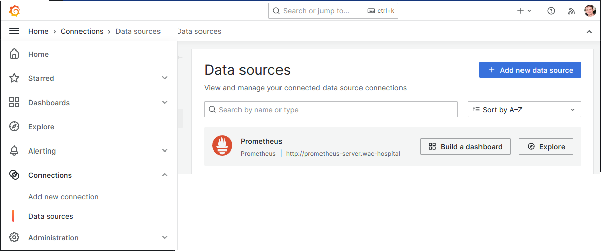
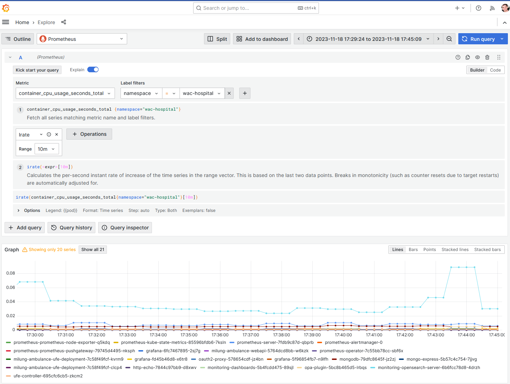
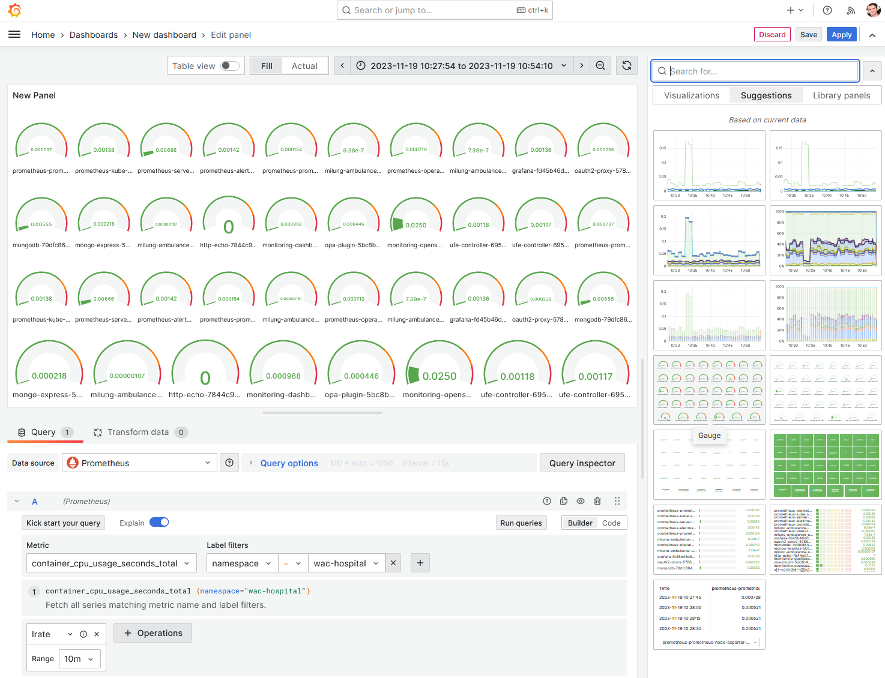

# Sledovanie stavu systému pomocou metrík s využitím služieb Prometheus a Grafana

---

>info:>
Šablóna pre predvytvorený kontajner ([Detaily tu](../99.Problems-Resolutions/01.development-containers.md)):
`registry-1.docker.io/milung/wac-mesh-090`

---

Pokiaľ sú naše logy vhodne vytvorené, môžeme z nich okrem analýzy problémov získať aj dostatok informácií o aktuálnom stave systému. Logy však primárne neriešia túto úlohu a vo väčšine prípadov nie sú najvhodnejším spôsobom na sledovanie rôznych výkonových parametrov systému a iných metrík systému vo všeobecnosti. V tejto časti si ukážeme, ako náš systém obohatiť o zber metrík formou časových sérií aktuálneho stavu systému. Na začiatok si ukážeme, ako zozbierať tieto metriky pre samotný klaster a v ďalšej časti si ukážeme postup, ako generovať špecifické metriky pre našu aplikáciu. Pre účel zberu metrík využijeme nástroj [Prometheus] a pre ich vizualizáciu nástroj [Grafana](https://grafana.com/).

Nástroj [Prometheus] patrí medzi najčastejšie využívané nástroje na monitorovanie stavu komplexných systémov. Zaznamenáva merania získavané z rôznych zdrojov, pričom každému meraniu priradí časovú značku, čím vznikne časová séria takýchto meraní. Meraním môže byť objem alokovanej pamäti, oneskorenie odpovede na HTTP požiadavku a mnoho ďaších ukazovateľov. Jednotlivé merania potom možno zo systému získať, vzájomne kombinovať alebo agregovať pomocou dotazovacieho jazyka [PromQL](https://prometheus.io/docs/prometheus/latest/querying/basics/). [Prometheus] obsahuje aj jednoduché rozhranie na získanie a vizualizáciu údajov, vo všeobecnosti sa ale na účely vizualizácie stavu systému využívajú špecializované nástroje, v našom prípade to bude nástroj [Grafana].

>info:> Metriky zo služby [Prometheus] je možné sprístupniť aj v službe [OpenSearch], avšak v dobe písania tohto textu - november 2023 - táto funkcionalita bola ešte limitovaná a nie celkom stabilná. Aktuálny stav a návod na použitie nájdete v [dokumentácii](https://opensearch.org/docs/latest/observing-your-data/prometheusmetrics/).

1. Pri nasadení [Prometheus] na kubernetes klaster je potrebné zvoliť vhodný spôsob nasadenia. V našom prípade použijeme [Helm] chart [prometheus-community/prometheus](https://github.com/prometheus-community/helm-charts/tree/main/charts/prometheus), ktorý okrem konfigurácie servera _Prometheus_ zabezpečí aj nasadenie ďalších komponentov, v našom prípade je asi najdôležitejšou služba [kube-state-metrics](https://github.com/kubernetes/kube-state-metrics#readme), ktorá zabezpečí zber metrík z kubernetes klastra. Nasadenie budeme vykonávať použitím objektov operátora [flux cd].

   Vytvorte adresár `${WAC_ROOT}/ambulance-gitops/infrastructure/prometheus` a v ňom súbor `${WAC_ROOT}ambulance-gitops/infrastructure/prometheus/helm-repository.yaml` s nasledujúcim obsahom:

   ```yaml
   apiVersion: source.toolkit.fluxcd.io/v1beta2
   kind: HelmRepository
   metadata:
     name: prometheus-community
     namespace: wac-hospital
   spec:
     interval: 1m
     url: https://prometheus-community.github.io/helm-charts
   ```

   Objekt [_HelmRepository_](https://fluxcd.io/flux/components/source/helmrepositories/) slúži systému [flux cd] ako referencia zdroja - repozitára - [Helm] balíčkov.

   Ďalej vytvorte súbor `${WAC_ROOT}/ambulance-gitops/infrastructure/prometheus/helm-release.yaml` s nasledujúcim obsahom:

    ```yaml
    apiVersion: helm.toolkit.fluxcd.io/v2beta1
    kind: HelmRelease
    metadata:
      name: prometheus
      namespace: wac-hospital
    spec:
      interval: 1m
      chart:
        spec:
          chart: prometheus
          sourceRef:
            kind: HelmRepository
            name: prometheus-community @_important_@
            namespace: wac-hospital
          interval: 1m
          reconcileStrategy: Revision
      values:
        prometheus-node-exporter:
          hostRootFsMount:
            mountPropagation: false # required on docker-desktop kluster 
      ```

   Pomocou objektu [_HelmRelease_](https://fluxcd.io/flux/components/helm/helmreleases/) systému [flux cd] predpisujeme, aby na cieľovom klastri nainštaloval balíček `prometheus` z repozitára určeného objektom `prometheus-community` typu [_HelmRepository_](https://fluxcd.io/flux/components/source/helmrepositories/).

   Vytvorte súbor `${WAC_ROOT}/ambulance-gitops/infrastructure/prometheus/kustomization.yaml` a zintegrujte predchádzajúce manifesty.

   ```yaml
   apiVersion: kustomize.config.k8s.io/v1beta1
   kind: Kustomization

   namespace: wac-hospital

   resources:
   - helm-repository.yaml
   - helm-release.yaml
   ```

2. Pripravíme konfiguráciu pre službu [Grafana]. Vytvorte priečinok `${WAC_ROOT}/ambulance-gitops/infrastructure/grafana` a v ňom súbor `${WAC_ROOT}/ambulance-gitops/infrastructure/grafana/deployment.yaml`:

   ```yaml
   apiVersion: apps/v1
   kind: Deployment
   metadata:
     name: grafana
   spec:
     template:
       spec:
         securityContext:
           fsGroup: 472
           supplementalGroups:
             - 0
         containers:
           - name: grafana
             image: grafana/grafana:latest
             imagePullPolicy: IfNotPresent
             ports:
               - containerPort: 3000
                 name: http-grafana
                 protocol: TCP
             readinessProbe:
               failureThreshold: 3
               httpGet:
                 path: /robots.txt
                 port: 3000
                 scheme: HTTP
               initialDelaySeconds: 10
               periodSeconds: 30
               successThreshold: 1
               timeoutSeconds: 2
             livenessProbe:
               failureThreshold: 3
               initialDelaySeconds: 30
               periodSeconds: 10
               successThreshold: 1
               tcpSocket:
                 port: 3000
               timeoutSeconds: 1
             resources:
               requests:
                 cpu: 250m
                 memory: 750Mi
             volumeMounts:
               - mountPath: /var/lib/grafana
                 name: grafana-pv
               - mountPath: /etc/grafana
                 name: config
               - mountPath: /etc/grafana/provisioning/datasources
                 name: datasources
         volumes:
           - name: grafana-pv
             persistentVolumeClaim:
               claimName: grafana  @_important_@
           - name: config
             configMap:
               name: grafana-config  @_important_@
           - name: datasources
             configMap:
               name: grafana-datasources @_important_@
   ```

   V tomto súbore sme definovali nasadenie kontajnera s nástrojom [Grafana] a priradili sme mu dva zdroje konfigurácie. Prvým je objekt `grafana-config` typu [_ConfigMap_](https://kubernetes.io/docs/concepts/configuration/configmap/), ktorý bude obsahovať konfiguráciu samotného nástroja [Grafana], druhým je objekt `grafana-datasources` typu [_ConfigMap_](https://kubernetes.io/docs/concepts/configuration/configmap/), ktorý bude obsahovať konfiguráciu zdrojov dát pre nástroj [Grafana]. Tieto objekty vytvoríme v nasledujúcich krokoch.

   Vytvorte súbor `${WAC_ROOT}/ambulance-gitops/infrastructure/grafana/params/grafana.ini`:

   ```ini
   [server]
   domain = wac-hospital.loc @_important_@
   root_url = https://wac-hospital.loc/grafana/ @_important_@
   serve_from_sub_path = true @_important_@
   
   [security]
   # enable iframe embedding in ufe-controller
   # or to embed graphs in external pages
   allow_embedding = true

   [users]
   auto_assign_org=true
   auto_assign_org_role=Admin
   
   [auth]
   disable_login_form = true
   
   [auth.proxy]
   enabled = true
   header_name = x-auth-request-email @_important_@
   header_property = email
   auto_sign_up = true
   sync_ttl = 60
   whitelist =
   headers = Name:x-auth-request-preferred-username Groups:x-auth-request-groups Role:x-auth-request-groups
   enable_login_token = false
   ```

   V inicializačnom súbore sme v základnej konfigurácii povolili anonymný prístup k nástroju [Grafana] a nastavili sme základné parametre pre autentifikáciu pomocou HTTP hlavičky `x-forwarded-email`. Táto hlavička bude obsahovať emailovú adresu používateľa, ktorý sa prihlási do nástroja [Grafana]. Táto hlavička bude vytvorená službou [oauth2-proxy], ktorú  sme nasadili v predchádzajúcich častiach. Tiež sme špecifikovali, že nástroj [Grafana] bude dostupný na adrese `https://wac-hospital.loc/grafana/`.

   Vytvorte súbor `${WAC_ROOT}/ambulance-gitops/infrastructure/grafana/params/prometheus-datasource.yaml`:

   ```yaml
   apiVersion: 1
   datasources:
     - name: Prometheus
       type: prometheus
       access: proxy
       url: http://prometheus-server.wac-hospital @_important_@
       jsonData:
         httpMethod: POST
         manageAlerts: true
         prometheusType: Prometheus
         prometheusVersion: 2.47.0
         cacheLevel: 'High'
         disableRecordingRules: false
         incrementalQueryOverlapWindow: 10m
   ```

   [Grafana] umožňuje konfigurovať zdroj údajov cez používateľské rozhranie alebo formou automatického nastavenia -  [_provisioning_](https://grafana.com/docs/grafana/latest/administration/provisioning/), ktorý umožňuje predpripraviť konfiguráciu známych zdrojov údajov. Táto konfigurácia sa aplikuje pri štarte služby _Grafana_. V našom prípade sme konfigurovali zdroj údajov pre nástroj [Prometheus], ktorý sme nasadili v predchádzajúcom kroku.

   >info:> [Grafana] podporuje aj automatické nastavenie údajových panelov - _dashboards_. V cvičení budeme postupovať manuálnym vytváraním údajových panelov. Ich konfiguráciu vo forme JSON špecifikácií si potom môžete zobraziť v používateľskom rozhraní, uložiť a použiť pre automatické nastavenie. Tieto špecifikácie musia byť uložené v adresári `/etc/grafana/provisioning/dashboards` - _mountPath_ parameter kontajnera `grafana`.

   Pripravíme konfiguráciu pre [_Persistent Volume Claim_](https://kubernetes.io/docs/concepts/storage/persistent-volumes/#persistentvolumeclaims). Vytvorte súbor `${WAC_ROOT}/ambulance-gitops/infrastructure/grafana/pvc.yaml`:

   ```yaml
   apiVersion: v1
   kind: PersistentVolumeClaim
   metadata:
     name: grafana
   spec:
     accessModes:
       - ReadWriteOnce
     resources:
       requests:
         storage: 1Gi
   ```

   Ďalej nakonfigurujeme objekt [_Service_](https://kubernetes.io/docs/concepts/services-networking/service/) v súbore `${WAC_ROOT}/ambulance-gitops/infrastructure/grafana/service.yaml`:

   ```yaml
   apiVersion: v1
   kind: Service
   metadata:
     name: grafana
   spec:
     ports:
       - port: 80
         protocol: TCP
         targetPort: http-grafana
   ```

   Nakoniec všetky konfiguračné súbory integrujte pomocou súboru `${WAC_ROOT}/ambulance-gitops/infrastructure/grafana/kustomization.yaml`:

   ```yaml
   apiVersion: kustomize.config.k8s.io/v1beta1
   kind: Kustomization

   namespace: wac-hospital
   
   commonLabels:
     app.kubernetes.io/component: grafana
     
   resources:
   - deployment.yaml
   - pvc.yaml
   - service.yaml
   
   
   configMapGenerator:
     - name: grafana-config
       files: 
       - params/grafana.ini
     - name: grafana-datasources
       files:
       - params/prometheus-datasource.yaml
   ```

3. Vytvorte objekt [_HTTPRoute_](https://gateway-api.sigs.k8s.io/api-types/httproute/) v súbore `${WAC_ROOT}/ambulance-gitops/apps/observability-webc/grafana.http-route.yaml`:

   ```yaml
   apiVersion: gateway.networking.k8s.io/v1
   kind: HTTPRoute
   metadata:
     name: grafana
   spec:
     parentRefs:
       - name: wac-hospital-gateway
     rules:
       - matches:
           - path:
               type: PathPrefix
               value: /grafana
         backendRefs:
           - group: ""
             kind: Service
             name: grafana
             port: 80
   ```

   Vytvorte súbor `${WAC_ROOT}/ambulance-gitops/apps/observability-webc/grafana.webcomponent.yaml`:

   ```yaml
   apiVersion: fe.milung.eu/v1
   kind: WebComponent
   metadata:
     name: grafana
   spec:
     module-uri: built-in
     navigation:
     - attributes:
       - name: src
         value: /grafana
       details: Aktuálny operačný stav systému
       element: ufe-frame
       path: grafana
       priority: 0
       title: System Dashboards
     preload: false
     proxy: true
   ```

   a upravte súbor `${WAC_ROOT}/ambulance-gitops/apps/observability-webc/kustomization.yaml`:

   ```yaml
   ...
   resources:
    - monitoring-opensearch.webcomponent.yaml
    - monitoring-opensearch.http-route.yaml
    - grafana.webcomponent.yaml     @_add_@
    - grafana.http-route.yaml     @_add_@
   ```

4. Upravte súbor `${WAC_ROOT}/ambulance-gitops/clusters/localhost/prepare/kustomization.yaml`:

   ```yaml
   ...
   resources:
   ...
   - ../../../infrastructure/monitoring-opensearch
   - ../../../infrastructure/prometheus @_add_@
   - ../../../infrastructure/grafana @_add_@
   ...
   ```

5. Overte správnosť konfigurácie. Otvorte príkazové okno v priečinku `${WAC_ROOT}/ambulance-gitops` a vykonajte príkaz

   ```ps
   kubectl kustomize clusters/localhost/prepare
   kubectl kustomize clusters/localhost/install
   ```

   Archivujte Vaše zmeny príkazmi:

   ```ps
   git add .
   git commit -m "Added prometheus and grafana"
   git push
   ```

   Vyčkajte, kým sa zmeny prejavia v klastri:

   ```ps
   kubectl get kustomizations --namespace wac-hospital
   kubectl get pods -n wac-hospital
   ```

   Mali by ste vidieť 5 podov s menom začínajúcim na `prometheus` a 1 pod s menom začínajúcim na `grafana`.

6. Otvorte prehliadač a navigujte sa na stránku [https://wac-hospital.loc/ui/grafana](https://wac-hospital.loc/ui/grafana). Ak budete vyzvaný, zadajte svoje GitHub prihlasovacie údaje. Kliknite na dlaždicu `System Dashboards`. Otvorte bočný navigačný panel, zvoľte položku _Connection_ a následne položku _Data Sources_. V zozname zdrojov by ste mali vidieť zdroj údajov pre nástroj [Prometheus], nastavený na adresu `http://prometheus-server.wac-hospital`.

   

   Stlačte na tlačidlo _Explore_ v sekcii _Prometheus_. Zobrazí sa Vám okno, v ktorom môžete vyhľadávať jednotlivé dostupné metriky a vytvárať ich agregácie a grafy. Prepnite mód zobrazenia z _Builder_ na _Code_ a do vstupného poľa označeného _Enter PromQL query ..._ zadajte nasledujúci príkaz:

   ```plain
   irate(container_cpu_usage_seconds_total{namespace="wac-hospital"}[10m])
   ```

   Prepnite mód zobrazenia späť do módu _Builder_ a v hornej časti panela prepnite voľbu _Explain_. Otvorte panel _Options_ a v poli _Legend_ zvoľte možnosť _Custom_ a následne zadajte {{pod}}. Nakoniec stlačte tlačidlo _Run Query_ v pravom hornom rohu stránky. Výsledný panel aj s grafom aktuálneho vyťaženia CPU jednotlivými podmi v [_namespace_](https://kubernetes.io/docs/concepts/overview/working-with-objects/namespaces/)  `wac-hospital` by mal vyzerať nasledovne:

   

   Stlačte na tlačidlo _Add to dashboard_ a vytvorte nový údajový panel stlačením tlačidla _Open Dashboard_. Zobrazí sa Vám stránka s údajovým panelom pre aktuálne vyťaženie CPU. Myšou prejdite nad panel a v pravom hornom rohu zobrazte _Menu_ a zvoľte _Edit_. Zobrazí sa režim úprav panelu. Stlačte tlačidlo voľby zobrazenia - momentálne _Time series_ - a následne tlačidlo _Suggestion_. Zvoľte si Vami preferovaný spôsob zobrazenia, napríklad _Gauge_. Následne stlačte tlačidlo _Apply_.

   

   Stlačte na ikonu _Save dashboard_ a uložte si údajový panel pod názvom `WAC Hospital CPU`. Následne stlačte na tlačidlo _Save_. Pokiaľ teraz prejdete na úvodnú stránku [https://wac-hospital.loc/grafana](https://wac-hospital.loc/grafana), uvidíte v zozname panelov - _dashboards_ - aj Vami uložený panel `WAC Hospital CPU`.

   >homework:> Rozšírte údajový panel o ďalšie metriky, napríklad o aktuálne vyťaženie pamäte alebo o aktuálne vyťaženie CPU jednotlivých podov v [_namespace_](https://kubernetes.io/docs/concepts/overview/working-with-objects/namespaces/) `wac-hospital`. (Hľadajte metriku `container_memory_usage_bytes`). Vyskúšajte rôzne spôsoby vizualizácie metrík. Viac podrobností o možnostiach vizualizácie metrík nájdete v [dokumentácii nástroja Grafana](https://grafana.com/docs/grafana/latest/panels/visualizations/).

Metriky v kombinácii s analýzou logov dávajú tímom pracujúcim technikou DevOps okamžitý náhľad na operačný stav aplikácie nasadenej v dátovom centre. Môžu sledovať priebeh jej zaťaženia, reakcie systému na zmeny v aktuálnom zaťažení a optimalizovať implementáciu systému. Metriky, ktoré máme momentálne k dispozícii, sú generované najmä službou [_node-exporter_](https://github.com/prometheus/node_exporter) a [_kube-state-metrics_](https://github.com/kubernetes/kube-state-metrics). V nasledujúcej časti si ukážeme, ako generovať metriky špecifické pre našu aplikáciu.

>info:> Tu uvádzané nástroje sú ukážkou populárnych nástrojov na monitorovanie systémov, pravdaže nie sú jedinými.  V prípade, že máte záujem aj o iné nástroje, môžete si ich vyhľadať na stránke [CNCF Landscape](https://landscape.cncf.io/) v časti `Observability and Analysis`.
