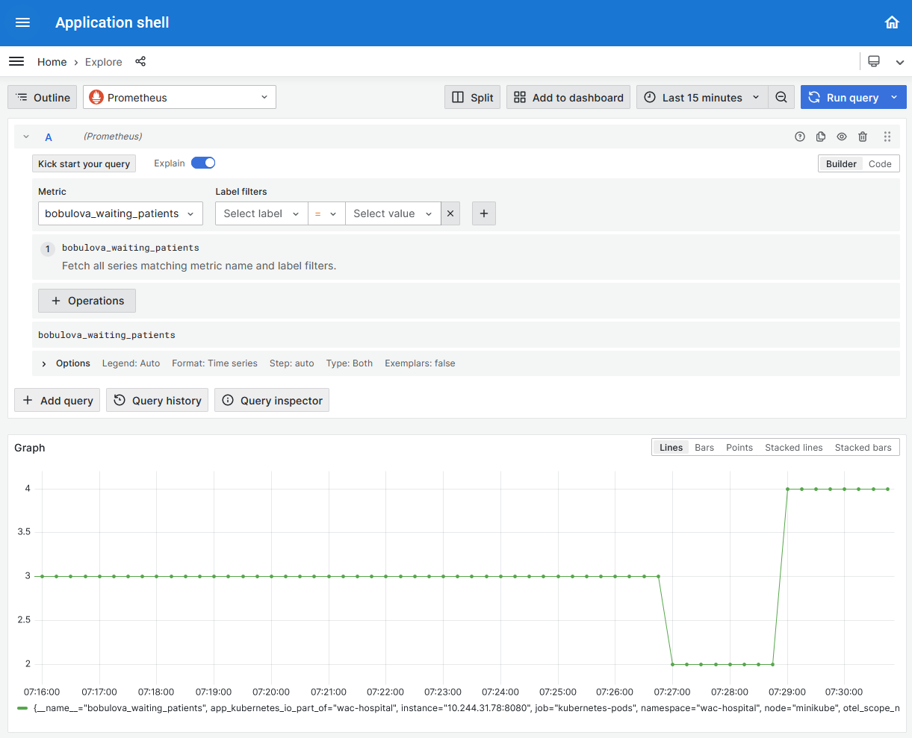

# Vytváranie vlastných operačných metrík s využitím OpenTelemetry SDK

---

>info:>
Šablóna pre predvytvorený kontajner ([Detaily tu](../99.Problems-Resolutions/01.development-containers.md)):
`registry-1.docker.io/milung/wac-mesh-100`

---

V predchádzajúcej sekcii sme nasadili do nášho systému služby [Prometheus] a [Grafana], čo nám umožnilo zbierať a zobrazovať rôzne operačné metriky nášho systému, prevažne získané sledovaním parametrov kubernetes systému. Nie vždy sú však tieto metriky dostatočné, pretože nezahŕňajú metriky z našej aplikácie, ktoré sú pre nás dôležité. V tejto časti si ukážeme ako môžeme vytvoriť vlastné operačné metriky. K tomuto účelu musíme upraviť náš zdrojový kód. V našom prípade budeme využívať knižnicu [OpenTelemetry], ktorá nám umožní vytvárať vlastné metriky a zároveň ich exportovať do formátu, ktorý dokáže spracovať služba [Prometheus].

Knižnica - SDK - [OpenTelemetry] je výsledkom integrácie rôznych projektov, ktoré sa zaoberajú monitorovaním aplikácií. Výsledkom je jednotná knižnica, ktorá umožňuje vytvárať metriky, distribuované trasovanie, generovanie záznamov - logov, vo všeobecnosti nazývanými [_Signals_](https://opentelemetry.io/docs/concepts/signals/metrics/). Tieto signály je potom možné exportovať do rôznych formátov. Formát a [špecifikácia OpenTelemetry](https://opentelemetry.io/docs/specs/) sú podporované väčšinou známych knižníc a integrovateľné so službami rôznych poskytovateľov. SDK je implementované v rôznych programovacích jazykoch, v našom prípade budeme využívať implementáciu pre jazyk [Go](https://opentelemetry.io/docs/instrumentation/go/).

1. V prvom kroku musíme pripraviť inštrumentalizáciu (zber rôznych meraní a záznamov - signálov) programu. Otvorte súbor `${WAC_ROOT}}/ambulance-webapi/cmd/ambulance-api-service/main.go` a upravte ho:

   ```go
   import (
      "context"
      "time"
      "log"
      "net/http" @_add_@
      "os"
      "strings"
     
      "github.com/gin-gonic/gin"
      "github.com/milung/ambulance-webapi/api"
      "github.com/milung/ambulance-webapi/internal/ambulance_wl"
      "github.com/milung/ambulance-webapi/internal/db_service"
      "github.com/prometheus/client_golang/prometheus/promhttp"  @_add_@
      "github.com/technologize/otel-go-contrib/otelginmetrics"  @_add_@
      "go.opentelemetry.io/otel"     @_add_@
      "go.opentelemetry.io/otel/attribute"     @_add_@
      "go.opentelemetry.io/otel/exporters/prometheus"     @_add_@
      "go.opentelemetry.io/otel/sdk/metric"     @_add_@
      "go.opentelemetry.io/otel/sdk/resource"     @_add_@
      semconv "go.opentelemetry.io/otel/semconv/v1.24.0"     @_add_@
   )
   
   ...

   // initialize OpenTelemetry instrumentations   @_add_@
   func initTelemetry() error {   @_add_@
     ctx := context.Background()   @_add_@
     res, err := resource.New(ctx,   @_add_@
      resource.WithAttributes(semconv.ServiceNameKey.String("Ambulance WebAPI Service")),   @_add_@
      resource.WithAttributes(semconv.ServiceNamespaceKey.String("WAC Hospital")),   @_add_@
      resource.WithSchemaURL(semconv.SchemaURL),   @_add_@
      resource.WithContainer(),   @_add_@
     )   @_add_@
       @_add_@
     if err != nil {   @_add_@
      return err   @_add_@
     }   @_add_@
       @_add_@
     metricExporter, err := prometheus.New()   @_add_@
     if err != nil {   @_add_@
      return err   @_add_@
     }   @_add_@
       @_add_@
     metricProvider := metric.NewMeterProvider(metric.WithReader(metricExporter), metric.WithResource(res))   @_add_@
     otel.SetMeterProvider(metricProvider)   @_add_@
     return nil @_add_@
   }   @_add_@
   ```

   Funkcia `initTelemetry()` pripravuje globálnu inštanciu poskytovateľa metrík - [_metric provider_](https://opentelemetry.io/docs/concepts/signals/metrics/#meter-provider), ktorý bude zodpovedný za zber metrík a ich exportovanie. Všetky naše metriky (a neskôr [_traces_](https://opentelemetry.io/docs/concepts/signals/traces/) ) budú asociované s objektom, ktorý je opísaný inštanciou vytvorenou volaním funkcie `resource.New`, a ktorému priraďujeme atribúty, pomocou ktorých tento objekt môžeme identifikovať.

   Zároveň sme vytorili inštanciu `metricExporter`, ktorá je zodpovedná za poskytnutie - [_export_](https://opentelemetry.io/docs/concepts/components/#exporters) metrík vo formáte, ktorý je schopná spracovať služba [Prometheus].

   Ďalej upravte funkciu `main()` v tom istom súbore `${WAC_ROOT}}/ambulance-webapi/cmd/ambulance-api-service/main.go`:

   ```go
   func main() {
       log.Printf("Server started")
    
       port := os.Getenv("AMBULANCE_API_PORT")
       if port == "" {
           port = "8080"
       }
    
       environment := os.Getenv("AMBULANCE_API_ENVIRONMENT")
       if !strings.EqualFold(environment, "production") { // case insensitive comparison
           gin.SetMode(gin.DebugMode)
       }
       engine := gin.New()
       engine.Use(gin.Recovery())
    
       // setup telemetry    @_add_@
       initTelemetry()    @_add_@
       @_add_@
       // instrument gin engine
       engine.Use(otelginmetrics.Middleware(    @_add_@
           "Ambulance WebAPI Service",    @_add_@
           // Custom attributes    @_add_@
           otelginmetrics.WithAttributes(func(serverName, route string, request *http.Request) []attribute.KeyValue {    @_add_@
               return append(otelginmetrics.DefaultAttributes(serverName, route, request))    @_add_@
           }),    @_add_@
       ))    @_add_@
    
       ...
    
       // metrics endpoint   @_add_@
       promhandler := promhttp.Handler()   @_add_@
       engine.Any("/metrics", func(ctx *gin.Context) {   @_add_@
           promhandler.ServeHTTP(ctx.Writer, ctx.Request)   @_add_@
       })   @_add_@
    
       engine.Run(":" + port)
   }
   ```

   Okrem vyvolania samotnej funkcie `initTelemetry()` sme zabezpečili inštrumentalizáciu knižnice [gin] pomocou funkcie `otelginmetrics.Middleware()`. Táto funkcia je zodpovedná za zber metrík pre každú požiadavku, ktorá prejde cez náš server, ako napríklad objem prenesených údajov, či počet aktívnych požiadaviek v danom čase. Nakoniec sme pridali aj endpoint `/metrics`, ktorý bude slúžiť na čítanie metrík službou [Prometheus].

   Pokiaľ by sme teraz naše úpravy ukončili, získali by sme sadu ďalších metrík, ktoré by sme mohli zobraziť v službe [Grafana]. Zároveň by sme mohli pristúpiť k ceste `/metrics`, kde by sme videli jednotlivé záznamy meraní vo formáte služby _Prometheus_.

2. Našim cieľom je vygenerovať dve doplňujúce metriky: celková doba strávená čakaním na odozvu databázy a momentálny počet čakajúcich pacientov v jednotlivých ambulanciách. Druhá z týchto metrík nie je celkom _operačnou_ metrikou, ukážeme si ju hlavne ako príklad asynchrónnej metriky. [OpenTelemetry] rozlišuje medzi synchrónnymi a asynchrónnymi metrikami. Synchrónne merania sa vytvárajú a ukladajú synchrónne s prebiehajúcim výpočtom, zatiaľ čo asynchrónne merania sa získavajú len v prípade, že ich klient potrebuje - meranie sa vyvolá asynchrónne pomocou _callback_ funkcie.

   Upravte súbor `${WAC_ROOT}}/ambulance-webapi/internal/ambulance_wl/utils_ambulance_updater.go`:

   ```go
   package ambulance_wl

   import (
       "fmt" @_add_@
       "log" @_add_@
       "net/http"
       "time"  @_add_@
       "context"  @_add_@
   
       "github.com/gin-gonic/gin"
       "github.com/<github_id>/ambulance-webapi/internal/db_service" @important
       "go.opentelemetry.io/otel"   @_add_@
       "go.opentelemetry.io/otel/attribute"   @_add_@
       "go.opentelemetry.io/otel/metric"   @_add_@
   )
   
   var (    @_add_@
       dbMeter           = otel.Meter("waiting_list_access")    @_add_@
       dbTimeSpent       metric.Float64Counter    @_add_@
       waitingListLength = map[string]int64{}    @_add_@
   )    @_add_@
       @_add_@
   // package initialization - called automaticaly by go runtime when package is used    @_add_@
   func init() {    @_add_@
       // initialize OpenTelemetry instrumentations    @_add_@
       var err error    @_add_@
       dbTimeSpent, err = dbMeter.Float64Counter(    @_add_@
           "ambulance_wl_time_spent_in_db",    @_add_@
           metric.WithDescription("The time spent in the database requests"),    @_add_@
           metric.WithUnit("ms"),    @_add_@
       )    @_add_@
       @_add_@
       if err != nil {    @_add_@
           panic(err)    @_add_@
       }    @_add_@
   }    @_add_@
   ```

   Inštancia `dbMeter` reprezentuje rozsah meraní - [instrumentation scope](https://opentelemetry.io/docs/concepts/instrumentation-scope/) s označením `waiting_list_access`, v ktorom následne vytvárame metriku `dbTimeSpent`.

   V tom istom súbore `${WAC_ROOT}/ambulance-webapi/internal/ambulance_wl/utils_ambulance_updater.go` upravte funkciu `updateAmbulanceFunc`:

   ```go
   func updateAmbulanceFunc(ctx *gin.Context, updater ambulanceUpdater) {
       ...
       db, ok := value.(db_service.DbService[Ambulance])
       if !ok {
           ...
       }
   
       ambulanceId := ctx.Param("ambulanceId")
   
       start := time.Now() @_add_@
       ambulance, err := db.FindDocument(ctx, ambulanceId)
       dbTimeSpent.Add(ctx, float64(float64(time.Since(start)))/float64(time.Millisecond), metric.WithAttributes(   @_add_@
           attribute.String("operation", "find"),   @_add_@
           attribute.String("ambulance_id", ambulanceId),   @_add_@
           attribute.String("ambulance_name", ambulance.Name),   @_add_@
       ))   @_add_@   
       ...
       updatedAmbulance, responseObject, status := updater(ctx, ambulance)
   
       if updatedAmbulance != nil {
           start := time.Now() @_add_@
           err = db.UpdateDocument(ctx, ambulanceId, updatedAmbulance)
   
           // update metrics    @_add_@
           dbTimeSpent.Add(ctx, float64(float64(time.Since(start)))/float64(time.Millisecond), metric.WithAttributes(    @_add_@
               attribute.String("operation", "update"),    @_add_@
               attribute.String("ambulance_id", ambulanceId),    @_add_@
               attribute.String("ambulance_name", ambulance.Name),    @_add_@
           ))@_add_@
            @_add_@
           // demonstration of possible handling of async instruments:    @_add_@
           // not really an operational metric, it would be more of a business metric/KPI.    @_add_@
           // also UpDownCounter may be of better use in practical cases.    @_add_@
           if _, ok := waitingListLength[ambulanceId]; !ok {    @_add_@
               newGauge, err := dbMeter.Int64ObservableGauge(    @_add_@
                   fmt.Sprintf("%v_waiting_patients", ambulanceId),    @_add_@
                   metric.WithDescription(fmt.Sprintf("The length of the waiting list for the ambulance %v", ambulance.Name)),    @_add_@
                   metric.WithUnit("{patient}"),    @_add_@
               )    @_add_@
               if err != nil {    @_add_@
                   log.Printf("Failed to create waiting list length gauge for ambulance %v: %v", ambulanceId, err)    @_add_@
               }    @_add_@
               waitingListLength[ambulanceId] = 0    @_add_@
                @_add_@
               _, err = dbMeter.RegisterCallback(func(_ context.Context, o metric.Observer) error {    @_add_@
                   // we could have looked up the ambulance in the database here, but we already have it in memory    @_add_@
                   // so use the latest snapshots to update the gauge    @_add_@
                   o.ObserveInt64(newGauge, waitingListLength[ambulanceId])    @_add_@
                   return nil    @_add_@
               }, newGauge)    @_add_@
                @_add_@
               if err != nil {    @_add_@
                   log.Printf("Failed to register callback for waiting list length gauge for ambulance %v: %v", ambulanceId, err)    @_add_@
               }    @_add_@
           }@_add_@
            @_add_@
           // set the gauge snapshot    @_add_@
           waitingListLength[ambulanceId] = int64(len(updatedAmbulance.WaitingList))    @_add_@
   
       } else {
           err = nil // redundant but for clarity
       }
       ...
   }
   ```

   Zmeny v tejto funkcii teraz merajú čas strávený volaním databázy pri čítaní a zmene údajov v zozname čakajúcich a synchrónne tieto zmeny zaznamenávajú v metrike `dbTimeSpent`. Zároveň sa pre každú ambulanciu dynamicky vytvára asynchrónna metrika `newGauge` a registruje sa _callback_ funkcia, ktorá bude poskytovať aktuálny počet čakajúcich pacientov v danej ambulancii na základe poslednej známej hodnoty. Táto metrika je asynchrónna, pretože sa poskytuje len v prípade, že klient požiada o jej hodnotu.

3. Uložte zmeny a v priečinku `${WAC_ROOT}}/ambulance-webapi` vykonajte nasledujúce príkazy:

   ```ps
   go get github.com/technologize/otel-go-contrib
   go mod tidy
   ./scripts/run.ps1 start
   ```

   V prehliadači otvorte stránku [http://localhost:8080/metrics](http://localhost:8080/metrics), ktorá zobrazí existujúce metriky vo formáte [Prometheus]. Zatiaľ nie sú viditeľné metriky vytvorené pre rozsah  `waiting_list_access`.
   Zastavte proces.

4. Aby systém [Prometheus] vedel o nových metrikách, musíme upraviť konfiguráciu nasadenia našej aplikácie, konkrétne musíme pridať na náš pod špecifické anotácie. Služba _Prometheus_ je konfigurovaná tak, aby vyhľadávala objekty typu [_Service_](https://kubernetes.io/docs/concepts/services-networking/service/) a typu [_Pod_](https://kubernetes.io/docs/concepts/workloads/pods/) s anotáciami určenými v konfigurácii služby `prometheus-server`. Upravte súbor `${WAC_ROOT}/ambulance-webapi/deployments/kustomize/install/deployment.yaml`:

   ```yaml
   ...
   spec:
     replicas: 1
     selector:
       matchLabels:
         pod: milung-ambulance-webapi-label 
     template:
       metadata:
         labels:
           pod: milung-ambulance-webapi-label 
         annotations:   @_add_@
           prometheus.io/scrape: 'true'   @_add_@
           prometheus.io/path: '/metrics'   @_add_@
           prometheus.io/port: '8080'   @_add_@
   
       spec:
       ...
   ```

5. Uložte a archivujte zmeny v priečinku `${WAC_ROOT}/ambulance-webapi` :

   ```ps
   git add .
   git commit -m "Added custom metrics"
   git push
   ```

   Overte, že boli naše zmeny úspešne nasadené a pod pre webapi bol reštartovaný:

   ```ps
   kubectl get pods -n wac-hospital
   ```

   Prejdite na stránku [https://wac-hospital.loc/ui/](https://wac-hospital.loc/ui/) a vo svojej aplikácii _Zoznam čakajúcich <pfx>_ vytvorte niekoľko záznamov Vyčkajte približne 2 minúty, kým služba [Prometheus] aktivuje proces načítania metrík. Prejdite na aplikáciu _System Dashboards_ a v ľavom navigačnom paneli zvoľte položku _Explore_. V poli _Metric_ vyhľadajte merania `bobulova_waiting_patients` a stlačte tlačidlo _Run query_. V grafe by ste mali vidieť hodnoty zodpovedajúce aktuálnemu počtu čakajúcich pacientov. Pokiaľ budete ďalej vytvárať alebo mazať záznamy v zozname čakajúcich, budú na to hodnoty v grafe náležite reagovať (s príslušným oneskorením). Podobným spôsobom možete sledovať aj metriku `ambulance_wl_time_spent_in_db_milliseconds_total`, ktorá zobrazuje celkový čas strávený čítaním a zápisom do databázy.

   

   >homework:> Vytvorte údajové panely pre tieto metriky v aplikácii _System Dashboards_ - [Grafana]. Vyskúšajte aj metriky začínajúce prefixom `http_server_` a `promhttp_`.
