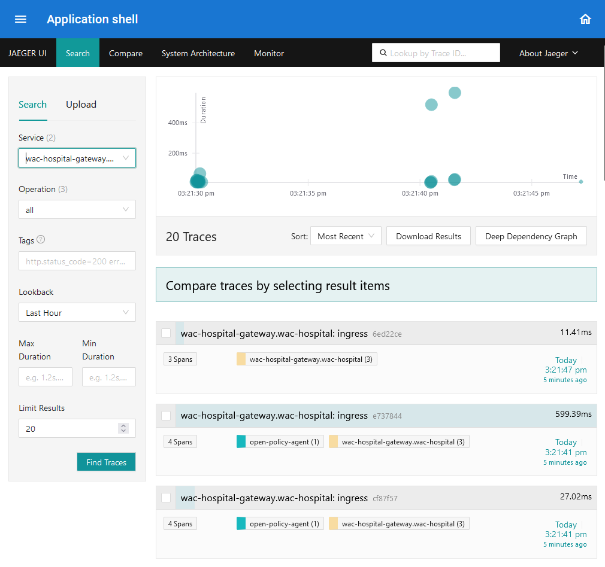

# Distribuované trasovanie s Jaeger Tracing

---

>info:>
Šablóna pre predvytvorený kontajner ([Detaily tu](../99.Problems-Resolutions/01.development-containers.md)):
`registry-1.docker.io/milung/wac-mesh-110`

---

Metriky a analýza logov nám výrazne uľahčia sledovanie stavu systému a analýzu prípadných odchýliek od špecifikovaného správania sa systému. Mimo vývojového prostredia, kedy je nasadený systém pod záťažou, sa ale budeme stretávať so situáciami, kedy je potrebné analyzovať, ako prebieha spracovanie jednotlivých požiadaviek skrz viacero mikroslužieb, prípadne budeme potrebovať nájsť príčinu chyby, ktorú pozorujeme až ako zlyhanie požiadavky v niektorej zo služieb, kde už nie je možné vykonať opravnú operáciu. V zásade potrebujeme nájsť vzťah medzi jednotlivými operačnými záznamami - log-mi - v rôznych častiach nášho systému, pričom takýto systém môže simultánne spracovávať desiatky až tisícky požiadaviek. Spôsob takejto analýzy sa nazýva distribuovaným trasovaním - [_distributed tracing_](https://microservices.io/patterns/observability/distributed-tracing.html).

Zjednodušene opísané, v kontexte distribuovaného trasovania je požiadavke vstupujúcej do systému (prípadne samostatnej požiadavke vzniknutej v rámci systému samotného) priradený takzvaný _trace-id_, ktorý sa propaguje pri volaniach jednotlivých subsystémov - mikroslužieb, knižníc alebo komponentov mikroslužieb. Každý subsystém potom definuje rozsah výpočtu - [_span_](https://opentelemetry.io/docs/concepts/signals/traces/#spans), ktorému priraďuje príslušné [atribúty](https://opentelemetry.io/docs/concepts/signals/traces/#attributes) potrebné pre identifikáciu služby, typu výpočtu, prípadne parametre výpočtu a udalosti vznikajúce počas výpočtu. _Span_ má priradený [_span context_](https://opentelemetry.io/docs/concepts/signals/traces/#span-context) alebo tiež nazývaný [_trace context_](https://opentelemetry.io/docs/concepts/signals/traces/#span-context), ktorý obsahuje identifikátor pôvodnej požiadavky - _trace_id_ - v ktorej kontexte je výpočet vykonávaný, ako aj rozsah výpočtu - _span-id_, ktoré zahŕňajú príslušný výpočet. Tieto záznamy sú následne odoslané do služby - _collector_ - ktorá tieto záznamy odošle na trvalé uloženie pre neskoršiu analýzu.

Podobne ako v prípade metrík, sa pri distribuovanom trasovaní asi najčastejšie využíva knižnica [OpenTelemetry]. V tejto časti cvičenia si ukážeme ako nasadiť služby systému [Jaeger] pre zber a analýzu distribuovaných záznamov do nášho systému a v nasledujúcej časti upravíme službu ambulance-webapi aby generovala vlastné rozsahy výpočtu.

>info:> Podobne ako v prípade metrík, aj v prípade distribuovaného trasovania sú dostupné rôzne alternatívy produktov a služieb, ktoré túto funkcionalitu sprístupňujú. Základný prehľad dostupných služieb môžete nájsť napríklad na stránkach [CNFC Cloud Native Landscape](https://landscape.cncf.io/). V každom prípade odporúčame zamerať sa najmä na služby a produkty, ktoré natívne podporujú špecifikáciu [OpenTelemetry Protocol](https://opentelemetry.io/docs/specs/otlp/)

1. Službu [Jaeger] budeme inštalovať s využitím [Jaeger Helm Chart](https://github.com/jaegertracing/helm-charts). Vytvorte adresár `${WAC_ROOT}/ambulance-gitops/infrastructure/jaegertracing` a v ňom súbor `${WAC_ROOT}/ambulance-gitops/infrastructure/jaegertracing/helm-repository.yaml` s obsahom:

   ```yaml
   apiVersion: source.toolkit.fluxcd.io/v1beta2
   kind: HelmRepository
   metadata:
     name: jaegertracing
     namespace: wac-hospital
   spec:
     interval: 1m
     url: https://jaegertracing.github.io/helm-charts
   ```

   Vytvorte súbor `${WAC_ROOT}/ambulance-gitops/infrastructure/jaegertracing/helm-release.yaml`:

   ```yaml
   apiVersion: helm.toolkit.fluxcd.io/v2beta1
   kind: HelmRelease
   metadata:
     name: jaeger
     namespace: wac-hospital
   spec:
     interval: 1m
     chart:
       spec:
         chart: jaeger
   
         sourceRef:
           kind: HelmRepository
           name: jaegertracing
           namespace: wac-hospital
         interval: 1m
         reconcileStrategy: Revision
     values:
       provisionDataStore:
         cassandra: false
       storage:
         type: opensearch
       collector:
         enabled: true
         extraEnv:
           # see https://opensearch.org/docs/latest/observing-your-data/trace/trace-analytics-jaeger/
           - name: SPAN_STORAGE_TYPE
             value: opensearch
           - name: ES_TAGS_AS_FIELDS_ALL
             value: "true"
           - name: ES_SERVER_URLS
             value: http://monitoring-opensearch.wac-hospital:9200 @_important_@
           - name: ES_TLS_ENABLED
             value: "false"
         service:
           otlp:    @_important_@
             grpc:    @_important_@
               name: otlp-grpc     @_important_@
               port: 4317    @_important_@
             http:
               name: otlp-http
               port: 4318
       query:
         enabled: true
         basePath: /jaeger   @_important_@
         extraEnv:
           - name: SPAN_STORAGE_TYPE
             value: opensearch
           - name: ES_SERVER_URLS
             value: http://monitoring-opensearch.wac-hospital:9200 @_important_@
           - name: ES_TLS_ENABLED
             value: "false"
   ```

   Všimnite si konfiguráciu služieb `jaeger-collector` a `jaeger-query`. Táto konfigurácia nám umožňuje využiť službu `monitoring-opensearch` ako úložisko záznamov distribuovaného trasovania a zároveň sprístupní funkcionalitu analýzy trace-ov v službe `monitoring-opensearch-dashboards`. Taktiež sme v službe `collector` zapli podporu pre [OpenTelemetry Protocol](https://opentelemetry.io/docs/specs/otlp/), čo nám zjednoduší pripojenie externých služieb.

   Vytvorte súbor `${WAC_ROOT}/ambulance-gitops/infrastructure/jaegertracing/kustomization.yaml`: 

   ```yaml
   apiVersion: kustomize.config.k8s.io/v1beta1
   kind: Kustomization

   namespace: wac-hospital

   resources:
   - helm-repository.yaml
   - helm-release.yaml
   ```

2. Vytvorte súbor `${WAC_ROOT}/ambulance-gitops/apps/observability-webc/jaeger-query.http-route.yaml`

   ```yaml
   apiVersion: gateway.networking.k8s.io/v1
   kind: HTTPRoute
   metadata:
     name: jaeger-query
   spec:
     parentRefs:
       - name: wac-hospital-gateway
     rules:
       - matches:
           - path:
               type: PathPrefix
               value: /jaeger
         backendRefs:
           - group: ""
             kind: Service
             name: jaeger-query
             port: 80
   ```

   a súbor `${WAC_ROOT}/ambulance-gitops/apps/observability-webc/jaeger-query.webcomponent.yaml`

   ```yaml
   apiVersion: fe.milung.eu/v1
   kind: WebComponent
   metadata:
     name: jaeger
   spec:
     module-uri: built-in
     navigation:
     - attributes:
       - name: src
         value: /jaeger
       details: Analýza spracovania požiadaviek v distribuovanom systéme
       element: ufe-frame
       path: jaeger
       priority: 0
       title: Distribuované trasovanie
     preload: false
     proxy: true
   ```

   Upravte súbor `${WAC_ROOT}/ambulance-gitops/apps/observability-webc/kustomization.yaml` :

   ```yaml
   ...
   resources:
   ...
   - jaeger-query.webcomponent.yaml   @_add_@
   - jaeger-query.http-route.yaml   @_add_@
   ```

   Na záver upravte súbor `${WAC_ROOT}/ambulance-gitops/clusters/localhost/prepare/kustomization.yaml` :

   ```yaml
   ...
   resources:
   ...
   - ../../../infrastructure/jaegertracing   @_add_@
   ```

3. Záznamy distribuovaného trasovania musia byť aktívne generované v službe, ktorú chceme sledovať a v dávkach zasielané do služby určenej na zber týchto záznamov, v našom prípade do služby jaeger-collector. To vyžaduje, aby sme upravili príslušné nastavenia služieb, ktoré distribuované trasovanie podporujú.

   [Envoy Gateway] umožňuje konfigurovať inštancie dynamicky vytváraných [envoy proxy] podov pomocou objektov typu [EnvoyProxy](https://gateway.envoyproxy.io/v0.6.0/api/extension_types/#envoyproxy). V tomto objekte je potom možné nastaviť aj prístupové body pre odosielanie záznamov distribuovaného trasovania. Vytvorte súbor `${WAC_ROOT}/ambulance-gitops/infrastructure/envoy-gateway/envoy-proxy.yaml` s obsahom:

   ```yaml
   apiVersion: gateway.envoyproxy.io/v1alpha1
   kind: EnvoyProxy
   metadata:
     name: wac-hospital-proxy
     namespace: envoy-gateway-system
   spec:
     telemetry:
       tracing:
         # sample 100% of requests - downrate in production, see https://opentelemetry.io/docs/concepts/sampling/
         samplingRate: 100 @_important_@
         provider:
           host: jaeger-collector.wac-hospital @_important_@
           port: 4317
           type: OpenTelemetry @_important_@
   ```

   V tomto zdroji sme určili, aby všetky požiadavky boli odosielané do služby `jaeger-collector` na porte `4317`.  Premenná `samplingRate` určuje, aká pomerná čiastka požiadaviek má byť trasovaná a odoslaná do služby `jaeger-collector`. V tomto prípade sme pre demonštračné účely nastavili hodnotu na 100%, čo ale v produkčnom systéme môže zbytočne zaťažovať systém a môže byť na obtiaž aj pri analýze prípadných odchýliek, keďže väčšina požiadaviek bude aj tak nezaujímavá. Ak by sme chceli trasovať len každú desiatu požiadavku, nastavili by sme hodnotu `samplingRate` na `10`. Viac o možnostiach nastavenia vzorkovania záznamov nájdete v [dokumentácii](https://opentelemetry.io/docs/concepts/sampling/).

   Doplňte do súboru `${WAC_ROOT}/ambulance-gitops/infrastructure/envoy-gateway/gateway-class.yaml` referenciu na vytvorený objekt typu [EnvoyProxy](https://gateway.envoyproxy.io/v0.6.0/api/extension_types/#envoyproxy):

   ```yaml
   ...
   spec:
     controllerName: gateway.envoyproxy.io/gatewayclass-controller
     parametersRef:   @_add_@
       group: gateway.envoyproxy.io   @_add_@
       kind: EnvoyProxy   @_add_@
       name: wac-hospital-proxy   @_add_@
       namespace: envoy-gateway-system   @_add_@
   ```

   Upravte súbor `${WAC_ROOT}/ambulance-gitops/infrastructure/envoy-gateway/kustomization.yaml`:

   ```yaml
   ...
   resources:
   ...
   - envoy-proxy.yaml @_add_@
   
   configMapGenerator:
   ...
   ```

   Podobne nakonfigurujeme [Open Policy Agent](https://www.openpolicyagent.org/), aby všetky požiadavky boli odosielané do služby `jaeger-collector`. Upravte súbor `${WAC_ROOT}/ambulance-gitops/infrastructure/opa-plugin/params/opa-config.yaml` :

   ```yaml
   plugins:
    ...
   decision_logs:
     console: true
   distributed_tracing:    @_add_@
     type: grpc    @_add_@
     address: jaeger-collector.wac-hospital:4317    @_add_@
     service_name: open-policy-agent    @_add_@
     # downrate in production, see https://opentelemetry.io/docs/concepts/sampling/    @_add_@
     sample_percentage: 100    @_add_@
     encryption: "off"    @_add_@
   ```

   Ďalšie úpravy sú potrebné v službe [Grafana](https://grafana.com/docs/grafana/v9.3/setup-grafana/configure-grafana/#tracingopentelemetry). Otvorte súbor `${WAC_ROOT}/ambulance-gitops/infrastructure/grafana/params/grafana.ini` a pridajte konfiguráciu pre distribuované trasovanie:

   ```ini
   ...
   [tracing.opentelemetry]
   sampler_type = rateLimiting
   sampler_param=10
   sampling_server_url = 
   
   [tracing.opentelemetry.otlp]
   address= jaeger-collector.wac-hospital:4317
   propagation= w3c
   ```

   Upravte súbor `${WAC_ROOT}/ambulance-gitops/infrastructure/grafana/deployment.yaml`:

   ```yaml
   ...
   spec:
     template:
       spec:
         ...
         containers:
           - name: grafana
             image: grafana/grafana:latest
             imagePullPolicy: IfNotPresent
             env:    @_add_@
               # workaround for issue https://github.com/grafana/grafana/issues/58608   @_add_@
               - name: JAEGER_AGENT_HOST   @_add_@
                 value: ""   @_add_@
               - name: JAEGER_AGENT_PORT   @_add_@
                 value: ""   @_add_@
              ...
   ```

4. Overte správnosť konfigurácie príkazmi v priečinku `${WAC_ROOT}/ambulance-gitops`

   ```ps
   kubectl kustomize clusters/localhost/prepare
   kubectl kustomize clusters/localhost/install
   ```

   a archivujte zmeny v git repozitári:

   ```ps
   git add .
   git commit -m "Added jaeger tracing"
   git push
   ```

   Overte, že sa nové konfigurácie aplikovali v klastri a pod-y pre grafanu a opa plugin boli reštartované:

   ```ps
   kubectl get pods -n wac-hospital
   ```

5. Prejdite na stránku [https://wac-hospital.loc/ui](https://wac-hospital.loc/ui), do Vašej aplikácie _Zoznam čakajúcich_ a vykonajte niekoľko operácií nad zoznamom. Potom prejdite do aplikácie _Distibuované trasovanie_ na stránke [https://wac-hospital.loc/ui/jaeger](https://wac-hospital.loc/ui/jaeger). Zobrazí sa Vám vyhľadávacie okno aplikácie [Jaeger Query][jaeger]. V rozbaľovacom poli _Service_ zvoľte službu `wac-hospital-gateway.wac-hospital` a stlačte tlačidlo _Find Traces_. Na pravej strane stránky sa zobrazia výsledky trasovania zodpovedajúce Vašej predchádzajúcej aktivite.

   

   Stlačte na niektorý zo záznamov - ideálne taký, ktorý zahŕňa aj rozsah `open-policy-agent`. V novom okne môžete vykonať analýzu toho, ako sa jednotlivé rozsahy výpočtu prelínajú, aké atribúty sú priradené k jednotlivým rozsahom a aký je časový podiel jednotlivých operácií na celkovom rozsahu výpočtu. Vyskúšajte aj rôzne spôsoby zobrazenia záznamov pomocou rozbaľovacieho poľa v pravom hornom okne.

   

   Prejdite teraz na stránku [https://wac-hospital.loc/http-echo?am-i-admin=yes](https://wac-hospital.loc/http-echo?am-i-admin=yes). Vo výslednom JSON súbore si všimnite hlavičky `traceparent`, `tracestate`. Tieto sú generované každou službou podieľajúcou sa na splnení požiadaviek a reprezentujú [_span context_](https://opentelemetry.io/docs/concepts/signals/traces/#span-context). Úvodné _trace_ a _span_ sú v našom prípade vytvorené službou [Envoy Gateway] a rodičovské rozsahy sú postupne predávané do ďalších služieb v rámci systému. Formát týchto hlavičiek je štandardizovaný, viac o tomto formáte nájdete v špecifikácii [W3C Trace Context](https://www.w3.org/TR/trace-context/#traceparent-header).

   ```json
   {
   "path": "/http-echo",
   "headers": {
       "host": "wac-hospital.loc",
       ...
       "traceparent": "00-132e2f75d9acb963a7b615142af630bc-ed213bfdbcdae197-01", @_important_@
       "tracestate": "" @_important_@
   },
   ...
   }
   ```
