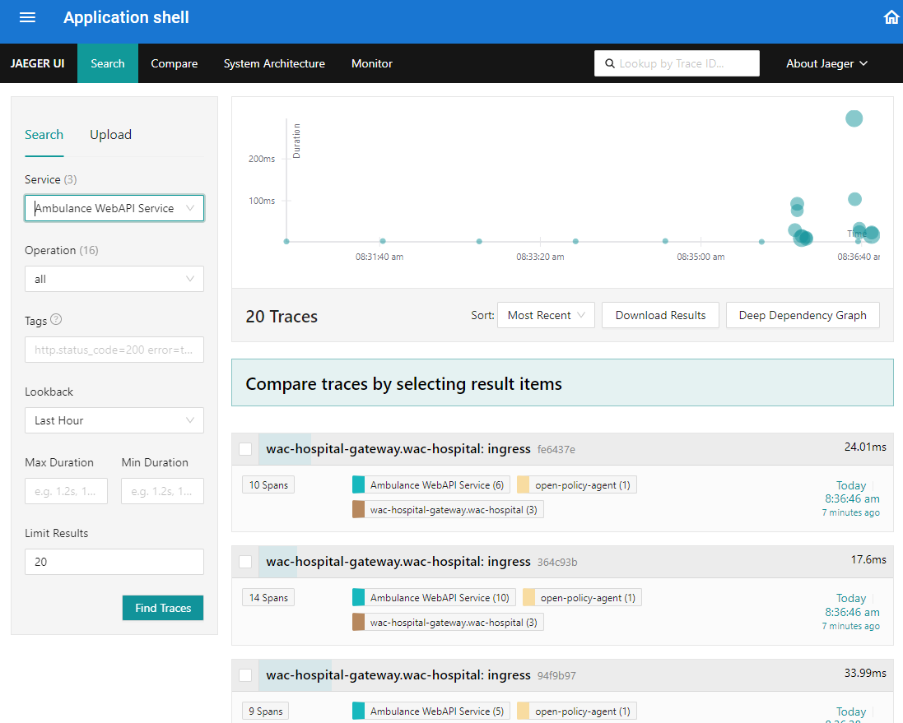
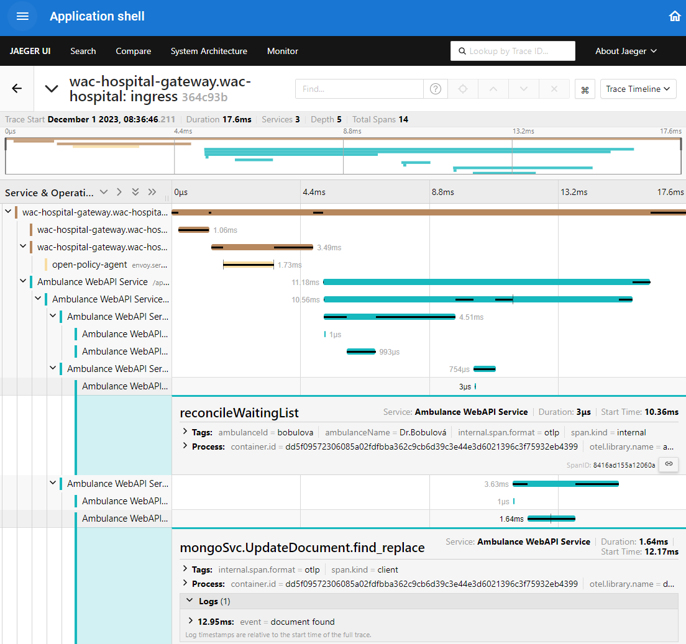

# Pridanie distribuovaného trasovania do Web API služby

---

>info:>
Šablóna pre predvytvorený kontajner ([Detaily tu](../99.Problems-Resolutions/01.development-containers.md)):
`registry-1.docker.io/milung/wac-mesh-120`

---

V predchádzajúcej sekcii sme videli, ako môžeme analyzovať jednotlivé požiadavky pomocou distribuovaného trasovania, samotné záznamy boli ale pomerne hrubé a stále nemáme k dispozícii ďalšie detaily ohľadne prebiehajúceho výpočtu. V tejto sekcii si ukážeme, ako doplniť do aplikácie rozsahy - _span_ - vlastného výpočtu.

1. Otvorte súbor `${WAC_ROOT}/ambulance-webapi/cmd/ambulance-api-service/main.go` a upravte ho

   ```go
   package main
   
   import (
       ...
       "go.opentelemetry.io/contrib/instrumentation/github.com/gin-gonic/gin/otelgin"   @_add_@
       "go.opentelemetry.io/otel/exporters/otlp/otlptrace/otlptracegrpc"   @_add_@
       "go.opentelemetry.io/otel/sdk/trace"   @_add_@
       "go.opentelemetry.io/otel/propagation"   @_add_@
   )
   
   // initialize OpenTelemetry instrumentations
   func initTelemetry()  error { @_remove_@
   func initTelemetry() (func(context.Context) error, error) { @_add_@
        ctx := context.Background()
        res, err := resource.New(ctx,
        resource.WithAttributes(semconv.ServiceNameKey.String("Ambulance WebAPI Service")),
        resource.WithAttributes(semconv.ServiceNamespaceKey.String("WAC Hospital")),
        resource.WithSchemaURL(semconv.SchemaURL),
        resource.WithContainer(),
        )
    
        if err != nil {
          return nil, err     @_important_@
        }
    
        metricExporter, err := prometheus.New()
        if err != nil {
          return nil, err     @_important_@
        }
    
        metricProvider := metric.NewMeterProvider(metric.WithReader(metricExporter), metric.WithResource(res))
        otel.SetMeterProvider(metricProvider)
   
       // setup trace exporter, only otlp supported      @_add_@
       // see also https://github.com/open-telemetry/opentelemetry-go-contrib/tree/main/exporters/autoexport      @_add_@
       traceExportType := os.Getenv("OTEL_TRACES_EXPORTER")      @_add_@
       if traceExportType == "otlp" {      @_add_@
           ctx, cancel := context.WithTimeout(ctx, time.Second)      @_add_@
           defer cancel()      @_add_@
           // we will configure exporter by using env variables defined      @_add_@
           // at https://opentelemetry.io/docs/concepts/sdk-configuration/otlp-exporter-configuration/      @_add_@
           traceExporter, err := otlptracegrpc.New(ctx)      @_add_@
           if err != nil {      @_add_@
               return nil, err      @_add_@
           }      @_add_@
         @_add_@
           traceProvider := trace.NewTracerProvider(      @_add_@
               trace.WithResource(res),      @_add_@
               trace.WithSyncer(traceExporter))      @_add_@
         @_add_@
           otel.SetTracerProvider(traceProvider)      @_add_@
           otel.SetTextMapPropagator(propagation.TraceContext{})      @_add_@
           // Shutdown function will flush any remaining spans      @_add_@
           return traceProvider.Shutdown, nil      @_add_@
       } else {      @_add_@
           // no otlp trace exporter configured      @_add_@
           noopShutdown := func(context.Context) error { return nil }      @_add_@
           return noopShutdown, nil      @_add_@
       }      @_add_@
       return nil @_remove_@
   }
   ```

   Do funkcie `initTelemetry()` sme pridali inicializáciu [_TraceProvider_](https://opentelemetry.io/docs/concepts/signals/traces/#tracer-provider)-a. Samotnú konfiguráciu vykonáme neskôr pomocou premenných prostredia, doležité je, že túto sekciu vytvárame len v prípade, kedy je premenná prostredia `OTEL_TRACES_EXPORTER` explicitne nastavená na hodnotu `otlp` - žiadny iný spôsob ukladania záznamov nepodporujeme. Keďže [_Trace Exporter_](https://opentelemetry.io/docs/concepts/signals/traces/#trace-exporters) ukladá záznamy asynchrónne a v dávkach, je potrebné zabezpečiť, aby sa všetky záznamy uložili pred ukončením aplikácie. K tomu slúži funkcia `Shutdown()`, ktorej inštancia je návratovou hodnotou funkcie `initTelemetry()`. V prípade, že nie je premenná prostredia `OTEL_TRACES_EXPORTER` nastavená na hodnotu `otlp`, vraciame funkciu, ktorá nič nerobí.

   V tom istom súbore `${WAC_ROOT}/ambulance-webapi/cmd/ambulance-api-service/main.go` upravte funkciu `main()`:

   ```go
   func main() {
       
       // setup telemetry
       initTelemetry() @_remove_@
       shutdown, err := initTelemetry() @_add_@
       if err != nil { @_add_@
           log.Fatalf("Failed to initialize telemetry: %v", err) @_add_@
       } @_add_@
       defer func() { _ = shutdown(context.Background()) }() @_add_@
   
       // instrument gin engine
       engine.Use(
           otelginmetrics.Middleware(
               ...
           ),
           otelgin.Middleware(serverName), @_add_@
       )
   
       ...
   }
   ```

   Funkcia `main()` sa príliš nezmenila, okrem toho, že sme zabezpečili volanie funkcie `Shutdown()` pri ukončení programu a pridali sme inštumentáciu knižnice [Gin].

   Tieto úpravy by mali zabezpečiť, že všetky požiadavky, ktoré obslúžime na našom WebAPI už budú generovať záznamy  a tie budú odosielané na eventuálne nakonfigurovaný server podporujúci protocol [OTLP](https://opentelemetry.io/docs/specs/otlp/)

2. Otvorte súbor `${WAC_ROOT}/ambulance-webapi/internal/ambulance_wl/utils_ambulance_updater.go` a upravte ho:

   ```go
   ...
   "go.opentelemetry.io/otel/codes" @_add_@
   ...
   var (
       dbMeter           = otel.Meter("waiting_list_access")
       dbTimeSpent       metric.Float64Counter
       waitingListLength = map[string]int64{}
       tracer            = otel.Tracer("ambulance-wl-api") @_add_@
   )
   ...
   func updateAmbulanceFunc(ctx *gin.Context, updater ambulanceUpdater) {
        // special handling for gin context    @_add_@
        // we need to extract the span context and create a new context to ensure span context propagation    @_add_@
        // to the updater function    @_add_@
        spanctx, span := tracer.Start(ctx.Request.Context(), "updateAmbulanceFunc")    @_add_@
        ctx.Request = ctx.Request.WithContext(spanctx)    @_add_@
        defer span.End()    @_add_@
       ...
   
       span.AddEvent("updateAmbulanceFunc: finding document in database") @_add_@
       start := time.Now()
       ambulance, err := db.FindDocument(ctx, ambulanceId) @_remove_@
       ambulance, err := db.FindDocument(spanctx, ambulanceId) @_add_@
       dbTimeSpent.Add(ctx, float64(float64(time.Since(start)))/float64(time.Millisecond), metric.WithAttributes(
           attribute.String("operation", "find"),
           attribute.String("ambulance_id", ambulanceId),
           attribute.String("ambulance_name", ambulance.Name),
       ))
   
       if err != nil {  @_add_@
           span.SetStatus(codes.Error, err.Error())  @_add_@
       }  @_add_@
   
       switch err {
       ...
   
       if updatedAmbulance != nil {
           span.AddEvent("updateAmbulanceFunc: updating ambulance in database") @_add_@
           start := time.Now()
           err = db.UpdateDocument(ctx, ambulanceId, updatedAmbulance) @_remove_@
           err = db.UpdateDocument(spanctx, ambulanceId, updatedAmbulance) @_add_@
           dbTimeSpent.Add(ctx, float64(float64(time.Since(start)))/float64(time.Millisecond), metric.WithAttributes(
               attribute.String("operation", "update"),
               attribute.String("ambulance_id", ambulanceId),
               attribute.String("ambulance_name", ambulance.Name),
           ))
           if err != nil { @_add_@
               span.SetStatus(codes.Error, err.Error()) @_add_@
           } @_add_@
           ...
       }
       ...
   }
   ```

   Na začiatku funkcie `updateAmbulanceFunc()` sme vytvorili nový rozsah výpočtu. [_Span Context_](https://opentelemetry.io/docs/concepts/signals/traces/#span-context), to znamená _trace id_ a nadradený _span id_ sú prenesené do funkcie `tracer.Start()` ako atribút premennej `ctx`. Rozsah výpočtu je ukončený volaním funkcie `span.End()`. Všimnite si, ako sme vytvorili nový rozsah výpočtu aj pre volanie funkcie `db.FindDocument()` a `db.UpdateDocument()`. V prípade, že sa vyskytne chyba, nastavíme status rozsahu výpočtu na `Error` a do atribútu `status` pridáme chybovú správu. Tieto atribúty sa neskôr zobrazia v nástroji [Jaeger].

   Upravte súbor `${WAC_ROOT}/ambulance-webapi/internal/ambulance_wl/impl_ambulance_waiting_list.go`. Ukážeme si ako pridať záznamy pre rozsahy výpočtu do funkcie `UpdateWaitingListEntry()`, ostatné funkcie upravte obdobným spôsobom:

   ```go
   package ambulance_wl

   import (
       ...
       "go.opentelemetry.io/otel/attribute"   @_add_@
       "go.opentelemetry.io/otel/trace"   @_add_@
   )

   // UpdateWaitingListEntry - Updates specific entry
   func (this *implAmbulanceWaitingListAPI) UpdateWaitingListEntry(ctx *gin.Context) {
       // update ambulance document
       updateAmbulanceFunc(ctx, func(c *gin.Context, ambulance *Ambulance) (*Ambulance, interface{}, int) {
           // special handling for gin context  @_add_@
           // we need to extract the span context and create a new context to ensure span context propagation  @_add_@
           // to the updater function  @_add_@
           spanctx, span := tracer.Start(  @_add_@
               c.Request.Context(),  @_add_@
               "UpdateWaitingListEntry",  @_add_@
               trace.WithAttributes(  @_add_@
                   attribute.String("ambulance_id", ambulance.Id),  @_add_@
                   attribute.String("ambulance_name", ambulance.Name),  @_add_@
               ),  @_add_@
           )  @_add_@
           c.Request = c.Request.WithContext(spanctx)  @_add_@
           defer span.End()   @_add_@
           ...
           ambulance.reconcileWaitingList()  @_remove_@
           ambulance.reconcileWaitingList(spanctx) @_add_@
           return ambulance, ambulance.WaitingList[entryIndx], http.StatusOK
       })
   }
   ```

   Vo väčšine prípadov budeme vytvárať nový rozsah výpočtu vždy, keď vstúpime do novej funkcie a pomocou operátora `defer` zabezpečíme ukončenie rozsahu výpočtu. [_Span Context_](https://opentelemetry.io/docs/concepts/signals/traces/#span-context) je propagovaný medzi funkciami pomocou premennej `ctx`.

   >homework:> Samostatne doplňte záznamy pre rozsahy výpočtu do ostatných funkcií v súbore `${WAC_ROOT}/ambulance-webapi/internal/ambulance_wl/impl_ambulance_waiting_list.go`. Pokiaľ to je relevantné, nastavte chybový status rozsahu pomocou funkcie `span.SetStatus()`, prípadne pridajte dôležité udalosti výpočtu pomocou funkcie `span.AddEvent()`.

   Nakoniec upravte súbor `${WAC_ROOT}/ambulance-webapi/internal/ambulance_wl/ext_model_ambulance.go`:

   ```go
   import (
       ...
       "context" @_add_@
       "go.opentelemetry.io/otel/attribute"   @_add_@
       "go.opentelemetry.io/otel/trace"   @_add_@
   )
   
   func (this *Ambulance) reconcileWaitingList() { @_remove_@
   func (this *Ambulance) reconcileWaitingList(ctx context.Context) { @_add_@
       _, span := tracer.Start(ctx, "reconcileWaitingList",   @_add_@
           trace.WithAttributes(attribute.String("ambulanceId", this.Id)),   @_add_@
           trace.WithAttributes(attribute.String("ambulanceName", this.Name)),   @_add_@
       )   @_add_@
       defer span.End()   @_add_@
   
       slices.SortFunc(this.WaitingList, func(left, right WaitingListEntry) int {
        ...
   }
   ```

   Aby sme mohli vytvoriť nový rozsah výpočtu, musíme mať k dispozícii [_Span Context_](https://opentelemetry.io/docs/concepts/signals/traces/#span-context). Ten získame z pridaného argumentu funkcie.

3. Uložte súbory a archivujte zmeny v priečinku `${WAC_ROOT}/ambulance-webapi`:

   ```ps
    git add .
    git commit -m "added tracing"
    git push
    ```

4. Otvorte súbor `${WAC_ROOT}/ambulance-gitops/apps/<pfx>-ambulance-webapi/patches/ambulance-webapi.deployment.yaml` a doplňte do konfigurácie premenné prostredia potrebné pre pripojenie _Open Telemetry SDK_ k službe `jaeger-collector`:

   ```yaml
   ...
   spec:
     template:
       spec:
         containers:
           - name: <pfx>-ambulance-wl-webapi-container    @_add_@
             env:    @_add_@
               - name: OTEL_TRACES_EXPORTER    @_add_@
                 value: otlp    @_add_@
               - name: OTEL_EXPORTER_OTLP_ENDPOINT    @_add_@
                 value: http://jaeger-collector.wac-hospital:4317    @_add_@
               - name: OTEL_EXPORTER_OTLP_TRACES_INSECURE    @_add_@
                 value: "true"    @_add_@
               - name: OTEL_EXPORTER_OTLP_PROTOCOL    @_add_@
                 value: grpc    @_add_@
               - name: OTEL_TRACES_SAMPLER    @_add_@
                 # see https://opentelemetry.io/docs/concepts/sdk-configuration/general-sdk-configuration/#otel_traces_sampler    @_add_@
                 value: "parentbased_always_on"    @_add_@
        - name: openapi-ui
   ```

   Uložte zmeny a archivujte ich príkazmi v priečinku `${WAC_ROOT}/ambulance-gitops`:

   ```ps
   git add .
   git commit -m "added webapi tracing"
   git push
   ```

   Počkajte kým sa všetky zmeny aplikujú v klastri.

5. Prejdite na stránku [https://wac-hospital.loc/ui](https://wac-hospital.loc/ui), otvorte Vašu aplikáciu _Zoznam čakajúcich pacientov_ a vytvorte, upravte alebo zmeňte zoznam čakajúcich pacientov. Následne prejdite do aplikácie _Distribuované trasovanie_ - [https://wac-hospital.loc/ui/jaeger](https://wac-hospital.loc/ui/jaeger). V rozbaľovacom paneli vyberte službu _Ambulance WEBAPI Service_ a vyhľadajte záznamy.

    

   Vyberte niektorý zo záznamov, najlepšie taký, u ktorého je vidieť najviac rozsahov - _Spans_ a zobrazte si detaily.

   

   V detailoch rozsahu výpočtu môžete pre danú požiadavku vidieť všetky rozsahy a im priradené atribúty, ktoré sme v našej aplikácii vytvorili. Vidíme, aký je podiel jednotlivých služieb na celkovom čase výpočtu.

   >homework:> Vykonajte analýzu požiadaviek na službu _Ambulance WEBAPI Service_. Skúste zistiť, v ktorých častiach kódu sa stráca najviac času a ako by tieto časti bolo možné optimalizovať. Sú informačné záznamy dostatočne detailné? Ak nie, skúste doplniť ďalšie informácie a rozsahy do Vašej aplikácie. __Do záznamov nikdy nevkladajte údaje, ktoré by mohli narušiť súkromie používateľov!__.

   &nbsp;

   >info:> Pre [MongoDB] existuje možnosť inštrumentácie pre distribuované trasovania, tu ju ale nebudeme využívať. Viac informácií nájdete na stránke [Tracing & Logging](https://www.mongodb.com/docs/drivers/rust/current/fundamentals/tracing-logging/).
